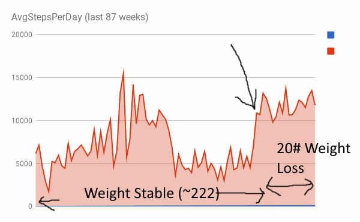

You have probably heard the phrase "10,000 steps a day" numerous times. How important is it to consistently hit 10,000 steps on a daily basis? I wanted to find out, so I really tore through the data captured by my iPhone. _BTW, Apple does not make it easy to run reports on this data. At the end of this article, I'll provide some guidance on how you can export and run reports on your Activity data._ Before I dig into the data, I want to provide some background on my previous walking. For the last decade, I have walked a lot. You can see some of my walking adventures in my [Urban Hiking](https://criticalmas.org/best-of/urban-hiking/) section. My pattern has been to walk a lot and then rest a lot. The day to day variance until recently has been wild. I might walk 8 miles on Sunday, 1 mile on Monday, 2 miles on Tuesday, and then 3 miles on Wednesday. For me, 10,000 steps are about 4.6 miles. So in the above example, I only had one day of 10,000 or more steps even though I walked 15 miles in 4 days.

### Consistency

In late March, I decided my goal would be to consistently hit 10,000 steps a day. And I've done a good job hitting that target. That is also the same time I started to lose weight after being weight stable for a long period.  This chart shows a weekly average for every week from the middle of December 2015 through July 29, 2017. You can see two things:

1.  My steps are much lower in the winter.
2.  My steps for 2016 were more erratic.

2016 was a year that I was working on recovering from a knee injury. Seattle also had the wettest winter in its entire history. For me to be successful, I will need to be better in the winter months.  In this chart, I counted the number of days each week that I had 10,000 steps or more. It further shows how I've become more consistent. There were many days I was in the 9,000 range, so I ran the same report using 9,000 as the target. 

### Why I Think 10,000 Steps a Day Works

In my opinion, there has been too much focus on the activity output of 10,000 steps. I think 10,000 steps a day works because it is sending frequent messages to the body to not down regulate metabolism. I lost 20 pounds since the end of March because I reduced calories. I see the role of 10,000 steps as locking in that loss so I'm less likely to regain. When you drop weight, your metabolism will drop. It will not only drop to match your new lower weight, but it will drop further as the body has learned how to become more efficient as a survival strategy. I go deeper into this topic in the post [The Role of Exercise in Preventing Weight Gain](/2017/03/exercise-weight-regain/). Frequently reaching 10,000 steps a day is a signal to my body to not become too efficient in reducing my metabolism as the weight comes off. And for me, 10,000 steps are not considered exercise. I still lift weights. The 10,000 steps are the opposite of sitting all day.

### How I Made Activity Reports With My Apple Health Export

If you have a recent iPhone and you have your phone set to capture your step data, follow these steps to get your data in a format you can make custom reports with. Check out the article [Apple Health Data How to Export Analyze Visualize Guide on how to get your data](http://www.ryanpraski.com/apple-health-data-how-to-export-analyze-visualize-guide/). That will show you how to get to the XML file you will need. Inside that article, there is a link to a tool that converts that XML file to separate CSV files. That tool is the [Apple Health XML to CSV Converter](https://ericwolter.com/projects/apple-health-export/). Grab the step data CSV. The next step is to make a PIVOT TABLE in a spreadsheet. The first link above shows you how to do that in Excel. If like me you use Google Docs, check out [Tutorial: How to make pivot tables in Google Sheets](https://web.archive.org/web/20170222015455/http://trendct.org/2015/09/04/tutorial-how-to-make-pivot-tables-in-google-sheets/). You will only be using 2 columns: _endDate_ and _value_. The _endDate_ will look like this: 2015-12-04 11:54:52 -0700. There will be many records for each day. We want to use the Pivot Table to group this data, so what I did first was trim that column using "\=LEFT(C2, 10)". This gave me 2015-12-04. Now you can start the PIVOT TABLE.  To get the data to all be grouped by Week, I used the _WeekNum_ function in Google Sheets. I also removed the initial and ending partial weeks from the dataset. Copy the values from the PIVOT TABLE to a new Sheet. From there you can create a Graph. Hopefully, the articles linked to above will answer all your questions. If not, you can peek at my [Steps Dec 2015 - July 2017 Google Sheet](https://docs.google.com/spreadsheets/d/1c_99VvbxIlCTDMcCn-04unp_8o-8OB3ywqM3XxbAm6A/edit?usp=sharing) for ideas. I'm not providing support.

---

## Comments

### Cathy
*August 7 at 2017 at 2:15 PM*

just to play devil's advocate, you stated earlier that you found exercise a detriment to losing weight.  I know you aren't at the end yet, and you stated that you don't consider the 10,000 steps a day "exercise" but the opposite of sitting still, would you then be considering it to be like what occurred in past times where most folks walked to do errands and/or get from point A to point B?  I think that chronic cardio as defined by some people is detrimental fyi, but for an older person like myself, the walking more and weight lifting more helpful.

---

### Cathy
*August 7 at 2017 at 2:16 PM*

Also, do you or the iPhone rate hills, such as are found in Seatle, differently than flat land walking?

---

### MAS
*August 7 at 2017 at 2:26 PM*

@Cathy - Great question and I do finally know another reason exercise why exercise been an issue for me with fat loss in the past. I'll cover why this works later, but the short version is after 15 years or so, I moved my weight training from the AM to the PM. This reduces both meal frequency and hunger levels. Again, I'll go deeper into this topic soon.

The iPhone tracks "flights climbed" which does apply to stairs, but it **may** be affected by hills. This article makes me believe so. But it is a data metric that I haven't been looking at.
https://www.quora.com/How-does-the-iPhone-health-monitor-measure-flights-of-stairs-climbed

---

