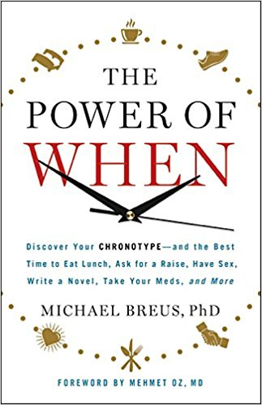

Earlier this year, I read the book _The Power of When_ after hearing the author on a podcast interview.

_The Power of When: Discover Your Chronotype--and the Best Time to Eat Lunch, Ask for a Raise, Have Sex, Write a Novel, Take Your Meds, and More by Michael Breus Ph.D._

Before I tell you the gem piece of advice I discovered for myself, I will briefly cover what the book is about. The premise is we all have some variation of four different sleep types. Each of these sleep types gets an animal designation. By discovering your sleep type, this book guides you with advice on how to structure your life better.

This is not a deep book and I have no idea if you will any get benefits from the ideas in _The Power of When_. I did. It was an idea so obvious that once I read it, I knew it would solve some of my problems and make my life better.

I'm a morning person. A Lion. For many years now my routine has been to start the day off strong and hopefully lock in the gains before the evening arrives. By the time evening has arrived, my productivity is much lower. My strategy has been to win early.

Winning early for me also meant working out early. **Two or three times a week for more than a decade I have been at the gym in the morning. _The Power of When_ explained to me that was a mistake.** Because I am a morning person, I should do all my project work in the morning and instead exercise in the late afternoon or early evening.

By structuring my day in this manner, ALL my mornings would be scheduled for projects and when the late afternoon arrived instead of going into zombie mode, I would go to the gym for an alertness pickup.

It all made sense.

On the days when I did my morning lifting, I tended to be more tired, more hungry, and less focused. I ate more meals throughout the day. I tend to eat more when I'm tired, as I almost never nap. Doing this week in and week out for so many years has likely caused me to consume more calories than I needed.

I started the late afternoon workout protocol around April and it is working great. I've completed more work on my projects and I've reduced the number of calories I consume on the days I workout. Start removing a few hundred calories a week and pretty soon you'll start to notice the results. I've lost 20 pounds in the last few months. This was one of the factors. I'll cover the others in an upcoming post.

---

## Comments

### t.
*August 8 at 2017 at 8:23 PM*

You might consider working out before you go to bed.  A late nite workout/shower works for me but I don't know how optimal it is for gains.  Maybe you have to really hit on all cylinders like diet as well, which I don't do. 

If you aren't awared, Tim Ferriss came out with another book "Tools of Titans".   Seems like what he has discovered is a formula for churning out profitable books more than the applicability of its contents (which involves a lot of expensive and hard-to-duplicate methods).  I dunno know, but to me it kinda seems like a pamphlet of truisms turned into a 700pg tome.

---

### MAS
*August 9 at 2017 at 12:56 AM*

@T - I found a system that works for me and matches the advice in the book, which is exercising around 4-5 PM. There is no way I would be motivated to exercise before bed and that matches what the book says. 

I have read/skimmed Tools of Titans. I have mixed feelings on the book. I might post on it. Not sure yet.

---

### garymar
*August 9 at 2017 at 4:06 AM*

Using Google Chrome, your latest post doesn't appear when I go straight to Critical Mas. If I search for "power of when" I can find it, but I only learned of its existence thru Nige's Diet &amp; Nutrition listup.

Clicking on the Critical Mas Title brings up the 10,000 step post instead.

---

### norlee
*August 9 at 2017 at 10:28 AM*

@garymar same problem with google chrome. I have to clear browsing data and cookies between post to get the newest.
@mas this happened before and you were able to fix it as I recall?

---

### norlee
*August 9 at 2017 at 11:52 AM*

actually it's "cached images and files" and cookies that I clear to make it work...

---

### MAS
*August 9 at 2017 at 5:35 PM*

@Garymar & @Norlee - Thanks for the report. I spent all morning on this problem. I learned a lot and I believe it is now fixed and fixed in a way that the site should still load very fast.

---

### norlee
*August 10 at 2017 at 12:42 AM*

still having to clear "cached images" this evening to see your latest, just FYI.

---

### MAS
*August 10 at 2017 at 12:50 AM*

@Norlee - I'm stumped then. I can see the expires headers coming off the server and it shouldn't be caching. Not sure what to do at this point. 

It was caching for 2 days. At most, it should be a few hours now. Hopefully, you just needed to clear the cache one last time. Guess we won't know until my next post.

---

