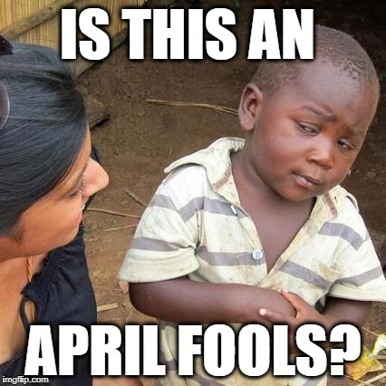

_I wrote this post last April Fools Day, but never published. I wanted to share this idea far away from April 1st._  I recall back in the pre-Internet Days, April Fools Day was more fun. Some teacher or co-worker would come up with something clever and we'd all enjoy the joke. Now we all globally connected every waking minute. This means usually within 30 minutes of waking up on the West Coast on April 1st, I've probably already read about some April Fools Day prank from a few time zones to my East. Also, year in and year old we are bombarded with more stories of April Fools Day pranks. Our guards are up. Corporations use the day for marketing. If something does happen to fool us, which is rare, it is fact checked instantly so one is only fooled for seconds. If I were King of the World, I'd change it so April Fools Day was less frequent. Maybe only on years that were divisible by 3 or 5. But that isn't going to happen. I have an alternate idea.

### Truth Bombs Then Silence

What if a large number of people held off on some really big news until April 1st? Post something really interesting that is true on the morning of April 1. Let people assume it is an April Fools joke. Don't respond until April 2nd, when you confirm the information was truthful. Use April 1 to announce your engagement, coming out of the closet, moving, quitting your job, your arrest or you've decided to go vegan. Why not? If enough people start doing this, it could make April Fools Day fun again or twice as bad. :) 

---

## Comments

### Jim
*September 8 at 2017 at 4:14 PM*

@MAS
I first realized that there was a problem when Tesla posted an April Fools announcement about a new "model W watch," and the stock price jumped (possibly due to automated trading bots not getting the joke).

---

