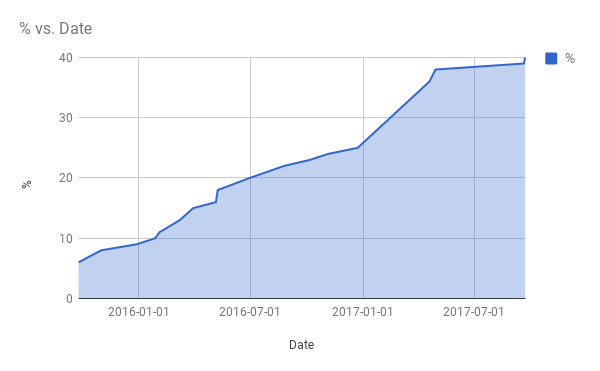

Back in January, I posted [Duolingo Fluency Estimates – My Data](/2017/01/duolingo-fluency-estimates-data/), in which I shared my fluency estimates charted over time to help other users better understand what a fluency path might look like if they show a similar level of commitment to the program.

Below is an updated view of that data. In mid-April this year, my fluency spiked 12%. Many users on Instagram reported a similar bump at that time.

The first data point I have is a 6% Spanish fluency on September 25, 2015. I began using the program on May 5, 2015. I'm currently on a 650 Day streak and I'm at Level 23 with 22,890 XP. A few observations:

-   Sometimes after achieving a new level of fluency, you will go up 1% more within a few days.
-   Almost always after hitting a higher level of fluency, Duolingo will drop you back down 1-3%, and then you can spend weeks or more getting back to where you were. And I'm telling you this as someone that is consistently using the program and uses other tools to augment my education.

Duolingo is no longer the great program it once was. Now the app is cluttered with ads and is obsessed with giving out worthless gem currency that you can spend in a store with only a few items. Memrise is a superior app for learning Spanish. But Duolingo is free and I'm still getting some benefit, so I'll continue using it for now.

If you are learning a foreign language and would like to learn with a native speaker, check out **[iTalki](https://www.italki.com/i/BaFdbA)**. I've been using them for a year and it is a great service. Use my link and we both will get $10 credit after you schedule your first lesson.

