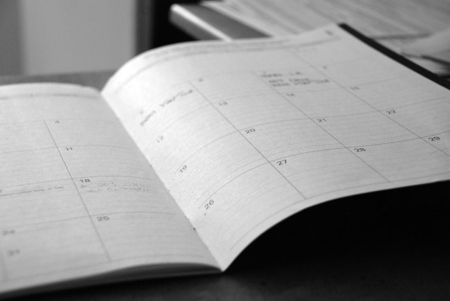

One of the criticisms I got regarding [The Potato Hack](/2016/11/potato-diet-calorie-savings-account/) was that once the hack ended and normal eating resumed that I'd regain the weight I lost. My critic claimed it was a lot of effort for unsustainable results. Was my critic correct? Nope. Not only did I keep off the weight that I lost during both 4-day Potato Hacks this summer (early June and mid-August), but I continued to lose fat afterward. I believe the primary reason is that the hack helps turn down your cravings for highly flavored foods, which tend to be high in calories. Foods that normally just taste good now taste better. Also, repeatedly interrupting the need to reach for high-calorie foods builds a habit that carries forward after the diet ends. However, I did notice something odd. Based on the number of calories I was cutting both during and just after the hack, I thought I would lose more weight. What happened just after each Hack was that I stalled for a week or so. Then when I didn't expect it, my skin would tighten up and the tape measure and scale would indicate I had lost more weight. One thing I've noticed when losing fat is that the fat doesn't go from "now it's here" to "now it's gone". There is this middle stage where the fat seems softer. The term that came to mind was squishy. When I searched on "squishy fat", I found this article by the always inciteful Lyle McDonald. [Of Whooshes and Squishy Fat](https://bodyrecomposition.com/fat-loss/of-whooshes-and-squishy-fat) From the article:

> Many people have noted that fat loss is often discontinuous, that is it often happens in stops and starts. So you’ll be dieting and dieting and doing everything correctly with nothing to show for it. Then, boom, almost overnight, you drop 4 pounds and look leaner.

The article continues:

> What’s going on? Back during my college days, one of my professors threw out the idea that after fat cells had been emptied of stored triglyceride, they would temporarily refill with water (glycerol attracts water, which might be part of the mechanism). So there would be no immediate change in size, body weight or appearance. Then, after some time frame, the water would get dropped, the fat cells would shrink. A weird way of looking at it might be that the fat loss suddenly becomes ‘apparent’. That is, the fat was emptied and burned off days or weeks ago but until the water is dropped, nothing appears to have happened.

That is exactly my experience just after a Potato Hack. Because my fat felt "squishy", I didn't get the visual affirmation until a week or more after the hack ended. Therein lies a lesson. Although the Potato Hack is about placing all your effort into a short period of time, your reward may not come right away. But don't fear and don't get frustrated. Think of this like a job where they hold your first paycheck. You are still getting paid. Be patient.  _Photo by [Eric Rothermel](https://unsplash.com/@erothermel)_

---

## Comments

### Tim
*September 11 at 2017 at 9:04 PM*

That's awesome, MAS.  I find the exact same thing.  Weight goes off and stays off.  People who carry lots of inflammation weight may not find it so easy, though.  But potatoes are very anti-inflammatory, so this diet can help in long-term, large weight loss as well as maintenance dieting.

I'm getting ready to harvest my spuds, I'll probably try PBD (potatoes by day) for a couple months just to see the effect. It's exactly as it sounds...potatoes for breakfast and lunch, then a normal dinner. Doing it just because I'll have a garage full of potatoes, I love potatoes, and it will make my work-day much simpler.

---

### MAS
*September 11 at 2017 at 9:42 PM*

@Tim - I like your phrase PBD. Before I was using the phrase "potatoes before six", which is an idea someone modified from Bittman's VB6 (Vegan Before 6 pm). The problem is people would hear "Potatoes Before Sex". So you take one crazy idea and merge it with a fetish. Laughter follows.

---

### t.
*September 12 at 2017 at 7:10 PM*

Could you list an diet list of cheap easily obtainable superfoods?  So far I have come up with potatoes, eggs, bananas, sauerkraut &amp; maybe cheese.

---

### MAS
*September 12 at 2017 at 8:33 PM*

@t. - I have a list on this post:
https://criticalmas.org/2016/11/designing-modern-peasant-diet/

---

### t.
*September 14 at 2017 at 5:34 PM*

Thanks for helping with my grocery list.  Why no beef of any kind?  I thought that was the best overall readily-available meat choice.

---

### MAS
*September 14 at 2017 at 5:43 PM*

@t - Beef is fine, especially 93-95% lean. I didn't include it on the list because the other foods on the list are cheaper. 

Another food I've been buying lately is ground turkey. Cost about $2 a pound. I make a meatloaf using cooked white rice instead of breadcrumbs. A big Pyrex can make a 3-pound meatloaf which is a super cheap way to make several meals at once. Add a little ketchup or tomato paste for more flavor.

---

### Alan
*September 20 at 2017 at 2:36 AM*

I am also a big fan of ground turkey. Been buying the four pack at Costo for years. Cheap and delicious.

---

### MikeTO
*October 12 at 2017 at 2:56 AM*

You might want to try resistance starches.  Brad Pilon talks about in his book Good Belly Bad Belly.  I did some research of my own.

You can do this with potatoes by roasting them in the oven then putting them in the fridge and let it cool.
https://www.healthline.com/nutrition/resistant-starch-101

http://www.precisionnutrition.com/all-about-resistant-starch

---

### MAS
*October 12 at 2017 at 2:00 PM*

@MikeTO - I've been eating 10-15 pounds a week of potatoes prepared this way for 2 years now. RS is mentioned on a few posts.

---

### Candice
*November 11 at 2017 at 8:01 PM*

Try sprouting your beans and lentils before cooking. Use your soaking bean water to feed your house plants. Sprouting first helps to digest better.

---

### MAS
*November 11 at 2017 at 8:04 PM*

@Candice - I have sprouted in the past. It just takes more planning.
https://criticalmas.org/2012/05/making-lentil-dal/

---

### Michael
*October 2 at 2018 at 2:33 AM*

I regained every gram within 24 hours.
Water weight

---

