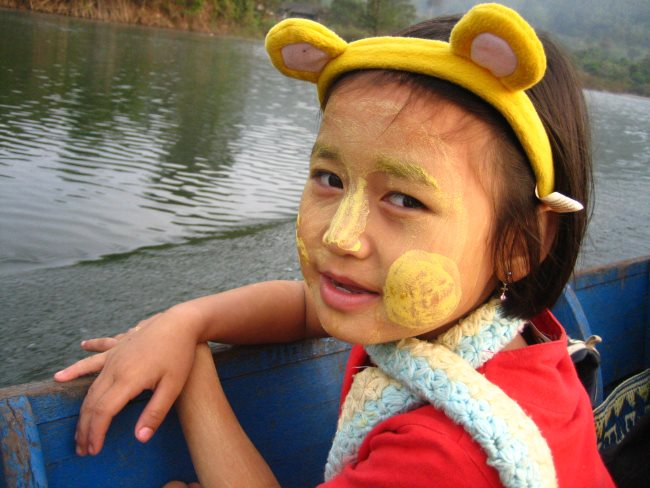

I want to continue the discussion I started in the post [Was Paleo Wrong About Sunscreen Too?](/2017/10/paleo-wrong-sunscreen/)

In that post, I addressed doubts I was having with the two polar extreme opinions on the role of sunscreen. Based on the comments of that post there is still a lot of disagreement. Paleo and other health bloggers are mostly dismissive of sunscreen and the mainstream view is that we really need sunscreen. I still am unsure on this topic.

What I did discover in the last two weeks is that neither side has made a convincing case. Both sides have carved out extreme positions. The pro-sunscreen side says we need to be protected all the time lest we get skin damage and accelerated aging and the anti-sunscreen side says we need to avoid sunscreen or we will get toxic chemicals and Vitamin D deficiency and all the ails that brings.

I've lost trust in many (most) health bloggers over the past few years and I often feel mainstream advice is dumb-downed tips for the unhealthy. What to do?

One of the big selling points in adopting the Paleo or WAPF narrative is that modern society is sick and that we were more healthy before industrialization. According to the NY Times, [sunscreen was invented](https://web.archive.org/web/20200416233632/https://www.nytimes.com/2010/06/24/fashion/24skinside.html) in the 1940s. A product of industrialization.

_Industrialization bad. Natural good. Right?_

Not so fast. I went further back to see how traditional cultures faired in the sun.

The Burmese people have been using a natural sunblock called [Thanaka](https://en.wikipedia.org/wiki/Thanaka) made from ground bark for over 2,000 years.

_By [Brian Adler](//commons.wikimedia.org/wiki/User:BrianAdler "User:BrianAdler")_ 

And according to the National Museum of the American Indian, American Indians invented sunscreen.

> Native tribes of the Northeast used sunflower oil for protection against harmful UV rays.

and

> In the Southwest, American Indians used a mixture of western wallflower and water.

Those were just two examples I found. I'm certain there are a lot more. I also have a friend that just returned from visiting a poor section of Northern Vietnam. There the workers cover as much as their skin as they can when working outdoors to prevent skin damage.

The fallacy peddled by some Paleo and WAPF bloggers that traditional cultures didn't need or use sunscreen is false. They just weren't sunscreens we see today. The traditional sunscreens may or may not be better than the ones we have today. Even when we speak of modern sunscreens, aren't those formulas changing frequently as learn more about the effect the sun has on the skin?

I honestly don't what to do. I'll continue to play a hedged strategy:

-   Keep sun exposure brief, especially early in the summer.
-   Wear a visor to protect the face,
-   On sunny days where I will be out, put sunscreen on my cheeks, nose, forehead, ears, and neck.

---

## Comments

### John
*October 26 at 2017 at 8:29 PM*

Great point. I remember seeing national graphic pictures of traditional societies when I was a child, and so many of them seemed to cover themselves in some form of clay mud. Perhaps they also absorb vital minerals that way too - elephants eat read clay for the minerals.

---

### John
*March 16 at 2018 at 2:37 AM*

I agree that a middle of the road approach may be wise. I use the natural mineral blocks, keep my shirt on and wear a hat and sunglasses. Being a bicyclist in Colorado, I get lots of sun at high altitudes, so I worry a bit. I’m Italian so I have pretty dark skin by mid summer.

---

