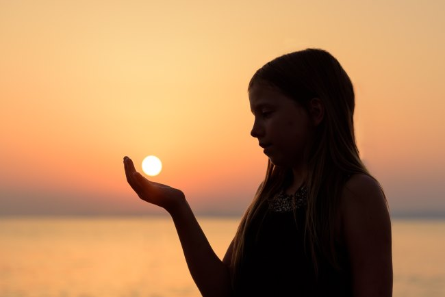

I've been actively following the direction of the disagreements Paleo has with the standard mainstream advice for almost a decade now. Sometimes the Paleo position moves closer to the mainstream and someones the mainstream moves closer to Paleo. One example is how saturated fat has become less demonized in popular media and how Paleo is less fearful of carbs.

I will often use [directional accuracy](/2017/08/directionally-accurate-metabolic-unicorns/) as a way to get closer to the truth.

One topic where I see little movement on either side is the use of sunscreens to prevent skin cancer and to reduce the aging effect of sun damage. Paleo is still anti-sunscreen. Conventional is still pro-sunscreen. And I can't tell who is right.

Without spending a lot of time block quoting several sources, I'll summarize the two sides briefly.

### Paleo View of Sunscreen

The body needs the sun to get Vitamin D. Most of us are deficient in Vitamin D because we are indoors so much. Paleo people were outside getting sunshine and Vitamin D. They didn't need sunscreen. Sunscreen reduces Vitamin D absorption and is full of chemicals, which might cause cancer.

Avoid sunscreen. Gradually build up exposure to the sun to prevent burning. Don't worry about skin cancer. Be concerned with not getting enough sun exposure.

### Mainstream View of Sunscreen

Always wear sunscreen to protect yourself against the harmful effects of sun exposure, which can be aging of the skin or even skin cancer.

_Photo by Olivier Fahrni_

### Finding a Middle Ground

For this discussion, let us throw out the outliers on both sides. We can all imagine a sickly porcelain skinned person that is scared of the sun that lathers up the SPF 50 sunscreen all the time. We can also all imagine the guy that owns a boat in Florida with the leather skin that makes him and his wife look like they are 15 years older than their true age.

Let us assume some sun exposure. Perhaps enough to get in our 10,000 steps a day, but not like we laboring in the fields all day. We will also assume that we gradually increase our exposure to the sun in a way that we never get sunburnt. Also, let us assume we wear hats on days when the sun in the most intense.

For me, I mostly do not wear sunscreen. I do wear a visor which keeps the sun mostly off my face. On the more intense days, I wear sunscreen on my cheeks and nose and sometimes neck and top of my ears. But my strategy is a middle ground guess. It may be "good enough". I want to know what is best for reducing skin damage.

If our sun exposure is done in brief increments - say 20 or 30 minutes at a time, what should be our position on sunscreen? What does the science say? How do you handle the sun?

[Part 2](/2017/10/paleo-wrong-sunscreen-part-2/)

---

## Comments

### Ondrej
*October 5 at 2017 at 6:09 PM*

Heh, endocrinologists also mention vitamin D and sunshine benefits while pathologists and dermatologists warn against sun exposure.
That said, melanoma is on the rise worldwide so I prefer to be careful. And it’s very prevalent in young 20, 30 somethings. I always use sunsreen when I’m (rarely) sunbathing and also when skiing during winter sunny days. Face is quite sensitive. Depends on which part of the world you live in, your exposure, skin type...
There is clearly a correlation with skin cancer later on when you get burnt as a kid for example. And it’s a great idea to get checked by dermatologist every year. Also, check yourself - changes in shape, size, colour, prominence, double-coloured etc. all warning signs. Google melanoma to get an idea. Some are also nasty, under nails, weird color etc. Hell, there is even a melanoma that dissapears from the surface while further methastasing. Scary stuff;-)
Also, tell someone to check sour back and other hard-to-see areas.

---

### Dr.
*October 5 at 2017 at 6:23 PM*

Australian lifeguards (Surfer's Paradise) have the lowest incidence of melanoma in the world. A friend in AR (I spend more time in the sun every day than he has in his entire
 life) had Stage T2a melanoma.

---

### Dr.
*October 5 at 2017 at 6:25 PM*

Correction: Surfers Paradise

---

### Ritesh
*October 5 at 2017 at 6:32 PM*

Hi MAS, your approach seems eminently sensible, and I guess you won't see much sun now for quite a few months! Same for me in rainy England. Though many years ago I enjoyed some weeks of early spring sunshine in Seattle which was magical. I have read 20 minutes of sun exposure (face/forearms) for Type I/II skin types is plenty to get enough Vitamin D in sunny climates,  more for darker skin types.  In more temperate climates over the winter months it is difficult to get much or any  vitamin D from the sun, and in the UK,  winter vitamin D supplementation is advised for most of the population, though uptake remains low. Certainly darker skin types like me would be advised to take vitamin D from now to April. About 50% of the tests I do for vitamin D (anecdotal figures) as family doctor  demonstrate insufficiency or deficiency. We have had a series of awful summers recently which has perhaps compounded this. Having said this, as Ondrej says, sunburn is both painful and bad for you so in stronger sunshine, covering up or sunblock is advisable. Some evidence the chemicals can be toxic to marine life so go for an environmentally friendly option if possible if you are lucky enough to be near tropical seas. I wear a rash vest and hat on vacation and try and minimise sunblock. In the UK the public health message we are trying to encourage is avoid sunburn but don't avoid the sun....with the (very real) skin cancer issue for the last decade things, even in this rainy sun starved country, had become a little skewed, with my sons (dark skinned) being smeared in sunblock before playtime on a 20 degree (70F) summers day...possibly exacerbating their vitamin D insufficiency!

---

### Ritesh
*October 5 at 2017 at 8:04 PM*

Dr Moore. can you elaborate on your post? Australia (mainly fair skinned population in sunny climate with an  outdoor lifestyle) has a high incidence of skin cancer (2 in 3 Australians  have had  a skin cancer by the age of 70). Yes-  most are non melanoma and are treatable/curable . Australian surfers have 3 x the national average of melanoma. Melanoma like all cancers is multifactorial but I don't think there are any respectable bodies denying intense sun exposure as a risk factor. There are always going to be melanomas in people who don't have much sun exposure, and many weathered outdoorsmen and women will not develop skin cancer.  Do the Surfers Paradise lifeguards wear a lot of sunscreen. Are they very aware and screened for atypical skin lesions every year? And can you reference the study please?

---

### MAS
*October 5 at 2017 at 11:42 PM*

@All - I love the comments so far. The disagreement tells me that I'm correct that this topic needs to be revisited in the Paleo community. 

Mark Si$$on has been dismissive of sunscreen going back to 2006. Maybe if he releases a Primal Sunscreen his view would change. :)

---

### Geoff
*October 6 at 2017 at 12:03 AM*

Isn't "Paleo Sunscreen" also known as the siesta? Nap it out during the hottest time of the day when the sun is at its most intense and you can go a long way toward avoiding sun burns.  Not so easy to monetize the siesta concept, though.

When I lived the south Florida, that was my approach - be out and active in the morning and afternoon but indoors during midday.  If I needed to be out at peak sun times for more that 10-20 minutes I'd cover up as much as practical for the heat and then put sunscreen on exposed areas.

Now that I live at a more northerly latitude (but still not Seattle north), I rarely use sunscreen and just take care not to burn myself.

---

### Mark
*October 6 at 2017 at 2:33 AM*

I have avoided sunscreen, but I like to be in the sun for mood-boosting reasons, for vanity reasons, and for theoretical health reasons. I try to be moderate, and usually cover up after I have had some sun exposure. Wind seems to give me red skin which can make it difficult to know when I have overdone sun exposure.

I get good doses of sun year round in the Chicago area. In the winter, I have the help of an easy-up sun cabana which collects heat from the sun; I also use aluminum reflectors (meant for car windshields) to direct more sun rays to me and to the cabana; if it is 20 degrees Fahrenheit, sunny, and not windy, I am comfortable in shorts without wearing a shirt and sometimes get hot enough to sweat; if it is windy when a big cloud obscures the sun, I get the hormetic benefit of cold exposure. :)

The sun cabana collects heat and blocks the wind in the winter. On a beach in the summer, the cabana can be positioned to provide shade.

---

### Dr.
*October 6 at 2017 at 2:51 PM*

Interesting comments Mark. It's exactly what I do, and why. 

Thanks for the cabana tip. 

When visiting my sister in the Midwest, I would always go out on the chaise lounge in the winter with gym trunks/no shirt. Sometimes it was only 20 degrees Fahrenheit. I would stay out for a half hour if it wasn't too windy. Sunshine and cold hormesis. If positioned out of the wind, with full sun, it was always quite pleasant/comfortable. The apricity felt like a warm blanket.

---

### Zac
*October 6 at 2017 at 3:44 PM*

Avoiding sunscreen is just asking for a problem. I use filter based sunscreens knowing the protection I’m getting is far greater than any potential harm from this short living filters. I moderate and limit my application to “beach days” or when I’m in the sun nearly all day long with no break. There’s no documented proof of them being harmful, still. Only “we need more evidence”. 

With that being said it’s silly not to include mineral based sunscreens. Those made with titanium and zinc. These can give great sun protection without the use of chemicals. You can have a 100% natural sunscreen that washes off and does not absorb. 

Let’s also speak about different UV rays since this isn’t mentioned at all.... UVB rays are the ones that burn us and cause a sunburn. These are only a small portion of the rays that hit us. There are also UVA rays which penetrate our skin, cause things like accelerated aging, loss of hydration, long term UV damage. Look up Bill the Truck driver with accelerated UVA damage to see what these rays do. 

http://m.huffingtonpost.ca/2012/06/06/bill-mcelligott-sun-damage_n_1573546.html

Please please please do your research. 

This is extremely ignorant and dangerous, sorry.

---

### Dr.
*October 6 at 2017 at 4:15 PM*

Ignorami?

Ultraviolet B (UVB) rays are what both make vitamin D and burn the skin  If you put on sunscreen that blocks UVB, then you block the production of vitamin D. Even weak sunscreens with an SPF of 8 block 95 percent of vitamin D synthesis.  So greasing up with sunscreen is definitely not going to have you “swimming in vitamin D.”

"In fact, if you’re not careful, you’ll end up more prone to the worst kind of skin cancer: melanoma.  Why?  Because a sunburn is nature’s way of telling you you’re getting too much sun. Unless you’re a moron, you get out of the sun before you get badly burned.  With graduated sun exposure you develop a tan, which prevents burning because the tan blocks the UVB much like a sunscreen does.  But the tan blocks UVA also.  UVA is the wavelength that doesn’t really burn but does stimulate the melanocytes (the pigment producing cells), which can cause melanoma.  If you slather on the sunscreen and stay out in the sun all day, you don’t get burned, but you do get a ton of UVA, which, until fairly recently, wasn’t blocked by sunscreen.  Now sunscreens contain agents that block both UVB and UVA, but no one knows yet whether these will prevent melanoma in the long run.

The paradox of melanoma is that this cancer typically develops as a response to too much sun but people with chronic sun exposure incur it less frequently than those with sporadic sun exposure.  This paradox can be easily explained.  Those who are out in the sun a lot develop a tan.  The tan blocks UVA, so there is less of the simulation for melanoma.  Those who go into the sun occasionally – office workers who vacation at the beach for a week – use sunscreen and stay out too long, receiving way too much UVA. UVA that increases the risk for melanoma."

Women whose jobs require massive sun exposure are much less likely to die of breast cancer!

People in the sunniest places also get less prostate cancer...

In one of the best studies, the factor most associated with increased melanoma risk was the use of sunscreens.  Subjects who often used sunscreens had triple the melanoma risk compared with subjects who never used sunscreens.  Skin color and higher numbers of sunbaths were significant protective factors.  Subjects who took more than 30 sunbaths per year were ten (10) times less (less) likely to have melanoma, compared with subjects who took less than 20 sunbaths per year.  However, sunbaths had no protective value when they were associated with sunburns.

Wolf P et al.  Phenotypic markers, sunlight-related factors and sunscreen use in patients with cutaneous melanoma: an Austrian case-control study. Melanoma Res. 1998 Aug;8(4):370-8.
 
"Ironically, sunscreens appear to dramatically increase the risk of melanoma, probably by increasing the amount of time one spends in the sun.  Until recently, sunscreens only blocked vitamin D producing UVB and let UVA through.  That is, the sunscreen-promoting dermatologists many be partially responsible for melanoma epidemic."

---

### MAS
*October 6 at 2017 at 5:12 PM*

@Zac - That is a powerful photo of the trucker. This is what I want to avoid. 

@Dr G -  Your comment combined with Zac's makes me think that the hybrid approach I'm currently taking might be the "least wrong" path. Sunscreen on the face, tops of the ears, and at times the neck. For most of the body - keep the sunscreen off - but also keep the exposure brief. 

Vitamin D + a pretty face. Do I have this right?

---

### Dr.
*October 6 at 2017 at 6:54 PM*

I think you have it right MAS...

---

### Eric
*October 22 at 2017 at 8:24 AM*

We all have different skin. I have red hair and can get sunburn on a cloudy day.
Others can be out in the sun all day and have no problems.

There is not a one size fits all approach to this.

A better approach would be "know your limits". Enjoy what sun your skin will allow, after that cover up / go indoors / wear sunscreen.

---

### MAS
*October 23 at 2017 at 3:00 PM*

@All - I think there is a lot more we need to learn about this topic. I will be doing a follow-up post on the topic after I learn more.

---

