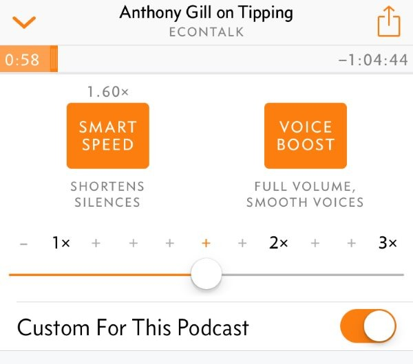

I graduated from college in 1994. Back then attending college was an easy decision. It didn't cost nearly as much as today and it was just before the web took off. Today information is everywhere and a lot of it is free. I'm not going to bash college in this post, [been there](/2009/07/the-importance-of-college/), [done that](/2010/09/the-college-debt-trap/). In this post, I am going to tell you about my self-directed graduate study program. It is free and anyone can join. I'm calling it **The 10,000 Steps University**. Don't have time to learn and be more active? No problem. At 10K SU, we'll do them both at the same time. All you need to join are some shoes and a device to play podcasts. I'll get into the courses later, but first, let me discuss the steps.

### 10,000 Steps

In the past few years, we have been hammered with the correct message that we don't move enough in modern society. We sit far too much. Most of us have heard it is a healthy idea to walk at least 10,000 steps a day. Some people argue the 10,000 number, but I like it. If it is wrong, it likely isn't too wrong, and it is better than not taking action. In the post, [The Power of 10,000 Steps a Day in Charts](/2017/08/power-10000-steps-day-charts/) I showed my data and how consistently walking 10,000 steps a day was a factor in helping me maintain a 20-pound weight loss. From that post:

> In my opinion, there has been too much focus on the activity output of 10,000 steps. I think 10,000 steps a day works because it is sending frequent messages to the body to not down-regulate metabolism.

So while the traditional college students are sitting in their lecture halls gaining their [Freshman 15](https://en.wikipedia.org/wiki/Freshman_15), the students of 10,000 Steps University will be walking through our neighborhoods, cities, parks, and shopping centers. We might even be walking around our own house knocking out some chores.

### Improved Scheduling

Unlike traditional colleges where students have to race to sign up for the classes they need at the times they want, at 10K SU, we take whatever classes we want whenever we want. We also eliminate all that wasted time traveling to and from classes, because we are already in class as soon as we start walking. One can start and stop a course at any time. Just subscribe to a podcast of interest and start downloading shows. And unlike the traditional college student that might be stuck with a mediocre professor or inarticulate graduate student, we at 10,000 Steps Univerity go directly to some of the best minds in their field. No barriers.  _I had the school logo made on Fiverr for $6._ 

### My Graduate Study Program

To give prospective students a glimpse of life at 10K SU, here is my current coursework. My interests are economics, finance, technology, Spanish, and health/fitness. Below are the podcasts that I have subscribed to for my self-directed program

#### Economics / Finance

EconTalk, Masters in Business, Planet Money, and Odd Lots.

#### Technology

Programming Throwdown, Syntax - Tasty Web Development Treats, and JS Party.

#### Spanish

Spanishpodcast.org, News in Slow Spanish (Latin America, Spain), Españolistos, and Lightspeed Spanish (Advanced).

#### Health / Fitness

FoundMyFitness, Kwik Brain, and Sigma Nutrition.

#### Other

I also listen to interview shows such as James Altucher and Tim Ferriss, which tend to cross disciplines such as health, history, and business.

### Mainlining Knowledge

For me to walk 10,000 steps, it takes about 90-120 minutes a day. I don't power walk and I stop when I want. Also, except with Spanish podcasts, I am not listening at a normal speed. Many podcast applications provide the option to speed up play and collapse the silent pauses. This takes a little practice, but you can fully understand speech at a faster rate. When I listen to EconTalk, I'm listening at 1.5-1.6 x speed. Interview shows such as Tim Ferriss might be closer to 1.7-1.9 x speed.  _Using the Overcast app, I was able to listen to this 64-minute podcast in 40 minutes._  A traditional college student can't fast forward a slow-talking professor. We can. We can also skip over the material we already know or don't have an interest in learning. And we can go back and replay something again if we need to. You can't do that in a traditional classroom environment. A traditional college student might spend 15 hours a week in class when school is in session. And what percent of that time is devoted to learning once you remove testing and non-academic chat? Maybe 10 hours? Now take away weekend and academic breaks, which are not observed at 10K SU, and you can quickly see how my free University delivers more knowledge.

### Are Podcasts an Effective Way to Learn?

For my interests, I think podcasts have been an effective way to learn. Many of the health and fitness posts on this blog first started with ideas I got from podcasts. I've learned far more about economics and finance from podcasts than I did at The Ohio State University where I earned a B.S. in Business Finance. And my listening skills in Spanish have improved tremendously in the last year.  _I took this photo last month while on one of my 10,000 Steps learning sessions._ 

### Enroll Today

My guess is many of my regular readers are already participating in their own 10,000 Steps University. But for others, please join us. Unlike traditional colleges, there is no cap on registration. See you on the streets.

---

## Comments

### Tim
*November 15 at 2017 at 6:39 PM*

Well I guess I'm a frat-boy.  My favorite pastime is watching hour-long episodes of Naked and Afraid while on the treadmill after dinner, lol.

---

### GM
*November 15 at 2017 at 11:16 PM*

"Don’t have time to learn and be more active?"

Walking = Massive Time Suck

None of the so-called "experts" realize how little exercise volume it takes to achieve maximum benefits; and how little exercise volume it takes to maximize cardiovascular fitness, fat loss, strength gain, and metabolic efficiency.

Walking yields virtually zero metabolic stimulus. It's an exercise that yields little more than fatigue and hunger.  Low intensity/long duration provides minimal cardiovascular benefit and virtually no metabolic benefit. Fat must be lost metabolically. 

It is high intensity, short duration exercise that provides the metabolic stimulus to mobilize and utilize fat reserves right from the first moment of effort. Muscle guarantees a fat burning metabolism.

Maximize your return on time and energy invested in exercise.

Podcasts and walking 10,000 Steps?

Analogous to speed reading with multiple distractions. When I read a book, I analyze it, study it, highlight it and take copious notes that immediately go into Google Docs. Focus, spaced repetition + review = retention. 

"I think 10,000 steps a day works because it is sending frequent messages to the body to not down-regulate metabolism."

BTW, Four days of fasting actually increase TEE (total energy expenditure) by 12%. 
Studies of eating a single meal per day found significantly more fat loss despite the same caloric intake. Importantly, no evidence of muscle loss was found. Resting energy expenditure (REE) goes UP during fasting.

I move every 30 minutes --all day long. 20 strict push ups. 8-9 door pull ups in the kitchen while preparing a gustatory delight. Maybe a half dozen deck squats on the living room hardwood. Leg-raise-to plow anyone. Engaging the kinetic chain of muscular integration with a little intensity. An intensity that makes walking several miles about as worthless as kissing your sister.

The best way to stimulate your vestibular system is with postural changes — in other words, physical movement. A variety of movement patterns. Your vestibular system also influences biological functions.

Problems associated with prolonged/uninterrupted sitting: include a heightened risk of cardiovascular problems, stroke and cancer, especially colorectal, gastrointestinal, ovarian and prostate cancers.

Stand/move every 30 minutes. Intermittent, (even low-intensity) but high-frequency movement all day long.

Mercola does 10,000 steps or more a day. And he consumes 3000 calories. Most of it in the form of micronutrient poor/energy rich fat to fuel all of that senseless walking. That's about 2000 more calories a day than I consume. Mercola is skinny fat. I'm lean and sculpted.

I used to run/walk trails for hours a day. Other than crisp clean morning air, and loads of sunshine, it was a waste of time.

Systematic undereating. Restricting food intake, and particularly restricting the frequency of food intake is one of the most important aspects of maintaining health. People eat huge quantities (like pigs) and they eat almost incessantly.

I never eat more than one meal a day. And that meal would be considered -- by the average screwball, to be hypocaloric.

---

### MAS
*November 16 at 2017 at 1:12 AM*

@GM - I believe you assumed I wrote things I didn't and hold positions I don't. I'll clarify the numerous mistakes you made in your comment. 

1- I enjoy my walks through Seattle, so I do not consider them a time suck.

2- Where in this post or any post going back 10+ years have I ever said walking = exercise? I'll save you the time. The answer is never. 

3- I agree that High-Intensity Training is highly effective. I do that as well. Tons of posts on HIT on this site and hundreds of comments. That topic has been covered to death on this blog. 

4- Where in this post did I say that walking results in fat loss? I said NOT walking and sitting on your ass likely leads to weight gain. Even in the posts where I mentioned my 22# weight loss, I credit walking with helping maintain the loss - not for creating the loss. 

5- There are multiple ways to learn. This method is but one. And it has been effective for me.

6- Your Mercola example is ridiculous. There are millions of office workers that have worse physiques than him and don't walk even 5,000 steps a day. 

7- This post did not cover undereating, restricted eating or fasting. That was not its intent. Completely separate topics.

---

### Tim
*November 16 at 2017 at 4:04 AM*

The "10,000 step" thing is quite well-studied, ie. https://www.ncbi.nlm.nih.gov/pmc/articles/PMC3197470/  I'm a hige believer in the power of walking.  When I walk 1-2 hours per day, my bp is in the 110's over 60s range.  Prior to walking (I, too, thought it was a silly notion) my bp was always in the 130s over 70s. 

Bp lowering, vagus nerve stimulating, gut motility, attributed to 10,000+ steps/day.  Not everyone has 2 hours to walk every day, but lots and lots of people have 6 hours to watch TV from a reclined position.  I say that if you cannot carve out 2 hours a day for walking, you should probably rethink your life.

---

### Thomas
*November 16 at 2017 at 9:47 AM*

That's an interesting way to study, thanks for the reminder.

In addition, it seems walking is also good for the brain: https://www.sciencedaily.com/releases/2017/04/[phone removed]40.htm

---

### norlee
*November 16 at 2017 at 11:44 AM*

I have just recently been reading that walking for relaxation (restorative walking vs power walking) is one of the best ways to lower stress hormones which is one of the best things you can do for your health. In the "blue zone" areas where people live the longest and the healthiest it's all restorative movement - they don't "exercise" at all. Movement for relaxation is a completely different mindset and as you pointed out it's extremely enjoyable!
love this post - I have even started doing my morning meditation on the treadmill rather than sitting.

---

### Geoff
*November 16 at 2017 at 12:26 PM*

It's a sign of the strange times in which we live that walking has become something to discuss, defend, justify.  No knock on any of the commenters here by this comment.  It's great to see that you derive joy or other benefits from your walks.  To me, justifying walking is a bit like justifying love.  It's a part of who we are as humans.

MAS, I like your 10KSU concept.  To me, though, if I have a solid 2-hour block for a walk I'd rather spend it chatting and ambling with friends, perhaps doing another walking-related activity like disc golf, or tuning in to the sights and sounds of the world around me.

Are your econ/finance podcasts presented in an equation free format?  Seems there are some subjects that need some kind of visual presentation mode (blackboard) to explain the concepts effectively.  Your topics may be perfectly good for this mode, but I am guessing topics such as mathematics, physics, chemistry, engineering, music theory, accounting, and chess might be less suited.  Is there anyone here who has listened to a podcast on any of those topics for learning purposes?  How are the formal concepts conveyed?

---

### Geoff
*November 16 at 2017 at 12:39 PM*

Sorry for the follow on comment - but before anyone starts:  Yes, I do appreciate that visually impaired people can and do study and excel in the topics I mentioned.  Perhaps I am wrong, but to me, those seem to be rare and wonderful exceptions, not the rule.  Blindfold chess isn't the default game, it's a variant. There are many wonderful blind musicians and composers, but most can see.  So perhaps what has really piqued my curiosity is the subjective learning experience of those topics without reference to visual guides.  Perhaps I just need to spend some time walking and learning to visualize a chess board or series of equations in my head.

---

### MAS
*November 16 at 2017 at 4:12 PM*

@Geoff - Yes, those econ/finance podcasts are equation-free. I'm trying to think of any podcast topics that have covered formulas and I can't right now. The closest might be one of the tech podcasts where they might discuss a coding concept - such as functional programming. For that, I'll stop walking and jot down a note. Then later I'll read and then experiment with the concept. 

@All - I want to add that some things I learn better sitting, such as coding. However, some things I learn better when moving. I include Spanish listening on that list. Sitting and listening for 20-40 minutes without being distracted is tough. However, walking and listening pairs nicely.

---

