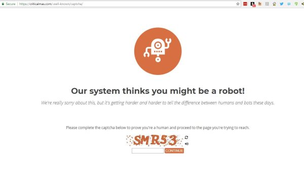
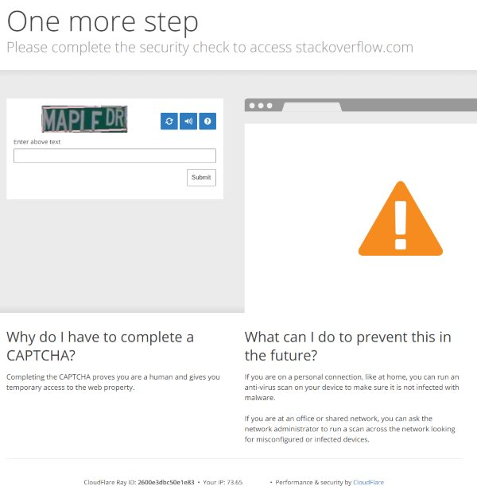

This is a quick housekeeping post.

### Blog Issues

First, I want to apologize to any of the users that received a CAPTCHA block trying to access this site over the past month. I was unaware it was happening until two users contacted me about the issue. My web host and CDN each were blaming each other. In the end, I HOPE it is finally resolved.

You should never see a CAPTCHA or security block on this site. If you do, please email me (digitalcolony@gmail.com) or tag me on Twitter @CriticalMAS with a screenshot and your IP Address (go to [whatsmyip.org](http://www.whatsmyip.org/)).

_CAPTCHA #1 is what some users saw. It was coming from my website._ 

_CAPTCHA #2 is by my CDN. I don't believe anyone received this one._ 

The bizarre thing is I'm hosting 4 websites on the same server with the same set up using the same CDN and it only affected this site.

### New Search

Try out the new search for this blog, which is located in the right column. I now have auto-complete! It is by [Algolia](https://www.algolia.com/) and I get 100,000 free searches per month, which should be more than plenty for this site. So far it seems to be quick and works fine on mobile.

My only issue is that it doesn't search comments, which is something the WordPress search didn't do either.

Let me know if you like it or have any issues.

### Requests

As the year winds down, I was wondering if there were any post topics that you want to see here on the blog? Thank you!

---

## Comments

### Anon
*December 26 at 2017 at 6:38 AM*

@MAS – I read your article, "5 Foods That Were Key to My Fat Loss."
https://criticalmas.org/2017/08/5-foods-key-fat-loss/
Could you please explain your decision to buy the cheapest eggs, which you referred to as ghetto eggs, over the fancy eggs? 
How many eggs do you eat a week? Do you eat the same number of eggs a week on your Peasant Diet and the Old School Bodybuilder? 
Is there any difference in egg consumption and health for men and women?
Almost every health blogger recommends only free-range or organic eggs. These fancy eggs are very expensive in my location. Also, the hens are likely to be given chicken feed in addition to what they can find to eat in a tiny free-range patch.
I am living on a tight budget and I really like the sound of your ghetto eggs as, “Dirt cheap pockets of protein.” :)
Thanks.

---

### MAS
*December 26 at 2017 at 3:22 PM*

@Anon - I might do another post on your question, but the short version is I use the power of story to accomplish my primary health goal. 

A peasant would not have access to fancy or more expensive food choices. If I choose to buy organic eggs at a higher price point, then I am weakening my story. If I weaken my story, I risk weakening my results. This post covers more of my thoughts:

https://criticalmas.org/2017/09/used-peasant-diet-lean/

In a given week, I will eat 12-24 soft boiled eggs. I do not know what the health recommendations are for men or women when it comes to eggs. My story is I'm a peasant seeking cheap sources of protein.

---

