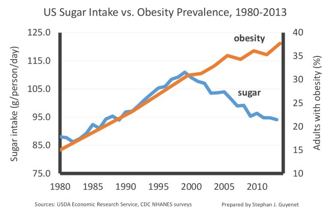

The latest battle in the never-ending [Carb Wars](/2011/07/carb-wars-in-the-blogosphere/) involves a narrative that the sugar lobby was suppressing scientists from publishing research that was unfavorable to sugar. As with any lobby group, there may be some truth, but what is implied - especially by the low-carbers - in this conspiracy is that [sugar must be toxic](/2015/01/chris-kresser-comes-clean-sugar-not-toxin/) and that we the people have been the clueless victims. It is mostly nonsense. Nobody in their right mind was fooled into thinking that eating a lot of sugar was a good idea. From my earliest memories as a child - long before the arrival of the public Internet - we knew to limit our sugar consumption. My parent knew. My grandparents knew. My great-grandparents knew. These stories remind me of a conversation I had with my father about the warning labels on cigarette packs. He was smoking two packs a day and said the labels just stated clearly what every smoker already knew. When you wake up coughing out dark-colored phlegm, you learn quickly that smoking isn't healthy. Well before the Internet, I had an aunt with diabetes that knew she needed to stop her sugar intake. But she loved desserts and soft drinks. She went blind and later died. She knew. There was no sugar lobby conspiracy that plotted to kill her for profits. We need to grow the hell up as a nation and stop falling for these neatly packaged conspiracy theories. The low-carb zealots are all over this story as if it explains everything. Evil sugar people destroyed the health of a nation by hiding the truth about sugar. Really? A little game I have been playing to accelerate my decision-making process is to first say _"Imagine it is 1995"_ and then decide. Very often that ends up being the best choice. Before the public Internet, apps, and broadband, we used common sense and intuition to guide us. My dad knew smoking was bad long before the labeling laws and my aunt knew her excess intake sugar was going to kill her. And in the event, a low-carb zealot is reading this post and ketogenic smoke is coming out of their ears, I've copied this chart from [Carbohydrate, Sugar, and Obesity in America](http://wholehealthsource.blogspot.com/2015/11/carbohydrate-sugar-and-obesity-in.html) on Whole Health Source.  Sugar consumption has dropped significantly since 1999 yet obesity continued to rise. Oh nooz, I guess Big Sugar isn't to blame for that extra weight we as a nation have gained since the start of the 21st century. Where are the calories coming from then? Not other carbs. Those peaked in 1999 as well. Must be fat then, because if it was protein, the obesity rate would have fallen. Oops, there goes a big chunk of the narrative that the evil sugar lobby is tricking us into killing ourselves for their profit. My dad and aunt both took responsibility for their poor health outcomes. If you're heavy, it is because you ate too much. Even if you were clueless about what was in your food, you had a feedback mechanism of seeing your waist size increase to tell you that you were on the wrong path. Imagine it is 1995. Use your common sense.

---

## Comments

### Lynn
*December 1 at 2017 at 7:25 PM*

Thank you!

---

### norlee
*December 3 at 2017 at 1:04 PM*

LOL - maybe it's the artificial sweeteners?

http://www.cnn.com/2016/01/18/health/where-do-we-stand-artificial-sweeteners/index.html

---

