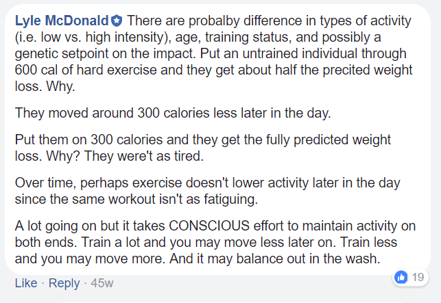

Last month, I posted [Constrained Total Energy Expenditure and Metabolic Adaptation](/2017/12/constrained-total-energy-expenditure-metabolic-adaptation/), which is an overview of the research of Dr. Herman Pontzer. In short, his work makes the case that we adapt metabolically to higher levels of exercise by burning fewer calories than expected. As one gets more active, the calories burned don't increase linearly. The caloric burn rises at first and then drops often back to a pre-activity level. Read the notes in [Part 1](/2017/12/constrained-total-energy-expenditure-metabolic-adaptation/) for more details. In this post, I sought out more resources to extend the discussion.

### Scientific American Article

_The Exercise Paradox_ is an article Dr. Pontzer wrote for Scientific American. It is behind a paywall, but I found a PDF copy online (May 2019: link removed).

> We found that daily physical activity, tracked by the accelerometers, was only weakly related to metabolism. On average, couch potatoes tended to spend about 200 fewer calories each day than people who were moderately active: the kind of folks who get some exercise during the week and make a point to take the stairs. But more important, energy expenditure plateaued at higher activity levels: people with the most intensely active daily lives burned the same number of calories each day as those with moderately active lives.

### Lyle McDonald on Facebook

When it comes to calories, fat loss, and exercise, one of my go-to researchers is Lyle McDonald. I found his thoughts on Pontzer's work in a year-old comment on Facebook.  McDonald's comment rang true to me. At the times of my life when I trained the hardest, were also the times you couldn't peel me off the coach at the end of the day. And the times when I trained the least, were the times I couldn't sit still. In my case, it seemed like my body was trying to even things out as best as it could.

### PubMed Response to Dr. Pontzer

McDonald also linked to [Physical Activity and the Missing Calories](https://www.ncbi.nlm.nih.gov/pubmed/25906428) on PubMed. [Text here](https://www.ncbi.nlm.nih.gov/pmc/articles/PMC4470776/). That article was balanced. Here is the critique.

> However, there are compelling data from humans showing that energy intake is indeed increased in response to exercise (e.g., (1)). Unfortunately, the evidence presented by Pontzer does not include data on energy balance, and it is possible that these constraints on energy expenditure only operate under certain conditions of ill-favored negative energy balance. Another possibility is that energy expenditure does not increase with structured physical activity due to decreases in spontaneous physical activity (e.g., fidgeting) or reductions in the energy cost of physical activity (e.g., improved muscle efficiency), rather than from reductions in resting metabolic rate. Indeed, spontaneous physical activity can account for a large amount of caloric expenditure even in sedentary conditions and may represent a buffer against changes in structured physical activity (5). Moreover, as Pontzer admits, athletes and subsistence farmers present a clear challenge to his model because they exceed the proposed limits on energy expenditure, even after correcting for body size (3). And even in the case of the Hadza who have comparable energy expenditure to Westerners once adjusted for fat-free mass, the Hadza expend more energy in physical activity and are leaner than their Western counterparts (4). Therefore, despite a possible upper limit on energy expenditure, physical activity can reduce adiposity.

 _Photo by [Daniel Apodaca](https://unsplash.com/@danielapodaca96)_

### G-Flux

G-Flux is a concept I learned about from Precision Nutrition. They explain it as a process where when high levels of activity are matched with high levels of calories you get a better body composition and health outcome than would be predicted from a linear calorie model. Read the article [All About G-Flux](https://www.precisionnutrition.com/all-about-g-flux) by Ryan Andrews for an excellent overview. The article states:

> ...to get and stay lean, it’s probably better to exercise as much as you can while eating as much as possible — as long as you’re gaining muscle and losing fat — than the reverse.

The example in the article compares 3 cases where an individual is in calorie balance at 2000, 2500, and 3000 calories. The best outcome is the highest activity level that uses 3000 calories. My impression is G-Flux doesn't conflict with Dr. Pontzer's work, because calories are increased. Without creating a calorie deficit, the body doesn't need to compensate and down-regulate metabolism. To the fans of high levels of exercise, this seems like the path to take. Keep eating to support a higher metabolism and a high activity level. Even if you don't exercise a lot, I'm guessing this principle still applies, although it appears to work best at the upper end. The question is how do you know when your weight-table body is increasing or decreasing metabolism on a week-to-week basis? There are so many variables to consider. My prediction is that technology will solve this problem in time. If I can have a gadget that measures everything and tells me to eat more or move more in near-realtime, that'd be awesome. Until that day comes, perhaps we use a combination of body fat percentage (or tape measure) and (maybe) body temperature or resting pulse. If body-temp and resting pulse are falling that might be signs to eat more. This is speculation.

### Summing Up

To me, it sounds like there is an initial agreement that high levels of exercise will not have the previously predicted body composition effects. What those levels of exercise are for you at different stages of life will likely vary. The G-Flux angle is interesting, but I know my slower recovery times did not allow me to exercise a lot or for long periods. Or perhaps, all these years I've never consumed enough calories to support the higher levels of activity to see where it would have taken me? There is a lot to think about here.

---

## Comments

### Jim
*January 4 at 2018 at 2:15 PM*

@MAS
The high exercise/ high calorie results are interesting.  Perhaps we've been getting noisy data all these yers by studying and researching people with relatively low activity levels.  It's like if the show Top Gear did a review of a Ferrari by driving it at 10 MPH the whole episode. "Tough to turn the wheel, starts and stops are kind of jerky, not very fun." You wouldn't really learn much about the car.

---

### MAS
*January 4 at 2018 at 4:22 PM*

@Jim - Yes. Or at the other end researching highly active people with lower than expected calorie levels. 

I only wish I knew all this info 20 years ago. I wonder how many of my injuries were connected to not consuming enough calories during high output periods?

---

### Stuart
*January 7 at 2018 at 3:51 PM*

I'm not sure that I'm fully getting what these two articles are driving at...BUT in terms of high activity coupled with high calorie intake in terms of our evolutionary past, was that ever an option? Or was food more plentiful than we were led to believe? Plus was high activity day in day out a good thing considering what can happen to aging joints that have abused exercise in modern times. Surely conservation of energy wherever possible was the common sense option for our ancestors?
The only time that high calorie intake, clued with high activity would have come into the equation was when we became an agricultural species. Harvest time is hard work, but brought in lots of food most of the time. In this sense it also brings up the question of what we as a species are best suited for. Perhaps, as the book "Paleofantasy" by Marlene Zuma suggests we have evolved in subtle ways far more than the Paleolithic propagandists would have us believe.

---

### MAS
*January 7 at 2018 at 4:23 PM*

@Stuart - Just because there is no ancestral evidence of a high G-Flux population (assuming that statement is correct), does not mean the combo of high activity with high calories doesn't have the health benefits outlined on the Precision Nutrition site. 

Compare the male athletes of today versus hunter-gathers. Athletes have more muscle, are often leaner, and have higher testosterone levels,  which are the metrics that we care about. The high G-Flux case, which I'm not defending, I'm just sharing, is not about what is historically healthy, but about doing better. Pushing the human software to achieve more.

---

### Stuart
*January 7 at 2018 at 4:34 PM*

MAS I get what you are saying. But is more necessarily better? Athletes may be fitter than the general population, but they are not always healthier. Besides in a world where large portions of the population are going hungry  this is a non argument. Only in the most developed countries is this even a concern. Imagine having this discussion with people from some of the lesser developed nations. They'd laugh at you, or be offended. Morally the G Flux approach is a bankrupt one in most nation's outside of the western world.

---

### MAS
*January 7 at 2018 at 4:52 PM*

@Stuart - Look around Western society. We already are eating a lot of calories. We just don't have the activity levels high enough to put those calories to use. I think we agree that being in caloric balance at a healthy weight is a good first goal. Should that level be 2000, 2500, or 3000 calories? Probably the one that gets the best health outcome assuming weight is ideal. How do we measure that? That was the question I raised at the end of the blog post, for which I do not know. 

A high G-Flux strategy will probably only be an option for a minority. I see them as being younger and extremely fit. They don't get sick or injured that have plenty of time and discipline. Although there would be exceptions. This is speculation. With better data, we will know more. 

The rest of us will likely aim for that middle range that matches the activity level we can support.

---

### Ondrej
*January 18 at 2018 at 11:29 AM*

Well, the best physiques I've personally seen around me in my generation...these guys eat protein and donuts and workout in the gym every other day for 90 minutes, then sometimes take a month off, then 2x a week...injuries happen to them too - shoulders etc., but they are young and have macho mentality. Still, the physiques are really muscular. They even do bike warmups, probably all the classic gym stuff...of course could be selection bias, some of those are hockey players...but they definitely have this approach of work out a lot, see results. Some of them are even starting to get a bit fat, but unlike us, their physique don't suffer as much as they really have that fit shape. And no, no steroids are used. It's probably really hard to workout once a week and get good looking, which leads to these diet experiments like potato diet to match this with adequate calorie intake. Personally I'm intriqued to try this other approach as I regard actively doing somethinf as easier than limiting calories. but I'm too aware of injuries and too HIT indoctrinated I guess.

---

### Matrixik
*February 11 at 2018 at 7:01 PM*

&gt; My prediction is that technology will solve this problem in time. If I can have a gadget that measures everything and tells me to eat more or move more in near-realtime, that’d be awesome. Until that day comes, perhaps we use a combination of body fat percentage (or tape measure) and (maybe) body temperature or resting pulse? If body-temp and resting pulse are falling that might be signs to eat more. This is speculation.

About this last part. Do you consider something like Oura Ring enough (over night tracking of heart rate, HRV and body temperature) or you would like to have something more advanced?

---

### MAS
*February 11 at 2018 at 8:54 PM*

@Matrixik - That is a good first step. However, a future version would need to capture hormone levels. I'm guessing some embedded nano-technology will be the solution.

---

### Matrixik
*February 12 at 2018 at 8:34 AM*

Yea, real time hormone tracking would be great. But I'm not sure we will have it in next 5-10 years. For now I'm waiting for new version of Oura and will see what it will give me.

---

