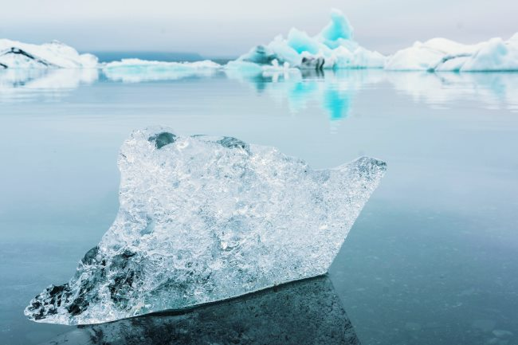

I was going to wait until spring before trying my first 5-day Fasting Mimicking Diet period, but I got impatient and went for it starting last Thursday. This post will cover my experience.

For those that need a background on the Fasting Mimicking Diet read these two posts:

-   [The Longevity Diet Book Overview](/2018/02/longevity-diet-book-overview/)
-   [Fasting Mimicking Diet Overview](/2017/12/fasting-mimicking-diet-overview/)

Instead of following the detailed macro and calorie recommendations in Dr. Longo's book, I decided to keep it simple. The most important thing is to keep protein super low for this period. The 2011 [Protein Cycling Diet](https://proteincyclingdiet.wordpress.com/article/protein-cycling-diet-11-2s3nmvrwklbxs-12/) has a page on calculating your upper limit of protein grams.

Their 20 grams is calculated as the boundary for a man weighing 154 pounds. At the start of my FMD, I weighed 203. Instead of bumping up my protein grams, I stayed with a 20 grams limit. Each day during the FMD, I would not exceed 20 grams of protein.

### Pure Fasting

What is less than 20? Zero. My concern was that if I tried to micro-manage low levels of calories early into the FMD, I might find it harder to be committed for 5 days. This concern may not be warranted. What I decided to do was to start the FMD with a pure fast. Not only zero grams of protein but zero calories as well.

I've done intermittent fasts of 16-24 hours probably 250 times in the past decade. However, I've never gone longer and I've never gone to sleep on an empty stomach. My belief was that I couldn't sleep if I was hungry. What I learned was that I could, but the sleep was not great, which was to be expected.

My hunger peaked at hour 22 on Day 1 and declined afterward to a steady level that was not distracting. The loud stomach rumbling only happened on Day 1.

On Day 2, I discovered what countless other fasters have discovered, hunger doesn't continue to rise. It actually falls a little. So I continued a pure fast until 9 PM on Day 3. During the FMD, I drank a lot of coffee, which Dr. Longo doesn't like, but without coffee, not only would I have never succeeded, I would never have attempted the FMD.

### Low Calorie, Low Protein

At the very end of Days 3, 4, and 5, I had a bowl of boiled potatoes with a pad of butter. Protein grams were well under 20. Probably closer to 12 grams.

I could have probably continued the pure fast for the 2nd half of the FMD, but I wanted to experience a few days of eating very low protein. During the pure fast, I got SUPER COLD. However, it just so happened that Seattle experienced a sharp drop in temperature at the same time. This is why I originally planned to start my first FMD in the spring. Cold and windy weather sucks for fasting.

_[Photo](https://unsplash.com/@emcomeau) by Ezra Jeffrey. Did I mention how cold I felt?_

### Activity

During the 5 days, my activity level was very low. I averaged about 5,000 steps a day. I also did stretching. Mostly I stayed immobile at home trying to stay warm.

### Results

It is impossible to know much my health benefited from a single 5-day FMD. Other than the skill of being able to deal with hunger, the only metric I can really discuss is my weight.

-   Day 0: 203  (morning before Day 1)
-   Day 3: 197
-   Day 6: 193   (morning after the end of FMD)
-   Day 9: 197

I placed my Day 9 weight here because it is something I see too many fasters not including. When you depleted your glycogen stores via fasting or ketosis, the water that binds to the glycogen is also lost. So when you resume normal eating, not only will your glycogen stores fill back up, but so will that lose water. Whenever you hear some Low-Carb fans talk about their amazing first week with carbs or how they gain the weight back when they resume eating carbs, this is what is going on.

See the post [Understanding Bodyweight and Glycogen Depletion](https://web.archive.org/web/20230531105448/https://justinowings.com/understanding-bodyweight-and-glycogen-de/) for a deeper explanation.

A 6-pound weight loss over 5 days is pretty awesome. Is it possible that some of that weight is muscle? Maybe, but I did lose almost an inch off my waist at the widest point. Muscle loss during fasting is a topic that is debated, but it is not a concern because I understand how muscle memory works. Muscle is hard to gain the first time, but easy to recover with training and calories. See the [Tim Ferriss](/2011/01/how-tim-ferriss-really-gained-34-pounds-of-muscle-in-28-days/) or [Mickey Rourke](/2009/01/how-mickey-rourke-gained-27-pounds-of-muscle-for-the-wrestler/) posts for details.

I will continue doing these 5-day FMD cycles using a combination of pure fasting and low protein fasting. They should get easier as the weather gets warmer.

---

## Comments

### seantheaussie
*February 23 at 2018 at 8:55 PM*

Glad to see the day nine figure as I agree that weighing yourself after a strict diet without refeeding produces a meaningless figure.

Personally I think having to pee without having ingested the liquid when on a strict diet is the only fun bit (utilization of bodyfat also produces H2O)

---

### norlee
*February 23 at 2018 at 9:19 PM*

it was my understanding from a podcast Dr Longo was on (I'm thinking it was Ari Whitten's) that you should also be in ketosis (as well as the low protein) when doing FMD? Of course maybe you were even eating potatoes if it was only the one bowl or maybe I misunderstood what I heard. Is there anything about being in ketosis in the book?

---

### MAS
*February 23 at 2018 at 9:24 PM*

@Norlee - Ketosis is not mentioned in the book. 

I do not know if I entered ketosis. If I did It was most likely at hour 72 after 3 days of zero calories.

---

### Jim
*February 23 at 2018 at 11:57 PM*

@MAS
Great info.  I'll have to try once the weather warms up.
I found an interesting series by Steve Pavlina on youtube (search steve pavlina 30 day fast).  He did a 30 topic video series (you probably won't be interested in the topics) concurrently with a juice fast.  For the first two minutes of each video, he starts with an update on his fast (then you can stop watching). 
If I'm ever having trouble on, say, day two of a fast, it's strangely inspirational to see how he was doing on, say, day 28. I think he eventually gets to 40 days.

---

### MAS
*February 24 at 2018 at 12:03 AM*

@Jim - I did watch one of his fasting videos. And a few others. They are inspiring. 

For me, I think cycling on and off makes more sense than doing a long fast. Trigger the burst in stem cells, then consume protein to put them to work. Then repeat periodically. 

@All - I just thought of something. I don't recall Longo stating how long the effect of increased stem cells lasts for. Hours? Days?

---

### Mark
*February 24 at 2018 at 11:02 PM*

Feeling cold while fasting is not unusual. I used to feel cold when I did 24-hour fasts and I often felt cold while doing my two Do-It-Yourself FMD's in January and February. I sometimes used hot baths to warm up before going to bed even though Valter Longo advises against it (probably because some people might faint); the hot baths definitely helped me.

I am fortunate to be retired so I didn’t encounter any work-related stress while on FMD. I walked 5 miles per day at a brisk pace although not quite as brisk as I walk on my non-fasting days. I probably went under the 800 calorie target eating mostly potatoes, mushrooms, onions, kale, sweet potato, avocado, and olive oil. And I didn’t stop my daily routine of taking one-quarter cup potato starch and 1.5 tablespoon of inulin. 

I plan on completing my third FMD within a 3-month window, and I have been following The Longevity Diet. I do lots of things for health and longevity so it is hard to know what is (or is not) bringing benefit. However, so far I am optimistic about FMD and The Longevity Diet. I have lost about 5 pounds and haven’t lost any strength.

---

### MAS
*February 25 at 2018 at 4:04 AM*

@Mark L. - Thanks for sharing your experiences. 

I do look forward to the summer when the heat of the sun can offset my lower body temp. :)

---

### Jim
*March 1 at 2018 at 5:58 PM*

@ALL
Kevin Rose podcast with Dr. Longo (including helpful topic index).
https://www.kevinrose.com/single-post/valter-longo

---

### Marc
*March 3 at 2018 at 8:35 PM*

https://www.consumerreports.org/dietary-supplements/heavy-metals-in-protein-supplements/

Protein powders are not the answer......Restricting protein during FMD looks better all the time.

marc

---

### Chris
*March 12 at 2018 at 10:11 AM*

Very interesting.

I've been thinking that a pure potato hack where you keep intake low - daily calories maybe 800 - is in effect a Longo FMD with the added benefits of all the RS.

---

