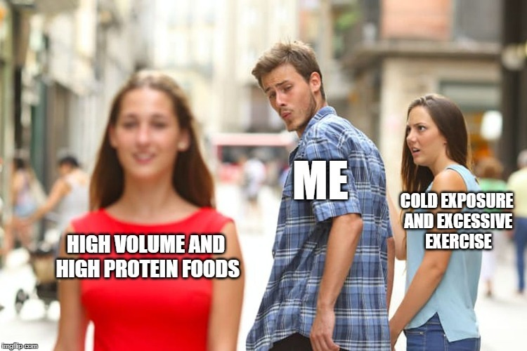

Now that I have enough experience with gaining and losing a few pounds over the years, I wanted to assemble all the ideas that have worked and those that haven't. This list is my experience, which may or may not match yours. The purpose of this post is to both remind me and perhaps to serve as a starting point for someone looking for guidance.

Standard disclaimer: I'm not a health professional. Just an enthusiast. I view health challenges with an [investor mindset](/2013/04/approaching-nutrition-from-an-investors-mindset/), meaning I use the best data available to me, but I also assume I have incomplete information. When I do try something ineffective, I don't double down and get stricter, I change course.

I also understand that fat loss is caused by a caloric deficit. But unlike the vast majority of people discussing fat loss, I see the challenge of keeping off the weight as equally or more difficult than losing it in the first place. So what works for me best will be strategies that use easy rulesets that minimize decision making and hunger, because I understand that willpower is not an unlimited resource.

Let's get started.

### What Works For Fat Loss

I'm organizing this list from most important to least important. These are all strategies that have worked for me.

1.  Really define the WHY. It is not enough to just wish that you were leaner. You need to want it. I've never lost weight when I didn't have the right mindset. Spend some time with your thoughts. Create a list of the reasons. Take this seriously, otherwise, you are wasting your time and likely to regain any weight you happen to lose.
2.  Once you have the why, create a story that is easy to understand and follow and aligns with your plan and your values. I cover this topic in the post [Using the Power of Story for Fat Loss](/2017/08/using-power-story-fat-loss/). Without a strong story, I believe compliance and motivation will fall.
3.  Get good sleep. Sleep is a skill and good habits need to be practiced. Without good sleep, all the ideas below will be much more difficult to implement. There are tons of resources online to help you. If you happen to wake up too early, see my [Better Sleep for the Too Early Riser](/2014/10/better-sleep-early-riser/) post.
4.  Measure your weight a few times a week. I use a tape measure a few times a week. When I measure, I make progress. When I don't, I slip.
5.  Stop snacking. This is a simple, yet powerful rule. I never dropped pounds when I was frequently snacking.
6.  Remove trigger foods from grocery purchases. These are high-calorie foods that you know you will overconsume if they are in the house. For me, those are cheese and ice cream.
7.  Reduce daily eating window. When do you eat your first bite of the day and when do you eat your last? I know I will gain weight at a 15-hour window and lose weight with an 11-hour window. Find your optimal eating window.
8.  No liquid calories. It is way too easy to overconsume calories that we drink. For me, I don't drink any calories when I want to lose a few pounds. Alcohol and colas are likely the worst offenders, followed by some fruit juices. Veggie drinks are likely fine. I don't have a juicer, so I don't need to make this decision.
9.  Eat higher volume food. Some foods are high in volume and low in calories. These are the opposite of processed foods. Potatoes, oats, whole grains, and legumes are examples. Do a search on Volumetrics for more ideas and resources. The higher volume strategy is the basis for my [Peasant Diet](/2016/11/designing-modern-peasant-diet/) and the [Potato Hack Diet](/tag/potato/).
10.  Increase protein. Protein is highly satiating. I believe it is the real reason why low-carb diets work. When you cut the carbs, you tend to add foods with higher amounts of protein. Whenever I have made a conscious effort to increase protein, I lose weight. Every time. Read [Just Count Protein For Fat Loss](/2014/07/just-count-protein-fat-loss/) for more info.
11.  Cook more at home. Eat staples. Prepare meals in bulk. Regardless of the diet you choose, repeating the same meals takes a lot of the decision making away from the process.
12.  Baseline exercise. I've always done some form of exercise, so it is hard to say how much of a role baseline exercise plays in fat loss, but I do recall the times when I was completely sidelined with an injury as times when I would gain some weight. I define baseline exercise as walking 5-7,000 steps a day plus at least one light strength workout, which could be as simple as bodyweight squats and push-ups.
13.  [Intermittent Fasting](/tag/intermittent-fasting/) (IF). I did have some success with IF, but not as much as gradually reducing my daily eating window.

### What Doesn't Work For Fat Loss

Again, this is my list and some of these ideas have worked for others.

1.  Frequent Small Meals such as The Zone Diet. At first, I got leaner on The Zone, but eating 5-6 meals throughout the day gradually ramped my appetite to the point I was always thinking about my next meal. Being able to plan a diet is essential for a diet to succeed. The more planning a diet requires, the harder it will be to execute. Planning 3 meals a day is easier than 5-6. It is that simple. I do understand that frequent meal diets are highly effective for very overweight people who go many hours without eating only to binge, but for people with normal hunger hormone levels, I am not a fan.
2.  Cold exposure. Sorry, Ray Cronise, but my experience is that [cold exposure](/tag/cold/) is almost worthless for fat loss. I am still a fan of cold exposure for building resiliency, but not for leaning out. As others have pointed out, [cold exposure makes you hungry](https://muscleevo.net/freeze-your-way-to-a-six-pack/). Indirectly, however, if cold exposure toughens you up to the point you are more comfortable with hunger then it could help. I remain unconvinced it would have anything but a minor role in fat loss. _\* See the 2021 update at the end of the article. \*\* And the 2023 update._
3.  Organic Grass-fed Farmers Market Heirloom Whole Paycheck eating. I'm going to explain this comment in much greater detail in a [future post](/2018/04/fear-of-a-toxic-planet/), but the short version is buying higher-quality foods will not make you leaner unless those foods have fewer calories. I know many people who make a decent living and want to spend their way to better health without making true sacrifices that would require willpower. The high amount of money they spend on groceries never seems to make a dent in their weight.
4.  Above baseline exercise. Sorry Brotards, but in the real world and not your 12-week studies with untrained college men, people respond to higher levels of activity with higher levels of hunger. Not at first, but eventually. The fact it doesn't happen immediately makes it look like exercise is a potent fat burner. It is not. See [Exercise and Fat Loss Revisited](/2015/04/exercise-and-fat-loss-revisited/). And for the record, I am a believer in the health benefits of exercise, just not when it comes to fat loss.

If you decide to try some of the ideas on this list, my advice is to roll in a few ideas at a time. Changing too many things at once is likely to be overwhelming. Plus, why add additional restrictions if you can see progress with just a few ideas?

UPDATE FEB 2021: I may have been too harsh on cold exposure. If it is combined with calorie restriction and you keep exercise to the minimum, it may not spike appetite. It probably still works best for men and men with greater mass. I'm going to move this idea into the maybe category.

UPDATE DEC 2023: I was correct that cold exposure is a poor tool for fat loss. See the post [Temperature and Appetite](/2023/10/temperature-and-appetite/).

---

## Comments

### Stuart
*February 18 at 2018 at 7:55 PM*

MAS,
          Just curious, but what is your exact training regime at the moment? Including all the non essential ( eg to the store etc ) walking that you do?
   I was thinking that a good post, which I'm sure many of your readers would love to read, would be one summing up the changes in your training approach over the years. Perhaps with sample weekly schedules from each of the different phases of your training life? It would be good to take an analytical glance at the development of your approach and focus on mistakes and successes. What do you think?

---

### MAS
*February 19 at 2018 at 1:35 AM*

@Stuart - I'm not interested in blogging about fitness routines. Been there, done that. I don't have a routine now. 

https://criticalmas.org/2017/12/3-types-fitness-conversations/

---

### Andy
*February 19 at 2018 at 4:02 AM*

Good list man. I appreciate your content. I am going through a fairly extreme change of habits at moment and it was comforting I guess, knowing I’m on a well worn track by a few people with good results, not just the same old crap trotted out. Especially the first two, the psychological component is so so important for a very lazy, very well fed individual such as myself. Keep up the great work mate

---

### MAS
*February 19 at 2018 at 3:50 PM*

@Andy - Thanks and best of luck!

---

### MAS
*February 23 at 2018 at 4:17 PM*

@All - Updated the list. I added "Measure Weight". It is super important!

---

### Mitch
*March 17 at 2018 at 4:11 AM*

I'm having good results doing 2-3 brief kettlebell workouts per week and doing time restricted eating per Doctor Satchin Panda. I go at least 13 hours without eating from Dinner till late morning or early afternoon the next day.

---

### Julia
*December 17 at 2020 at 5:56 PM*

I've omitted Dairy, Wheat, Soy, and Sugar from my diet for the month of December - no Christmas cookies for me!! We'll see how it goes...Honestly, I don't feel like I'm depriving myself, at this point: there's lots of delicious foods that omit the above four. And I'm not bored of those foods yet. Just enjoying me new eating, atm.

---

