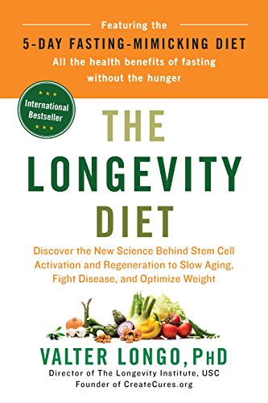

In December I posted [Fasting Mimicking Diet Overview](/2017/12/fasting-mimicking-diet-overview/), which was a collection of notes I took from a podcast interview with Dr. Valter Longo. The short version of that post is that by engaging in a low-calorie, very-low protein "fast" for 5 days, one could reap many regenerative health benefits.

I really loved the interview and because I had a deep interest in this topic and wanted to learn more, I read his recently published book _The Longevity Diet_.

_The Longevity Diet: Discover the New Science Behind Stem Cell Activation and Regeneration to SlowAging, Fight Disease, and Optimize Weight_

The book covers two diets:

1.  The Longevity Diet
2.  The Fasting Mimicking Diet (FMD)

The Longevity Diet is basically a low-protein mostly vegan diet with some fish. The diet is also low in sugar. Complex carbohydrate sources are recommended. Olive oil and nuts are ideal for fats.

The Fasting Mimicking Diet is the low-calorie "fast" diet that one does for 5 days that was outlined in my [December post](/2017/12/fasting-mimicking-diet-overview/). How many times a year a person engages in the fast will depend on their health status. People in worse health (obesity, autoimmune, high-risk for cancer or other serious ailments) may do the FMD monthly, whereas a top athlete might do it once or twice a year. Everyone else, somewhere in between.

The book was clearly written for the average person that doesn't dig into the health literature as much as we do. The book is only 217 pages worth of content before you get to the menus in the Appendix. Even at this short length, the core ideas are repeated over and over. This is probably good for someone concerned about their health that needs their handheld through these ideas.

For me, I felt the book was fluff compared to the Found My Fitness interview, which dug deeper into the topic. The questions I wanted to be answered in the book weren't. There were also statements made in the book that were never backed up. Some examples:

-   As someone dealing with an injury now, I wanted to know the role stem cells might play in repair. This also extends to exercise recovery. Not covered.
-   How stem cells work is never really explained. Because it is the very foundation of the book, I felt that it was a gross oversight. **Why would an expert on stem cells that finally has an audience with the general public assume that their knowledge of what stem cells can or can't do is accurate and complete?**
-   I'm also interested in skin health, as readers of my October posts on [sunscreen](/2017/10/paleo-wrong-sunscreen/) know. At one point, Longo states a patient that did his FMD Diet had "glowing skin", with no follow-up explanation. Why was her skin glowing? What was the mechanism? There was also a mention of skin cancer with no follow-up. You'd think any book on longevity would address skin health, but it doesn't.
-   Throughout the book, we are told to avoid bad fats, which are listed as saturated fats and trans fats. **Why do health writers always put saturated fats in the same sentence as trans fats?** Trans fats are not saturated fats, they are unsaturated. Everyone knows trans fats are bad. I was hoping to get the opinion of a longevity researcher on specifically why saturated fats are bad. Nope. They got lumped in with trans fats. Guilty. Maybe saturated fats are bad for longevity? If they are, I didn't learn why from this book.

I still am interested in trying the Fasting Mimicking Diet and even incorporating some of the food recommendations in The Longevity Diet. However, The Longevity Diet could have been a much better book.

UPDATE: [I Completed My First 5-Day Fasting Mimicking Diet](/2018/02/completed-first-5-day-fasting-mimicking-diet/)

---

## Comments

### Tim
*February 7 at 2018 at 6:16 AM*

Thanks for the honest review, MAS.  I corresponded a bit with Longo last year, he was totally uninterested in gut health, bacteria, yeast, fiber, etc...  I was very surprised by his very narrow view of diet and health.  I think he is more interested in selling his very expensive "medical food" pouches of low calorie soup (to be administered by health care professionals, lol).  

An examination of his recommended FMD nutrients made me realize that the Potato Hack is the best thing going when one wants to cut calories drastically for a short time.  Longo cut off contact when I mentioned this to him, haha.

What's next?  Potatoes by prescription only?

I agree that a longevity diet should be comprised mostly of plants, some meat, and good oils such as olive and coconut.  Isn't that called the Mediterranean diet?
Later!

---

### Marc
*February 7 at 2018 at 6:40 AM*

MAS,

I concur. I have the book......not many new ideas.

The potato hack, peasant diet, rice diet may be better ways to implement low calorie fast diets. A peasant diet combined with minimal strength training, minimal sprint interval training, and lots of medium intensity activity ....(I like practicing line dancing LOL) or aerobics or hiking.....along with myriads of other activities to enjoy.

To my dismay he does not explain the RAS/PKA pathway ... and the inclusion of oil on his fast days  may cause more harm than benefit,  and is left unexplained also. Oil is a cause of inflammation and harmful to the endothelium, the innermost lining of the artery. Oil is calorie dense, and without nutritional value to a very large degree, and contain no fiber. I think this is not his best effort.....and Steele is the MAN.

---

### MAS
*February 7 at 2018 at 3:19 PM*

@All - I just thought of another criticism.

He says:
- eat whole grains (major source of calories)
- but don't eat bread
- and avoid rice as it is a simple carb

What does that leave us with? I'm guessing things like ancient grains. Some of which are talked about on Tim's website. 
http://vegetablepharm.blogspot.com/2016/08/whole-wheatkamut-and-farro-review.html

But wait! 

Longo also speculates that one might want to avoid eating foods that our ancestors didn't eat. I think quinoa was cited as an example. Only his reasoning here is pure speculation with no evidence. 

This all left me wondering, what complex carbs is he talking about? So I jumped to the menus to see pasta, rice, and whole wheat bread making appearances. I'm sure we can figure out a way around these inconsistencies, but the average reader has to be puzzled.

---

### MAS
*February 7 at 2018 at 4:01 PM*

@Tim - Early in the book, Longo mentioned how early in his career his ideas didn't get respect and he was mostly ignored. By ghosting you and your ideas, he is doing exactly what happened to him. 

@Marc - Excellent point about the oil. That might be his Italian bias shining through. In this case, maybe he considers that the longevity cases are more important than the nutritional science?

---

### Tim
*February 7 at 2018 at 4:37 PM*

I am 100% convinced that "whole grains" are vital for human health, and that "bread" is mostly bad.  The way I reconcile this inconsistency is to make my own whole grain sourdough bread using organic whole grain flours, eating oatmeal (groats and steel cut, mostly), incorporating seeds (flax, quinoa, chia) into my diet, brown rice mostly, and lots of beans and potatoes.  Potatoes and beans are nearly "grain." 

I shun store bought bread, but if I have to get some, I like the Ezekial type sprouted breads that are sold in the freezer section.

---

### Mark
*February 7 at 2018 at 11:22 PM*

I am skeptical of the 12-hour eating window and a few other things in Valter Longo’s book, BUT I expect to MAJORLY BENEFIT from applying 2 concepts. First, the concept of occasionally mimicking fasting for 5 days by severely restricting protein while reducing calories may bring significant rejuvenation. (I mimicked his Fasting Mimicking Diet in early January.) Secondly, a low protein diet is associated with longevity in the Blue Zones so I have some confidence that being a “vegetarian who eats fish 3 times a week and occasionally eats some meat” won’t hurt longevity.

---

### MAS
*February 8 at 2018 at 2:52 AM*

@Mark L - I agree. I also still think his core ideas are solid.

---

### Marc
*February 8 at 2018 at 4:13 AM*

I want to amend my above remarks.  Dr Valter Longo did discuss PKA on page 57. 
He related that PKA is activated by sugars. Then on page 60 he states to minimize sugars, and maximize complex carbohydrates. Thus, I surmise that elevated glucose levels are primarily related to elevated PKA levels.....simplified version.  Complex carbohydrates like potatoes do no elevate glucose like simple sugars would. Of note...all exercise...especially high intensity exercise empties glycogen reserves in the muscles and regulates glucose levels downward. Longer, medium intensity aerobics burn even more glucose and the resultant decrease in PKA. The key is lowered normal blood glucose levels....ie.... and increase cellular insulin sensitivity.

It is easy to get below the magic 4 % protein........just add butter to the baked potato......to reduce the overall ratio of protein to calorie content.

And the kicker, decreasing glucose may not be the key.....yes  I have read of the Warburg effect.....cancer cells need glucose ....BUT...in glycolysis of glucose....lactate is formed....which may nourish cancer. Thus, athletes, or those who just exercise, are able to clear lactate in the bloodstream better. Exercisers have lower cancer rates. Exercisers have lower glucose levels....and better insulin sensitivity. Aha moment.

This seems a better approach.....although a low carb fast period of 5 days accompanied with a low protein diet might give desired results. A 5 day period of slightly elevated dietary fat that Longo prescribes is unlikely problematic.

@ Tim Steele,
I am attempting to perfect sourdough bread much like Jack Bezian reportedly has.

---

### Marc
*February 8 at 2018 at 4:20 AM*

BTW, a Longo pescatarian diet would be high in the amino acid methionine, which has been associated with cancer.....true or not.

---

### MAS
*February 8 at 2018 at 4:28 PM*

@Marc - Your 4% comment has me revisiting the Protein Cycling Diet online book. 
https://proteincyclingdiet.wordpress.com/article/protein-cycling-diet-2s3nmvrwklbxs-1/

Unless I'm wrong, the 4% number is based on normal calorie levels for a given weight, right? Whereas Longo is using a restricted calorie protocol. Which brings up another question: Why would the restricted calorie levels on the FMD be the same for everyone? 

The plan right now is to navigate a best first guess. Get protein under 5% and reduce calories. Repeat for 5 days.

---

### Marc
*February 8 at 2018 at 8:23 PM*

MAS

1) Yes....."the Protein Myth" chapter 10.....~25 grams for a 170 pound man

2) Longo's 9-10% protein of a 800-1000 calorie diet is roughly 75-100 calories devoted to protein....give or take a few calories. There are 4 calories per gram of protein......so......100 divided by 4 is ~ 25 grams of protein.......bingo........I'm sure he did not arrive his total from the above

3) there are so many myths regarding dietary protein....that dispelling some of these myths on this web site may cause some to not visit here.

4)  the body can recycle  proteins and make them complete. Around 200 grams of endogenous protein can be recycled and added to the 25 grams of fasting dietary protein per day

---

### MAS
*February 9 at 2018 at 12:13 AM*

@Marc - Thanks for doing the math. That confirms my thought that one could increase the calories provided they kept the protein even lower, which was your "add butter to potato" idea.  

That online book is an awesome resource, especially the charts showing how long it would take autophagy to do its trick based on the number of low protein days.

---

### Marc
*February 9 at 2018 at 4:31 AM*

That online book

https://proteincyclingdiet.wordpress.com/article/protein-cycling-diet-2s3nmvrwklbxs-1/

is great!

Tim Steele should write an  article on a 5-day fasting mimicking potato diet.....with butter....LOL.....but before that...we need a great recipe for long fermenting sourdough bread.

Chapter 13 is interesting in that one can use certain properties (protein availability ) to minimize protein content.....ie toasting bread....and that certain essential amino acids can be the "limiting" factor. 

"From the food table we can see that unenriched white bread has a protein calorie percentage of 11%. Since lysine is limiting in wheat at 45%, the effective percentage is 11%*45%=5%. Slice it thin and toast it dark and the percentage may perhaps drop to 4%.  Add a 100 calorie 0 gram protein pat of butter and the effective percentage drops to well below the magic 5%."  

Of NOTE: the limiting protein in white potatoes is isoleucine  at 60%....wheat (sourdough bread) is limited by lysine is at 45%..........the cogs should be turning now.

---

### Tim
*February 9 at 2018 at 4:59 AM*

Done and done, lol.

https://potatohack.com/2016/12/02/fasting-circadian-rhythms-and-the-potato-hack/

http://vegetablepharm.blogspot.com/2018/02/spelt-sourdough-bread.html

---

### Marc
*February 9 at 2018 at 5:51 AM*

@ Tim

Thanks  x 2!

I'm experimenting with Idahoan original mashed potatoes.....I wished there was a way to omit the milk in the recipe.....for mashed potatoes and potato pancake waffles.

I love hash brown with onions and garlic!

---

### Marc
*February 10 at 2018 at 5:16 PM*

Further thoughts on chapter 13:

After looking at protein availability........bioavailability.....unless someone can explain differently....this is not based on science.....rather BA seems like an attempt to compare vegetable protein to an imposed "standard" of animal protein or supplemental  protein powders.......perhaps marketing political NONSENSE at best! 

Chapter 13 is of no value.

The main problem is this:

Recycled endogenous and dietary protein are mixed in the intestines to make ALL necessary amino acids for muscle growth. Thus, essential amino acid profiles of a dietary food could never be a limiting factor of overall protein synthesis,  as the recycling mechanism supplies all the essential amino acids that are necessary. Furthermore,  the intestinal tract maintains a remarkably similar ratio of essential amino acids.

---

### John
*December 12 at 2019 at 2:16 PM*

I like this post, and the secret of long and happy life has been discovered by Ph.D. Allen Omton and Serge Dobrow. They found the hidden in human’s mind internal program that needs to be activated to keep you out of suffer and death.
John Logger

---

