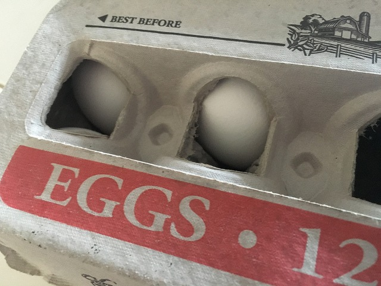

In previous posts, I've discussed my Peasant Diet. It is a way to use cheap unprocessed foods that are higher in nutritional quality to get lean or maintain a lean weight. The foods tend to be higher in volume and lower in calories. The foods are not hyper-palatable. Potatoes, beans, oats, and eggs are staples. The reason the Peasant Diet works for me is that it aligns with my values. I'm also able to create a story that is easy to understand, easy to follow, and motivating. I cover that topic in the post [Using the Power of Story for Fat Loss](/2017/08/using-power-story-fat-loss/). How do I deal with cravings? There are two tricks I use. The first I explained in the post [How I Beat Food Cravings on the Peasant Diet](/2017/09/beat-food-cravings-peasant-diet/). I called this the "BUT FIRST" strategy.

1.  I acknowledged the craving.
2.  I imagined fully indulging in the craving.
3.  I decided I would engage in the craving.
4.  BUT FIRST… I had to eat a pound of cold boiled potatoes, which were already prepped in the refrigerator.

I called step #4 the emergency brake. It was a rule that I pre-decided that I would automatically execute. The effect is always that the craving drops and I can stay compliant with the Peasant Diet. Doing this repeatedly makes it even easier. It is building a skill. Now here is the second trick.

### Price Knowledge

Modern foods will always taste better than Peasant foods. But Peasant foods will almost always win on price. Unlike other diets which focus in on calories or carb counts, the number that is going to serve you best will be the price. Peasant foods are filling and dirt cheap. I bought a can of black beans this week for 70 cents. A 15-pound bag of potatoes at the restaurant supply store is less than $4. A pound of 97% lean ground turkey is $2. A dozen eggs are less than $2. I can probably rattle off 100 other prices that I know.    _Ghetto Eggs by me_ With those prices in my head, I now can quickly calculate the true cost of indulging in a modern meal. If I go to Mod Pizza, that will cost me $10. How many eggs did that cost me? More than 60. Or I can envision 30-40 pounds of potatoes. Maybe a 5-pound turkey meatloaf that would have fed me for days. Although $10 isn't a lot, the food equivalent is tremendous for a Peasant. The Peasant is fighting back against the endless choice of calorie-dense foods using traditional foods. Not only is the peasant getting leaner in this rebellious act, but the peasant is also getting paid for their effort.

### The True Cost of Free Food

There is a potential issue with the price focus. Free food. Would a Peasant take free food? Probably. I've worked in offices where we were fed free food. Bagels or pizza or whatever calorie-dense thing that they could entice us with. Here the modern Peasant would need to step back and see the true cost. Are you trading your loyalty to a company, organization, or individual for free food? How much is your time worth and how much will that loyalty cost you? Free food is rarely free. When I was in college I worked at Pizza Hut. I noticed early on that the longer the employees had worked for the company, the fatter they were. Every shift or so, a pizza or two that couldn't be delivered to a customer landed on the table for the employees to wolf down. All that free pizza landed on the waistline of the employees, some of which had to buy new larger pants. The free pizza was never truly free. You just paid for it later. Recognizing this fact will save you many thousands of calories in your life.

---

## Comments

### Geoff
*February 12 at 2018 at 10:05 PM*

MAS

I think this is one of your greatest posts.  So simple yet so profound.  The Paleo story wants us to ignore the existence of modern foods: "Paleo man didn't have pizza.  So you don't either."  Your view embraces their existence yet deflects them.  Well done.

Though maybe those of us "working for the man" should adopt the Victorian diet - Would you really eat that free pastry or pizza if 10 minutes later your boss had a 50 pound package for you to deliver a mile away in 10 minutes?

---

### Sparky
*February 13 at 2018 at 1:04 AM*

Hi MAS
Always enjoy your posts.  One thing you might want to add to your strategy is mentioned in Why You Eat What You Eat by Rachel Herz.
Find a scent that reminds your mind of something non food related in a powerful way, and use it when you are wanted to snack or munch.  
She says it 'confuses' the mind and will make it focus on other things.
Worth a try.
You can watch her segment on cspan
its here https://www.c-span.org/video/?440485-1/why-eat-eat

---

### t.
*February 13 at 2018 at 2:41 AM*

funny...I did that just now.  Was seriously thinking about getting a delicious locally-made sandwich and instead ate 4 eggs.  The craving is gone but gotta admit it is hard not to indulge when the mood strikes.

---

### MAS
*February 13 at 2018 at 6:09 PM*

@Geoff - Thanks.

@Sparky - That is a cool trick. I'll try to think of some scent to use. 

@t. bondurant - It just takes practice. Make the decision ahead of time on how you will respond and then when you get the cravings, immediately execute that decision.

---

### MAS
*February 14 at 2018 at 7:43 PM*

@All - The video Sparky linked to is well worth your time. I plan to read that book this year and post on it.

---

