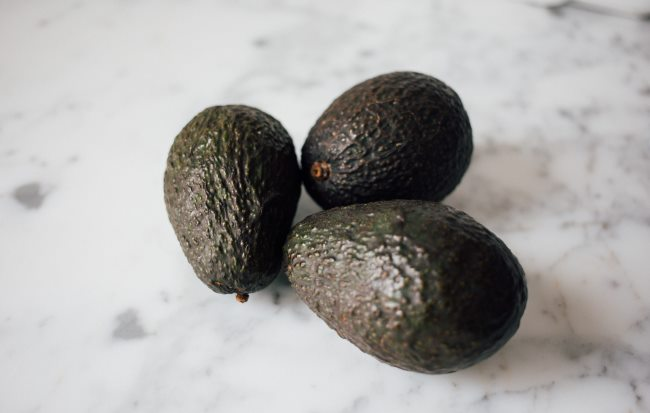

I was a bit critical of the Longevity Diet Book. Dr. Longo sold me on the merits of doing a Fasting Mimicking Diet during [his interview on Found My Fitness](/2017/12/fasting-mimicking-diet-overview/), but I wasn't a fan of the book. I thought it was too dumbed down and it didn't explain some core concepts I felt were important. **Book Review: [The Longevity Diet Book Overview](/2018/02/longevity-diet-book-overview/)** I didn't buy the book. I got it from the library, read it in 2 days, and then returned it. So I no longer have the book in front of me to check what I am about to post.

### Non-Fasting Optimal Diet

A few days ago, I listened to [Dr. Longo's interview with Ari Whitten](https://overcast.fm/+I32KNBuvo). In the interview, I felt Longo did a better job of explaining his standard optimal diet, which is mostly vegetarian with some fish. The diet he believes is best is low in sugar and low in saturated fat. To be clear, this is the diet you follow when you are not doing the Fasting Mimicking Diet. Longo explained his reason as being based on epidemiological studies. The populations with the longest life expectancies consume mostly seafood with little animal protein. He makes the point that organic grass-fed meat might be perfectly healthy, but we don't have data at this point to support a longevity claim for eating in that manner. Maybe I missed it in the book, but I felt he explained his reasoning better in the interview. I can respect this stance completely. Longo is an expert on what happens to the body when cells are deprived of amino acids and how we trigger repair processes. Nobody is really an expert on what the optimal diet is for longevity, so he decides that a basic Blue Zones diet is the default optimal. There may be better options, but there is no evidence yet. So if decades from now we start seeing keto people outpace the rest of us in longevity, we can reexamine the Blue Zones diet as the default optimal. Fair enough. Side note: I suspect the longevity benefits of the Blue Zones are mostly due to strong social bonds, which in my opinion would be easier to form if you lived in beautiful weather year-round along the ocean.

### Is Ketosis Required?

This is another question that came to me at the end of my Potato FMD: Do the full recovery benefits of the Fasting Mimicking Diet require the person to be in ketosis? Is that signal necessary? The hack that I have been posting about here uses potatoes to stay under 20 grams of protein, which is low calories and very low protein, but not ketogenic. [The Potato Diet Version of the Fasting Mimicking Diet](/2018/03/the-potato-diet-version-of-the-fasting-mimicking-diet/) My hack observes the low protein requirements, but not the low glucose requirements. I recall not hearing a good case on restricting glucose to trigger autophagy and apoptosis. I was more swayed by the math described in the [2011 Protein Cycling Diet book](https://proteincyclingdiet.wordpress.com/article/protein-cycling-diet-2s3nmvrwklbxs-1/). But does the ketosis signal itself play a role in repair? More specifically, ending the ketosis signal. Would someone get a greater repair response - perhaps more stem cell production - coming out of ketosis? I do not know. Anyone? My plan is to do the 2 avocados a day approach on my next FMD. Then I will be ketogenic and in full compliance. But I would still like to know.  _Photo by [Charles Deluvio](https://unsplash.com/@charlesdeluvio)_

### Is it Working?

I talked to a few people about this diet. People with issues could benefit from trying it. They showed no interest. The big reason is people want to be rewarded for making a sacrifice. With the FMD, you are taking a leap of faith that processes you don't fully understand will improve your health in some manner that you can not measure. This is not true for the truly sick. People with chronic illnesses or near the end of life will be motivated to try anything. But very few other people will. Someone asked how would I know if I benefited from the Fasting Mimicking Diet. I said I didn't know. There won't exist a copy of me that doesn't do the FMD that I can compare myself to. In the future, I believe we will have methods to measure so many health markers that we will be able to get real-time scoring of the body's repair processes. Getting those numbers will be the needed motivation for the general public. Until that day comes, I think the only people that will do this form of protein-restricted fasting will be the very ill and health geeks like ourselves. And many of us will lose interest as some other diet catches our eye.

---

## Comments

### Jim
*March 24 at 2018 at 4:17 PM*

For those not familiar with Longo's work, he attempts to use a "Five Pillars" approach in formulating his diet.  The blue zones are the fourth pillar.
1. Basic research.
2. Epidemiology.
3. Clinical studies.
4. Centenarian studies.
5. Studies of complex systems.
Short summary--https://www.mindbodygreen.com/articles/want-to-live-longer-heres-what-you-need-to-know-about-longevity

---

### Tim
*March 24 at 2018 at 5:48 PM*

Seen?  https://medicalxpress.com/news/2018-03-calorie-restriction-trial-humans-benefits.html

---

### Richard
*March 24 at 2018 at 5:59 PM*

I just read a pop health/beauty book by Naomi Whittel where she recommends intermittent fasting and alternating high and low protein days to induce autophagy. I wouldn't recommend it at the hardcover price but I found a few things that made it worth the $.99 kindle one.

https://www.amazon.com/Glow15-Science-Based-Weight-Revitalize-Invigorate-ebook/dp/B0777C3VZM/ref=sr_1_1_twi_kin_2?ie=UTF8&amp;qid=[phone removed]&amp;sr=8-1-spons&amp;keywords=glow15&amp;psc=1

---

### MAS
*March 24 at 2018 at 6:12 PM*

@Jim - Thanks for the notes. 

@Tim - Yes. I'm not convinced that a slow metabolism equals a longer life expectancy. I think there is much more to the picture. Fewer calories might mean reduced protein, which feeds into Longo's work. But what if you could have both? A high functioning youthful metabolism along with the longer life expectancy? It would be some form of a cycle that alternates between growth and repair. FMD fits nicely into that equation. 

@Richard - I think that is a start, but what Longo is proposing goes much further. 

A single day low protein will get you some autophagy, but at 5-days you go into apoptosis, which is the killing off of the damage cells, forcing them to regenerate as new once the body receives protein. Based off of my reading, Longo's method seems like it would have the strongest recovery response.

---

### Jim
*March 25 at 2018 at 3:25 PM*

RE: @Tim's post re Calorie Restriction.
Just read that Longo was influenced by, and worked with, Roy Walford, who was a pioneer in calorie restriction research. (Walford may be best known for the Biosphere project).

---

### Mark
*March 26 at 2018 at 3:41 AM*

Here are some of my comments related to the MAS statement: “not hearing a good case on restricting glucose to trigger autophagy and apoptosis”. 

I think Valter Longo states that the severe protein-restriction during FMD resets the MTOR pathway to slow down aging. Maybe a greater restriction of carbs than what MAS and I have been doing during our FMD’s will similarly reset the RAS and PKA pathways related to sugar. 

However, like MAS I decided to increase the ratio of carbs to fat (compared to the Prolon FMD food box) during a 5-day Do-It-Yourself FMD because potatoes, onions, sweet potatoes, and sauerkraut satisfy me, and I can easily make my meals. I also broke from standard instructions by eating all of my 800 calories in one meal about 5 pm. 

Perhaps another reason for increasing the carb to fat ratio when doing FMD is that the ratio of “energy obtained from carbs” to the “energy contained from fat” would be smaller than the ratio of “carbs eaten” to “fat eaten” because one is getting considerable energy from one’s own body fat. I don’t know if I was fully ketogenic because I haven’t been interested in the ketogenic fad; however, I have been losing body fat and have other common symptoms of fasting such as low energy and bad breath.

Continuing to eat low protein after the FMD as recommended in the Longevity Diet is also supposed to help health-span and life-span. I found it interesting that Longo thinks a 130-pound person can only use 30 grams of protein at a time for growth/repair.

Diets in the Blue Zones seem to be high in carbohydrates so eating lots of complex carbohydrates for most days seems to be a safe bet for health-span and life-span. 

I am completing my third Do-It-Yourself FMD today. I try to do a lot of walking during my FMD’s so that my body has to get energy through autophagy and apoptosis. I notice that I have less energy and strength during a FMD, but fortunately I have not had any extreme roughness although my experiences vary day to day. On Day3, I had much more energy than I expected so I accomplished household tasks, walked 8 miles, and kayaked. On Day4, I walked much slower, I had a slight left kidney ache, and I didn’t feel like getting out of my recliner once I sat down. Today is Day5, and I walked rather slow today, but I felt good otherwise and was motivated to do things even if at a slow pace.

One of the motivating tidbits for doing my FMD’s was learning that I would be getting energy by the autophagy of malfunctioning white blood cells and that healthy white blood cells would subsequently be created when refeeding post-FMD.

---

### MAS
*March 26 at 2018 at 3:10 PM*

@Mark - Thanks for sharing. Your comment reminded me of something Richard Nikoley once said. He said, most diets are higher fat diets once you add in the calories being contributed by body fat. 

My goal is to do FMD #3 in April using 2 avocados a day. Then decide which one is best for me or perhaps use a cycling strategy between the 3 methods (pure fast, higher carb, higher fat).

---

### Techdiverdown
*March 27 at 2018 at 9:45 AM*

Wondering how strength workouts are going for folks on FMD? I’ve been able to go from 220 to 195 in about 8 months using IF and the potato hack. I’ve been able to keep my strength, but certainly have not increased it. I do 2 kettlebell workouts per week of about 30 minutes along with some pull-ups. I cycle on weekends and get in 5000-10,000 steps per day. I’m a programmer so I sit or stand all day. Happy with the fat loss, about 3 inches off my waist but not so happy with my lack of strength gains.

---

### MAS
*March 27 at 2018 at 2:30 PM*

@Techdiverdown - I would not expect strength gains on the FMD. 

The body cycles between growth and repair cycles. The FMD is forcing a deep repair cycle. During this time, I would expect strength to slightly decline. But this is fine and to be expected. 

An analogy that just came to me is cleaning an office. When you stop working to clean your office, it is likely that you will get further behind in your tasks, but by the cleaning that office, you are creating an environment that will enable more future productivity. 

If I were in a strength gaining phase and I was still making noticeable gains on a regular basis, I would delay starting the FMD. Then once I plateaued or got injured, I'd start the FMD. Growth and repair. 

I believe the underlying reason for the FMD (and other fasting protocols) is that we are always in growth mode. Some will go to good things such as muscle and some will go to bad things such as fat or degenerative diseases. 

In another post, I mentioned that I had no concern about losing some muscle because muscle has memory and I could get in back quickly and if my body was in a position to recover faster from workouts and injuries, the long-term potential is likely greater.

---

### Ashlee
*March 27 at 2018 at 8:27 PM*

I'm really trying to understand the apoptosis aspect.  You're saying it takes 5 days of a strict fast (or at least a FMD with low-protein) in order to get to the stage where your body is killing off the cells in a hormetic way? Thank you for your work!

---

### MAS
*March 27 at 2018 at 11:52 PM*

@Ashlee - Thanks.  

I found this excellent explanation, which covers apoptosis.  
https://newlifelongevity.com/anti-aging-fasting-and-autophagy-part-1-how-autophagy-works/

---

### Ashlee
*March 28 at 2018 at 6:28 PM*

That article was great - the forest analogy really helped me picture the process.  I just need to ask one more set of questions on this, and then I'll stop, so as not to become annoying. : )
So, if I eat 2 avocados a day for 5 days, I'll reach apoptosis.  I could exercise for the first day or so, but should back off deeper in the fast.  Coffee and tea are okay, but no cream, yes?  Then, break my fast with mainly high quality protein for stem cell growth, yes?  Could I replace the avocado with green vegetables or lettuce + olive oil + vinegar, or does that change up the macro partitioning too much?  Okay - no more questions : )
P.S.  Been visiting your blog for several years now and I love your straight-forward style, well-researched ideas, and interesting topics.  I kinda miss your exercise &amp; fitness stuff, though, but I understand why you stopped discussing that.

---

### MAS
*March 28 at 2018 at 6:39 PM*

@Ashlee - I'm no expert. Everything I am posting related to this is based off keeping your protein intake super low. Just add your foods up. 

I forgot where I read the avocado idea, but the math works out. 322 calories and 4 grams of protein. Double that and you are still following low protein.

Longo does not want people drinking coffee during the fast. But if it weren't for coffee, I wouldn't even try the fast, so I'm doing the best I can for now. Maybe in the summer, I can try the FMD without caffeine. Not yet.  

Also, read or skim this book for ideas.
https://proteincyclingdiet.wordpress.com/article/protein-cycling-diet-2s3nmvrwklbxs-1/

---

### Tim
*March 30 at 2018 at 4:23 PM*

Interresting.  https://medicalxpress.com/news/2018-03-dietary-supplement-reversing-cardiovascular-aging.html

"But a new University of Colorado Boulder study published today indicates that when people consume a natural dietary supplement called nicotinomide riboside (NR) daily, it mimics caloric restriction, aka "CR," kick-starting the same key chemical pathways responsible for its health benefits.:

---

### Skyler
*April 2 at 2018 at 3:35 PM*

So the question is: do we care about the clinical endpoints or how we get there?

Put another way: if we can reach the same clinical endpoints that Longo hangs his hat on in his research populations (low IGF-1 &amp; low insulin) another way, do we get the same result.

That's effectively his argument, that because X population has low IGF-1/low insulin due to Larone's, and they don't get cardiovascular/cerebrovascular disease or cancer like we do, let's formulate a diet that results in low IGF-1 &amp; low insulin.

---

