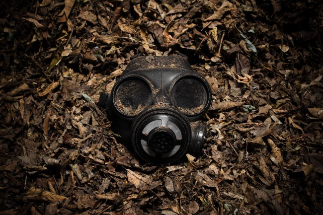

In the previous post, [Fear of a Toxic Planet](/2018/04/fear-of-a-toxic-planet/), I described my views on toxins and briefly on detoxification. I said:

> Toxins are stored in our body fat. The best way to reduce toxin load is to not be heavy. This means if you are already heavy, you will need a plan and some willpower to get lean. You can’t buy that at the Farmers Market or Whole Foods.

It turns out my view is both correct and incomplete. The Energy Blueprint Podcast recently had a FASCINATING show about the science of detoxification with Dr. Byran Walsh. I have always been a skeptic of detox plans, as I see so much fear being peddled for profit. Thankfully, Dr. Walsh was skeptical as well. He dug deep into the literature and read over 300 studies on the topic.

#### [How to Detox Your Body with Real Science (Instead of Pseudoscience)](https://www.theenergyblueprint.com/how-to-detox-your-body/)

I took some notes.

### Toxins Are Real and They Are Everywhere

Dr. Walsh explained how they can find toxins in everyone. People all around the world, including newborn infants, have some exposure. Toxins are everywhere. We are exposed to them in the air (driving), the soil, food, water, cleaning products, and possibly even supplements. Even some "green" cleaning products can have toxins.

So spending a bunch of money at Whole Foods may help you a little, but not completely. At one point in the interview, Dr. Walsh mentioned that poorer people are more likely to get toxins from smoking, whereas upper-class people are more likely to toxins related to gardening.

There are too many variables when it comes to toxicity. Much is still unknown. If you believe that "clean-living" is enough to keep toxins away, you are mistaken.

### Toxins Cause Real Problems

There are numerous studies connecting environmental toxins to different health issues. Some of the ones mentioned include:

-   cancers, lymphoma, leukemia
-   Parkinson's, Alzheimer's
-   Diabetes
-   Cardiovascular disease
-   ADHD, autism
-   poor fertility

Some toxins when released have a negative effect on thyroid hormone, which can cause a host of other issues.

Your initial reaction might be to pay for a toxicity test, but tests can be flawed. The reason is during periods of reduced calories toxins are released from body fat, which causes the numbers to go up. Then in periods of normal or excess calories, toxins remain in fat, which could under-represent toxic load.

A better course of action would be to assume exposure and respond accordingly.

_Photo by [Scott Rodgerson](https://unsplash.com/@scottrodgerson)_

### Caloric Deficits Are Required to Liberate Toxins

There are two classes of toxins: water-soluble and fat-soluble. Water-soluble are easily eliminated from the body. On the other hand, fat-soluble require the burning of body fat, which means a reduction in calories for some period of time.

There are many detox plans on the market that do not have a fat-loss component. Do not fall for them. **Lipolysis is required to liberate fat-soluble toxins.**

Many supplements that are peddled as detoxifying actually interfere with the detoxification process at higher doses. Green tea extract and curcumin were mentioned. Listen to the show for a deeper explanation. The short version is you can't pay for some magic pill or powder to make the toxins disappear.

### How to Detox According to Dr. Walsh

As I stated at the top of the post, my view that fat loss was the way to eliminate toxins was both correct and incomplete. What I learned is simply liberating the toxin from the fat cell is not always sufficient to expel them from the body. Sometimes toxins liberated in one area get reabsorbed in another area.

Some toxins get peed or pooped out. And some get sweated out. So in addition to being in a caloric deficit, **sweating is key to any detoxification**. Dr. Walsh recommends using a sauna for 30-minutes a day during a detox and he goes as far to say that he would not have anyone go on a fat-loss diet without drastically supporting detoxification and this includes sauna use. The type of sauna is not important. Sweating is a key pathway for removing toxins that must be utilized.

But before you kick off a detox plan, Dr. Walsh stresses to be healthy first. Meaning having a diet rich in nutrients, which will help with the detoxification pathways. I'm guessing the readers of this blog already are eating a nutrient-dense diet, but for the new readers, it is good to know.

Foods that will help transport the toxins out include leeks, broccoli, cauliflower, and sprouted mung beans. The supplement St. Johns Wort speeds up the detoxification pathway. Higher fiber is recommended and activated charcoal can also assist.

### Speculation

Before the show ended, I had already started connecting the dots in my head. If someone is losing a lot of weight without using a detoxification support they might make their health worse in the long-run. Especially someone yo-yo dieting that is continually liberating toxins, but not expelling them.

Dieters often experience a reduced metabolism. Not just from having a smaller body, but more than expected. Some theories state the [body learns to become more efficient](/2017/03/exercise-weight-regain/) at a lower calorie level. What if it was more than that? If certain toxins can negatively impact thyroid and we know this to be true, then this could be a piece of the metabolic puzzle.

I have more thoughts on this topic, which I will save for the [next post](/2018/04/dieting-and-detoxification/).

---

## Comments

### Andy
*April 20 at 2018 at 7:35 AM*

Good stuff MAS, looking forward to the next one. Things like this add another layer of psychological victory, “I’m losing fat AND I’m detoxifying my system”

---

### Geoff
*April 20 at 2018 at 11:03 AM*

Very interesting post, MAS. Thanks for that update.  Did they mention blood donation as another possible vector for detoxification?  Not as frequent or as accessible as a good sweat but I do remember the Eades suggesting that following a two week period of steep calorie restriction with a blood donation could help purge toxins that were release from stored fat.

---

### MAS
*April 20 at 2018 at 2:02 PM*

@Geoff - Blood donation was not mentioned, but it makes total sense. I'll be adding that tip to the upcoming post. Thanks.

---

### wildcucumber
*April 20 at 2018 at 4:59 PM*

I have a fair amount of experience with herbs, so I'd like to offer my 2 cents worth if I may ..

Please, to anyone considering taking St John'swort, make sure to get the real thing. St John'swort is one of the medicinal herbs most likely to be sold in "purified form", which actually means parts of the plant that protect us from side effects have been removed. (If it's labeled as "standardized Hypericum extract", for example, you could be looking at possible photo-sensitivity) Look for it in tincture (a liquid; alcohol based) and take it in small amounts. 

The reason St John'swort is helpful for detoxification is the same reason it shouldn't be taken with medications or other supplements, it acts through the liver. In some cases that can mean the amount of meds or supplements can spike in your blood stream, and that can be problematic. So, although it has its uses, it is actually one of the trickier herbs to use in this way. Ladies on the Pill should be especially wary! 

Dandelion leaf or root, burdock root or yellow dock root are even more effective at *supporting* the kidneys, liver and skin in their work of detoxification, and aren't known to have the same interaction issues with medications/supplements taken concurrently. They can be diuretic or laxative, but as long as they're used in small amounts until you know how they affect you individually, they're probably a safer choice.

---

### MAS
*April 20 at 2018 at 6:18 PM*

@wildcucumber - Thanks for sharing!

---

