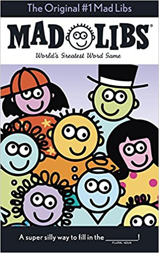

I have had this post sitting in my draft folder for many months half completed. This past weekend I saw that brownstudy.info posted _Creating random passphrases for stronger passwords_ (link down August 2019), which reminded me to finally complete this post.

In 2014 and 2015, I posted a series on tightening up your online security. This is not a technical blog, but I saw the idea of reducing risk as complimentary to my fitness and nutrition views. You can see that series here:

#### [Online Security (best of)](https://criticalmas.org/best-of/online-security/)

When I first started using a password manager, I would let that application generate secure passwords for me. I'd give it some parameters, such as length and whether I wanted numbers or special characters and it would dump out something like this:

)pl7&yeRRg11s$Z

That is a secure password. I'll never remember it, but that is OK because I have a password manager. Right? Well, no. The reason is sometimes I need to connect to an account from a device where I do not have my password manager installed, such as my Kindle 6. It would be a lot easier to type in a password that was just as secure (or more secure) that was also human-friendly.

In the article linked to above, you will see the dice method for creating passphrases. I think that is a good start, but I have developed a more memorable technique.

### The Mad Libs Password Method

My method is based on a series of kids' books called _Mad Libs_. Remember those? You would answer a series of questions asking for word types and then your answers would be used to make up a new sentence. The sentence was often funny and memorable. But more important for our needs, it was long.

And remember that when creating a password or passphrase, the length is your friend. Longer passwords are more difficult to crack than shorter ones.

_The Original #1 Mad Libs_

#### Building Your Mad Libs Style Passphrase

Sentences are basically a combination of names, actions, adjectives, adverbs, and numbers. That was my remedial-English explanation, so don't quote me. To get those words, I'll come up with questions to narrow my focus.

Example #1

1.  A famous person from the 1970s.
2.  An action verb.
3.  A color
4.  An animal
5.  A number
6.  Some special character bling

Example #1 Answers

1.  Elvis
2.  swims
3.  blue
4.  lizard
5.  200
6.  !!

We are off to a good start. I already see the sentence forming. I'm going to add the word WITH to make it more readable.

ELVISswimsWITH200bluelizards!!

That passphrase is 30 characters long. It is memorable. It is visual. You will not misspell it when typing it into a mobile device. It is perfect.

The website [How Secure is My Password](https://howsecureismypassword.net/) estimates it would take a computer 312 UNDECILLION YEARS to crack this password. That is a [big number](https://en.wikipedia.org/wiki/Names_of_large_numbers).

If you wanted to write down the new passphrase but didn't want others to see the paper, you can put together an image like I just did. There are enough reminders in the image should you forget. I would only use this technique for the master passphrase for your Password Manager.

Example #2

1.  Flavor adjective
2.  a word used on Star Trek
3.  action verb
4.  former President
5.  number
6.  Some special character bling

Example #2 Answers

1.  crunchy
2.  tribbles
3.  sells
4.  Lincoln
5.  99
6.  $

lincolnSELLS$99crunchytribbles

Now you can imagine Abe Lincoln behind a counter selling tribbles for $99 with a sign saying that they are crunchy. The visual is very memorable. And the password is unbreakable.

#### Practice Typing the Passphrase

If this is your Master Passphrase, I recommend typing it several times. You not only want to commit the sentence and image to memory but also connect with the sequence of the characters as you type. If the passphrase is too hard to type, go back, and create a new passphrase. And to keep the memory active, set up your password manager in a way that forces you to type it a few times a week.

---

## Comments

### Jim
*April 17 at 2018 at 2:49 PM*

@MAS
Great post.
Of course, the Mad Libs PW method goes well with the classic XKCD comic dircted to password strength.
https://xkcd.com/936/

---

### Jim
*April 17 at 2018 at 2:52 PM*

This related article is amusing and sad at the same time.
https://gizmodo.com/the-guy-who-invented-those-annoying-password-rules-now-[phone removed]

---

### MAS
*April 17 at 2018 at 4:01 PM*

@Jim - Thanks and thanks for the links.

---

