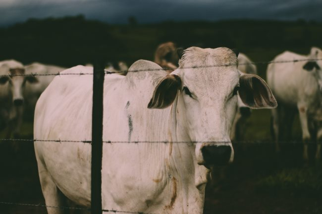

_This post is a continuation of the discussion of_ [_Detoxifica_tion Notes (Science Not Woo-Woo)](/2018/04/detoxification-notes-science-not-woo-woo/). Correct me if I am wrong on this part, but I see a real problem with chronic low-carb diets if one is concerned with detoxification. As Dr. Walsh explained, toxins are found everywhere and with everyone. They are in our fat. Which means they are in the fat of the animals we eat. They share the same air we do. They too are exposed to heavy metals and environmental toxins. Couldn't ingesting anything but the leanest cuts of meat be an issue? One of the concerns with low-carb diets is the negative impact on the thyroid. What if a partial explanation is both the intake and release of these toxins on a constant basis? Are toxins associated with the "low-carb flu" symptoms? What if the heavy exposure and release of toxins is a contributing factor to those plateauing on low-carb? Especially if they are not consuming enough of the higher fiber foods needed to help remove those toxins.

### The Research

After putting the first draft of this post together, I found this article.

#### [How to remove environmental pollutants from raw meat](https://www.sciencedaily.com/releases/2016/05/160506100202.htm)

The headline is not interesting, except to say that cooking lowers the toxin load, but by how much and which toxins were questions the article did not answer directly, except to say that cooking in a manner that removes the fat is ideal for lowering toxin exposure. I did find these interesting quotes.

> The potential environmental toxins include inorganic elements such as arsenic, cadmium, mercury, lead, PAHs, PFAs, dioxins, pesticides and other persistent organic pollutants (POPs), such as polychlorinated biphenyls (PCBs), industrial chemicals which are viewed as one of the twelve most harmful pollutants produced by humans, according to the United Nations Environment Programme. Most of these substances are fat-soluble, so any food with high fat contents accumulates higher levels of micropollutants than plant matter. "PCBs and other POPs accumulate in the fatty parts of meat because they are fat soluble. Reduced consumption of meat fats will reduce the intake of PCBs. On the other hand, eating meat with a high fat content can result in a significant exposure to PCBs," the scientist explained.

Also:

> Overall, the level of contamination in raw and unprocessed meat is below that of fish and seafood, "although it is much higher than that of fruits, vegetables and legumes," says Domingo.

The entire article is worth reading. However, the article misses the obvious method for reducing toxin load in meat, which is by eating the leanest cuts.

### My Takeaway

Low-carb diets also have two other potential issues. They aren't as nutrient-dense or have as much fiber as higher-carb diets. Of course, there will be exceptions, but I'd stack my Peasant Diet, which is full of legumes and potatoes, up against any ketogenic or all-carnivore diet to measure which is more detoxifying. Am I wrong?  _Photo by [Feliphe Schiarolli](https://unsplash.com/@flpschi)_

---

## Comments

### Robert
*April 24 at 2018 at 10:26 AM*

You make a convincing argument, i found the topic very interesting.

I too saw that episode on the Energy Blue print, but I didn't download it. I thought it would be the usual stuff, with expensive and time-consuming solutions for diminishing returns. But now I will listen to it.

Would there be a point in eating lean chicken meat? As they are slaughtered young, they would have had less time to build up toxins?

Low-carbers themselves are often quick in pointing out traces of pesticides in for example grains, thinking that their diet is the cleanest. But we see here that might not be true.

The only issue I have so far is fish. Seafood is always correlated with better health, how can that be if it's the most polluted food?

---

### MAS
*April 24 at 2018 at 4:12 PM*

@Robert - One way I would look at the seafood question is that the health benefits outweigh the toxic negatives. Or that the toxins we eat in seafood aren't problematic or problematic enough to measure. 

Also, the article lumps all seafood together. Farmed, fresh, salt-water, lakes, shell, old-fish, young-fish, and all regions. Digging deeper into the differences is likely relevant. Avoiding older fish or fish known to swim in toxic regions are two strategies.

---

### Marc
*April 24 at 2018 at 8:24 PM*

"Am I wrong?"

Yes!

"Low-carb diets also have two other potential issues."

Actually there are more than "two" issues.

In particular.......most low-carb diet aficionados indirectly promote  a high protein and fat diet. The logic used is flawed in that carbohydrates are demonized as solely causing insulin to rise. No mention of the fact that insulin is a normal hormone in the body that rises and falls as part of "normal" life. The low-carb logic fails  particularly in that protein is also a potent insulin producing agent in addition to carbs. This fact is also never mentioned. This is not guarded secret information. Anyone can read of this. One can surmise that writings stating other paradigms are deliberate attempts to mislead/make $,  as Gary Taubes does so frequently. Not to mention that a certain BBS author espouses a paleo diet.....once again a person who should know better. Enough!

Low carb diets cause a particular problem. The high protein/fat diet nature of these diets causes a insulin response. With a rising insulin level and resultant low levels of carbohydrate in the diet, the rising insulin level directly cause fat stores to  NOT be released for energy.  Muscles need insulin to work properly and get glucose into the muscle for glucose conversion to ATP. Because the insulin rises due to high protein diets, dietary fat is taken up into the muscles in low carb dietary states.....thus one of the cause of insulin resistance. Bye...Bye....health.  Hello....metformin...bienvenido diabetes.

https://www.ncbi.nlm.nih.gov/pubmed/?term=Early+skeletal+muscle+adaptations+to+short-term+high-fat+diet+in+humans+before+changes+in+insulin+sensitivity%2C

For everyone's sake: 
MAS....promote the peasant diet along with the potato hack.  
Tim Steele......please write more great books!

P.S. what about the endotoxins from hazardous bacteria such as salmonella which can be found on most chicken.  Cooking kills the bacteria  but does not inactivate the endotoxin. Plants don't have this problem.

Marc

---

### MAS
*April 24 at 2018 at 9:46 PM*

@Marc - Wrong or understated? ;) 

By "two other potential issues", I meant related to toxins. I should have been more clear. 

Great comment.

---

### Robert
*April 25 at 2018 at 5:35 AM*

@MAS - Yes, good point. Fish in some regions is probably the most polluted food source known to man. But in other places, especially from the open sea, probably quite clean. In Sweden fatty fish caught in rivers, lakes or the Baltic Sea is full of PCB and dioxins. Young people and women in fertile age are told to eat that fish maximum 2-3 times per year. Men are allowed to eat it once a week. 

Seafood contains Vitamin D, Omega-3, Iodine and Selenium. All important to health, and possible factors why seafood seem to be so healthy.

---

### Robert
*April 25 at 2018 at 6:43 AM*

@Marc - Interesting study. It was isocaloric, and yet saw some negative effects. I noticed that the high fat diet was exactly the macros of the perfect health diet: 55% fat, 30 % carbs, 15% protein. But we don't know the composition of the diet otherwise. Whole foods? Lots of processed crap?

I'm not sure how big of an effect it is in real life. People on PHD seem to do well.

---

### MikeT
*April 25 at 2018 at 6:01 PM*

@Marc. Yet we have untold multitudes of both clinical data and n=1 experiments that show that low carb diets  are extremely effective at managing or reversing TD2. Perhaps physiological IR does not come with the saem deleterious effects as pathological IR that comes with eating SAD.

---

### Robert
*April 25 at 2018 at 6:27 PM*

@MikeT - One tends to lose weight on low carb, like on any diet. This is the way to reverse diabetes. The question is what happens when weight loss stalls, and it becomes just a way of eating year after year. I've seen plenty of people complaining of rising blood sugar levels despite strict low carb for many years. But many other seem to do fine and do not experience these problems.

---

### MikeT
*April 25 at 2018 at 7:14 PM*

@Robert,

Completely agree, what works for some, does not work for others. I have tried several different approaches. As a kid, I was extremely lean and ate  enormous amounts of potatoes. However, further along my journey, my system does not react well to HC diets. I have been the most lean in the past 20 years on a LC diet, though I think I perform best on something close to the PHD with higher protein.

---

### Marc
*April 26 at 2018 at 3:40 AM*

@MAS

Just my awkward attempt at being facetious.

At least your post wasn't overstated.....HIT has wayyyy too much of that.

Arthur Jones,  many years ago, wrote perhaps the best post on diet ever:

http://www.arthurjonesexercise.com/Bulletin2/5.PDF

Furthermore, Ice cream may be the best supplement ever:

https://criticalmas.org/2015/09/yes-ice-cream-is-still-better-than-protein-powder/

@all

There is no perfect diet. Mankind can eat a large variety of foods, and this adds variety and defends against malnutrition. There is no perfect macronutrient percentages. Elimination of all toxins in life would be next to impossible....just trim the fat off fish...like you were taught as a boy....lol. Michael Pollan states: “Eat food. Not too much. Mostly plants.” Arguing about macro types and percentages ......just....wasted words... which will never be heard.

---

### Marc
*April 26 at 2018 at 4:16 AM*

Just to rain heavily on the low carb parade....is the Cahill cycle and fat/oil.

It is a biochemical fact that the body can take protein from muscle for energy needs to be met....ie... ATP......ever heard of....."protein-sparing"?

Good &amp; fats hardly belong in the same dietary sentence. 
Oils/fats have little nutritive value, no fiber or  minerals either. Fats and oils are harmful to the blood vessels endothelium. Fatback in the beans might not be such a great idea.

---

### MAS
*April 26 at 2018 at 5:05 PM*

@Marc - Ah. My classic Ice Cream post. Damn that one got a lot of views and still does. :)

---

### MikeT
*April 26 at 2018 at 8:46 PM*

@Marc.  You almost got it right with the no perfect diet comment, but then you had to have the last word. Yes, refined fats or oils (especially those healthy seed oils) are generally devoid of micronutrients, but the same can be said about carbs.  Whatever your diet is, if you can minimize processing and get your energy and nutrition from whole foods, you will be better off. Fat is part and parcel of the nutrition that you get from meat, fruits, nuts, and even vegetables. You cannot have one without the other.

---

### Robert
*April 27 at 2018 at 10:40 AM*

Some interesting comments about seafood and toxins:

https://drjockers.com/dont-eat-shellfish/

"In today’s society, with the overuse of fossil fuels, we have a high level of heavy metals like methyl mercury in our waterways.  This means that all seafood will have issues with metals, but fortunately, selenium and zinc help to reduce heavy metals in our body.  So it would seem that the nutritional benefits outweigh the environmental toxicity issues associated with consuming shellfish."

"Fish concentrate the metals in the digestive tract, when this is removed the flesh is safe for consumption"

---

### Mark
*December 7 at 2018 at 3:26 PM*

Potatoes are a high source of Cadmium.  We all have collected Cadmium in our tissues blocking/down regulating areas of our body. Plantarum a probiotic safely removes it, along with old spent iron zinc and some heavy metals, who knows what else??   I found it removes scar  tissue big time, I’m talking  old cartilage,  bone, organs, synapse toxins,  all tissue!
       So much so my diet required some extra elements: Molybdinium chelate(100mcg) , diatomaceous earth, natrual source vitamin C, L lysine, vanadium, L tyrosine, Boron, magnesiumchloride, Calcium Flouride, teaspoons of EVOO(olive oil), all once or twice a week ,    lots of veg(no dark greens),  red potatoes, sweet potatoes, white rice, NO GLUTEN from Wheat, no instant coffee, no tap water, no heavy cigarette papers or throat burning smoke medium! 
   I’m on track to getting back on my BMX again!
   My improved digestion ment I have found little use of zinc, selenium supplements, I take zinc once a month? Some times Copper, MSM, chromium.  
  One needs to learn the deficiency symptoms of nutrient pathways like B Vits, inorganic mineral face reading, nail form, tounge reading, skin signs, etc.  
      Fats provide keto energy, most vegetable oils are poisonous, beans contain Lektines  even after cooking!
No one in medical history has ever died of too much saturated fat, ever.  There’s so much corporate misinformation out there, I like drlwilson what a breath of fresh air.

---

### MAS
*December 7 at 2018 at 8:18 PM*

@Mark - What are your thoughts on this article?
https://nutritionfacts.org/2015/10/15/how-to-reduce-your-dietary-cadmium-absorption/

It states: 

"Cadmium bioavailability from animal-based foods may be higher than that from vegetable-based foods. There appears to be something in plants that inhibits cadmium absorption. "

"...the absorption of lead and cadmium is inhibited by plant components such as fiber and phytate."

---

