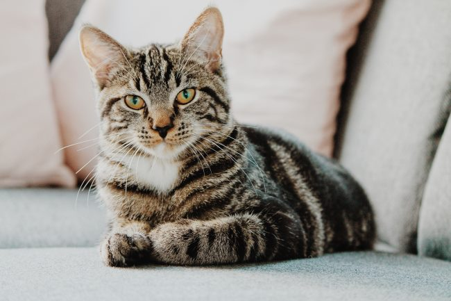

I've had this analogy I've been thinking about for a long time now regarding successfully losing weight and then keeping that weight off. It has to do with dogs and cats. Dogs are easier to understand than cats. They are either friendly or not and you determine that fact rather quickly. Cats, on the other hand, are more complicated. Although there are always exceptions, cats usually do not like to be directly approached by strangers. They need a level of trust first. Trust is built in a few ways. First is patience. Noticing the cat. Letting the cat notice you. Waiting. Maybe approaching by a meter and then ignoring. Then notice the cat again. Repeat the process. Move a little towards the cat and stop. Let the cat come to you. This trust-building with a cat is like a dance. An action is followed by an inaction. Recognition is followed by ignoring. If done correctly, the cat will slowly build trust with you. A trust that rarely would be established if you walked directly toward the cat. In those cases, the cat sees you coming and takes off. This is just like sustainable fat loss. If you sharply reduce your calories and exercise a lot, you will get closer to the cat. You may even catch the cat. But the moment you let your guard down, the cat will wiggle free and escape. The cat in this analogy is your brain dealing with signals it views as threatening to your survival, which are fewer calories and higher energy demands. Contrast this with a diet that cycles strategies of building trust with the brain such as high-volume ([Peasant Diet](/2017/09/used-peasant-diet-lean/), [Potato Hack Diet](https://criticalmas.org/best-of/potato-hack-diet/)) and higher-protein. Those diets quiet the hunger hormones. They are graceful and respectful steps that don't frighten the cat. A gradual increase in exercise doesn't alarm the brain. Charging the cat at full speed may get you closer to the goal of reaching the cat quicker, but is unlikely to work in the end. We all know stories of people that treated fat loss like a dog and lost weight. The vast majority regained that weight. The brain is really a cat and not a dog. Trust was never established. Last year, I approached fat loss like a cat and today I'm sitting on the porch next to a purring kitten [25 pounds lighter](/2018/04/declaring-victory-how-i-lost-and-kept-off-25-pounds/). Although there will always be exceptions, I believe that approaching fat loss like you would approach a cat is a better long-term strategy for maintaining fat loss. And this means using techniques to reduce hunger (higher-volume, higher-protein) and not trying to force an outcome using grit and willpower.  _Photo by [Erik-Jan Leusink](https://unsplash.com/@ejleusink)_

---

## Comments

### Tim
*May 14 at 2018 at 7:32 PM*

I've been known to sneak up on our cat and pull it's tail, sort of like the Potato Hack, lol.

---

### Pauline
*May 17 at 2018 at 11:33 AM*

I have noticed Autumn/Winter is not a good time to lose weight.  As long as the cat has access to a toasty fire, sleep and enough to eat - all surplus will ease back in the summer months when the light and warmth up-regulates appetite and the urge to explore and stay outside in the longer daylight gets stronger.

---

