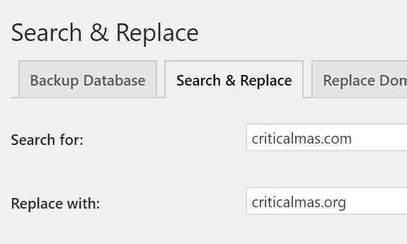

In my last post, I mentioned that I was approached by a company to buy the domain that has hosted my personal website since March 2000. That domain was CriticalMAS.com. The offer I received was generous enough to me to make it worth my time and effort to move to a new domain and change my email.

I was going to move this blog to MichaelAllenSmith.com, but I got an email from my pal [Joe](https://artlung.com/) in San Diego, who suggested a clean move to CriticalMAS.org. At first, it didn't click with me, but the more I thought about it, the more it made sense. The blog is titled Critical MAS. By moving to the .ORG, I maintain that title.

### The RSS Feed and Newsletter

The sale was finalized this morning, so I'm sure there are still little things I need to do, but I do believe the RSS Feed is working fine and if you subscribe directly to Feedburner, you won't need to change anything.

I'll be sending out one last newsletter with MailChimp. After that, I'll be shutting that down and using the Feedburner newsletter exclusively. I was terrible at maintaining that newsletter, not just for this site, but for two other sites I manage. I'm old school. I'd rather write a new post than craft a catchy newsletter hoping it gets a decent click-thru rate.

_[Subscribe to Critical MAS](https://criticalmas.org/subscribe/)_

Maybe one day, I'll post about my dislike of newsletters with actual numbers, if there is interest.

### Now For the Favor

If you have a website and you have ever linked to this blog, THANK YOU! My request is that you update those links so they point to the new criticalmas.org domain. Every page has the exact same URL. The only thing different is that ".com" is now ".org".

#### Example:

OLD: https://criticalmas**.com**/2018/04/dieting-and-detoxification/

NEW: https://criticalmas**.org**/2018/04/dieting-and-detoxification/

If you use WordPress, there are Search and Replace plugins to help you.

_[Search and Replace Plugin](https://wordpress.org/plugins/search-and-replace/) - Look for the posts and comments table. Either wp\_posts or whatever prefix you use followed by \_posts. Same for comments. Look for wp\_comments or whatever prefix you use followed by \_comments. Uncheck Dry Run and then choose "Save changes to Database"._  

Another option is to install a Broken Link Checker plugin and then after it completes, swap out the ".com" for the ".org".

Thank you!!!

---

## Comments

### Jérémie
*May 30 at 2018 at 8:21 AM*

I'm using Feedly as a RSS feed and I didn't had to change anything either.

Glad to see your sale finalized smoothly, and that you decided to keep the base URL the same.

---

### Massage
*June 6 at 2018 at 7:37 PM*

Or tell people to change their filters/whitelists to simply remove the .com (retaining CrititcalMAS) and change nothing else.  What if later you grab the .net or any other TLDs?  You'll always land in their inboxes.

---

### MAS
*June 7 at 2018 at 1:23 AM*

@Massage - Without a domain suffix, the link would break. Swapping in the .org takes just as much effort and fixes the problem. 

And I spent maybe 40 hours reaching out to sites requesting fixes for their links. Only about half even responded to me. Fortunately, I got several of big sites to link to my new .org blog.

---

