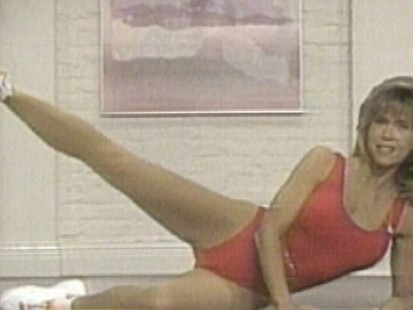

My last update related to my knee pain was in [January](/2018/01/bizarre-injury-4-months-later/). For months, I have had nothing new to share. I was making no progress with physical therapy. Then I found a video that provided a clue, which sent me down a path of developing my custom exercise plan.

It has only been a few weeks, but I'm making serious progress. Finally.

### #1 Weak Hips

What I found may likely help you, even if you do not have knee issues. Because it turns out, I don't really have a knee issue. I'll explain that comment later. First the video:

_[Stop Stretching Your Hip Flexors! (HERE'S WHY)](https://youtu.be/KCADorwJ6Ik) by Athlean X_

In the video, it is explained in detail the difference between tight hips and weak hips, along with tests you can do to determine which is your problem. The video makes the case that if your hips are weak, stop stretching them. Instead, focus your efforts on making them stronger.

As you likely know, sitting can make your hips weak. But you may not know that even though you might be a gym regular and have strong legs, you could still have weak hips. Your other muscles might be compensating for the hip weakness.

He lists a few tests, but a simple one to explain is the Side Leg Raise (aka the Jane Fonda).

You may be able to squat or deadlift a lot but try doing this move for reps. You may find it difficult to do 20 solid reps with your foot pointing forward. I've been doing this several times a week and it has helped a lot. I also do a standing version using a slower tempo. The standing version has the benefit of engaging my ankle and foot muscles for balance.

### #2 Tight Inner Thighs

I haven't tried to stretch my inner thighs since I was a little kid playing soccer. I just assumed I had good flexibility there. I did have flexibility, but they were still tight. An inner thigh stretch is easy to do and I was seeing benefits within a week.

### #3 Flat Left Foot

I don't have flat feet - normally. But with observation and a camera, a friend of mine noticed that doing some movements at the gym my left foot would collapse and not maintain a proper arch.

_My shoes are completely falling apart, but I only wear them in the gym😉._

What you can see in this photo is that my left arch fell inward while I did this pressing move. This photo was taken on May 13th. I do not let this happen anymore.

There are several videos online that explain exercises you can use to restore your arch. I'm using a few now and I hope to have a follow-up post on this very topic. In the meantime, you could get a shoe with arch support or you can do what I'm trying now. Throughout the day and especially when I'm lifting weights, I focus on driving my big toe down into the floor. This engages the muscles that lift the arch. If I don't do this, my foot will collapse inward, like in the photo above.

### #4 Band Squats and Guiding my Knee Bends

If my knee is weak my inner thigh is tight and my left arch is collapsing then what happens to the knee under load is that it starts to bend inwards. And if you are leg pressing or doing wall sits, it doesn't take much to cause pain.

The goal here is to not let my knees cave inward. One exercise is a banded squat. I step inside a band and then do slow body-weight squats focusing on pushing my knees outward. I want to put resistance on the bands.

The other thing I do is when I'm using the leg press or doing a wall-sit, I'll support the knees with a light touch if they start to move inward as a reminder to press outwards. Doing this has been a godsend. My quads are getting strong again, which in turn, helps my knee a lot.

### Summing Up

My knee pain was a result of being "off track". It was getting pulled into an inefficient pattern due to a combination of weak muscles and tight muscles. This post reminds me of what I need to do to continue improving. It can also help others, so they don't waste a year (or more) of their life trying to fix a knee issue that ends up not being a knee issue.

Build your hip strength, stretch your inner thigh, and strengthen your foot and ankle muscles. Do all that and your knee will be much happier.

---

## Comments

### seantheaussie
*June 8 at 2018 at 11:34 PM*

I did, and failed the hip flexor tightness test but quickly realized where the tightness was— my pants :-) I took my pants off and passed. That isn't the cause of my left knee pain.

---

### MAS
*June 8 at 2018 at 11:41 PM*

If I had to guess where to assign the blame at this time it would be:

50% foot and ankle
40% hip strength
10% inner-thigh tightness

---

### Hunter
*June 9 at 2018 at 9:30 PM*

I had the same issue with my ankles collapsing inwards, but this cue was super helpful for me on my goblet squats and romanian deadlifts. https://www.youtube.com/watch?v=QVjno5C0dxE  Maybe it'll be useful for you too

---

### MAS
*June 9 at 2018 at 10:56 PM*

@Hunter - That exercise is very helpful. It is in my routine. 

@All - Since I think there is interest, I will post my updated rehab exercise routine early next week.

---

