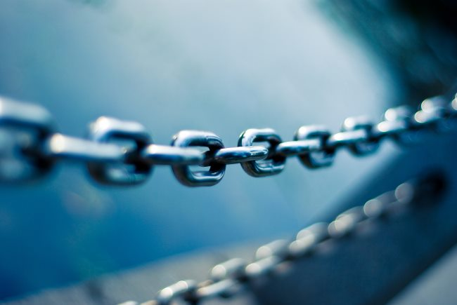

Let me give my fellow bloggers an easy win tip for their blog. **Run a broken link checker on a regular basis. And then, fix those broken links!** There are a number of reasons to make this a routine.

1.  It is a better experience for your readers. It takes time and effort to build trust with a reader. If they follow one too many broken links from your site, that trust could be in jeopardy. It may not be a conscious decision on their part either. Just a subtle sign that your website is less valuable than they initially thought.
2.  Search engines see sites littered with broken links as less maintained than those without broken links.
3.  Many of the links that go bad are domains that get hijacked by bad players. Remember my [Digital Graveyard](/2017/03/digital-graveyard-health-fitness-mentors/) post from last year? Andrew Kim lost his domain. The site was hijacked and a potential malware security risk. My broken link checker told me about the redirect and I removed the links. You don't want your readers to get their device infected because they trusted a link on your blog.

### How to use a Broken Link Checker Report

If you have a lot of content and you just ran a broken link checker, you may be overwhelmed by the results. That is OK. It might take a while to go through the report. Fix a little each day or whenever you can. Once you get caught up, it will be easier to maintain.

#### #1 Fix Internal Broken Links

The top priority is to fix your own internal links. Users may forgive an external link, but not internal. All the links between all the pages on your site should work. This includes images.

**Bonus Tip:** If you moved your site over to HTTPS, but did not update the **img src** tags to point to the HTTPS version of that image, the page is not secure. Users will not see the padlock on their browser. Those paths need to be updated. You can use a plugin like [Velvet Blues](https://wordpress.org/plugins/velvet-blues-update-urls/), which has an option to update content URLs, or use a Search and Replace plugin, but be careful if you do.

#### #2 Fix External Broken Links

When a link disappears, you have a few options. If the post doesn't need the reference, just remove the link. If you can use an alternate link, such as a news story, search for a replacement. Recently the Wall Street Journal broke a bunch of links without adding redirects. I found another news site for the same story and updated the post with a valid link.

The last option is if the link you need is necessary and no longer online. Check archive.org and the Wayback Machine. Here is a [link to the old Art De Vany website](https://web.archive.org/web/*/www.arthurdevany.com). If you find an old copy of the post, you can replace the link. The Archive.org site can be slow, so if you just need a quote or two, I would advise you to blockquote the section and then add it inside your post, then list the Archive.org copy as a reference underneath the article.

Not every site is indexed or allows themselves to be indexed by archive.org. So if you get this far and the link is truly gone, remove the link and add a note. An example might look like _(UPDATE June 2018: abc.com/cool-article/ is no longer online)_.

#### #3 Examine 301 Redirects

If everyone used redirects like they were supposed to, you would not need to look at them. But they don't. A 301 Redirect is a signal saying the resource has moved. The most common 301 today is when a site moves from HTTP to HTTPS. Sometimes bloggers will move from dated URLs to [dateless URLs](/2014/06/blogging-permalinks/).

When I sold the criticalmas.com domain, the new owner decided to use 301 redirects to capture the traffic of this blog and direct it towards their product. I covered this in detail in [An Issue With the Domain Sale I Did Not Forsee](/2018/06/an-issue-with-the-domain-sale-i-did-not-forsee/). This is not a proper use of redirection, as the resource the link points to is not there. This is why I am reaching out to many sites to update their backlinks to my content. It helps us both.

If the 301 redirect is proper, I can either leave it alone or update it. However, if it is invalid, I then treat it like a broken link and follow the procedure outlined above in section #2.

_Phot0 by [JJ Ying](https://unsplash.com/@jjying)_

### Too Much Work?

I was mentoring a WordPress blogger at the Seattle WordPress group. She mentioned to me that she was struggling to get 50 visitors a day and that she knew her links were not maintained. She also told me that my method for cleaning up broken links was too much work. I responded by saying that [my coffee site](https://ineedcoffee.com) gets thousands of visitors a day. Part of that reason is I've kept broken links off that site for 19 years.