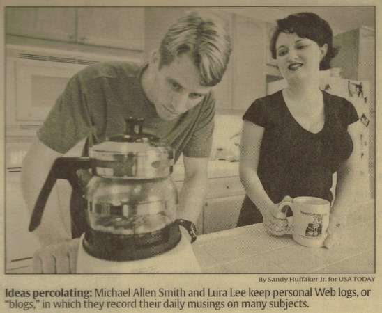
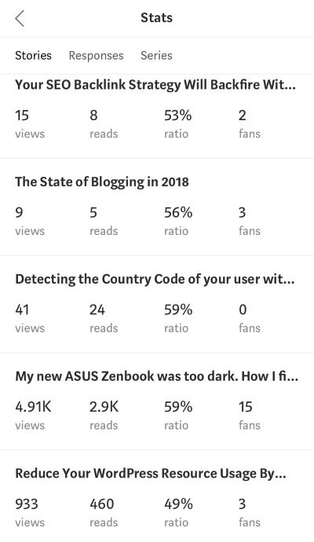

A few days ago, I tossed around a few ideas on the [state of blogging in 2018](/2018/06/the-state-of-blogging-in-2018/) and possibly mixing things up here on Critical MAS. I've decided what to do, but before I get into that, I want to cover a little history of this site.

### Critical MAS 1.0 (March 2000 - November 2004)

The first version of this blog used Blogger. This was way before they sold to Google. As much as I think Blogger is a terrible piece of software today, back then it was cutting edge. So the average person not only had access to the broadband internet but some decent tools to post things. The Internet user of this time had escaped the AOL and Compuserve cages and was running wild. Exploring. Having fun. The mood was less serious and more playful than today. This was before we stepped back into the comfortable cages built for us by Facebook, Twitter, Pinterest, Snapchat, and Instagram. Even though I had already coded my own Content Management System for [INeedCoffee](https://ineedcoffee.com), which started a year before CriticalMAS, I used Blogger, because it was easier to use and handled comments well. My posts at that time were shorter and more sarcastic. Often they were a response to a news story. Like many people online at that time, I was playing a character and having fun with it. I even appeared in a story about blogging ran by USA Today.  Then around 2004 or so, Joe from [ArtLung](https://artlung.com/) organized a party for San Diego Bloggers. At that Meetup, I met a guy that had read my site. After chatting for 20 or so minutes, he told me that I was nothing like he imagined I would be in person. Based off my blog posts, he thought I would be a jerk. That conversation stuck with me and I stopped blogging near the end of 2004. Version 1 of this blog was in many ways similar to how people use Facebook or Twitter today. Shorter and more disposable content. When people wonder why I almost rarely post on social media, one of the reasons is I did all that years ago. It was fun at the time, but the times have changed. Today people are hypersensitive and easily prone to outrage - be it real or staged. The downside risks for offending someone today far outweigh the fun we experienced during this early era of blogging.

### Critical MAS 2.0 (December 2005 - May 2018)

When I relaunched the site, my goal was to be kinder and focus on topics of personal interest and not be yet another voice responding to the daily outrage. So, I got rid of all the old posts and started fresh. Initially, the blog covered San Diego, hiking, and the [real estate crisis that I saw brewing](/2006/03/buy-low-sell-high/). My posts on real estate lead me to the stock market where I saw a sell-off coming. Then the posts became more about fitness and nutrition, both are topics that are still common. Last month, I [sold the domain](/2018/05/criticalmas-org-is-my-new-home-i-need-to-ask-a-favor/) criticalmas.com and relaunched on criticalmas.org. I got a fair price, so although it took some work to move the website and update my email with many people, it was worth it.

### Critical MAS 3.0 (June 2018 - ?)

Initially, I thought I could get back maybe half the traffic on the new domain, but that was too optimist. My numbers went from 900 page views a day to less than 200. The number of users dropped from 600 a day to less than 100. Getting the search engines to both recognize the new domain and more importantly, stop linking my article titles to the old domain is taking longer than I expected. I toyed with the idea of moving the blog to Medium, but that will not happen. I do not trust them, plus the tests I did with some of my articles showed wildly different display rates. Look at my stats below.  I will continue to post occasionally on Medium, but just things related to tech.

#### más MAS

You don't need to follow me on Medium or INeedCoffee. What I'll do going forward is occasionally post a "más MAS" with links to those articles here on Critical MAS. Thanks to all those that did update their links to this blog. Of the people I reached out to, about half came through for me. I'm hoping to be able to get a few more to help me. For now, I am staying with WordPress, as I have 1,500 posts and 10,000+ comments. Moving to a different publisher would be too much effort. I will be exploring other content systems for other projects and if someday it makes sense to convert this site over, I will. But that might be a year or more away. Welcome to 3.0. The rebuilding begins.

---

## Comments

### Fabian
*June 26 at 2018 at 5:32 AM*

Happy you’re not moving to Medium. I wouldn’t trust them with neither consistent article displays nor longevity. While I understand your issues with Wordpress, staying on your own domain+host seems like a much better decision. Looking forward to things to come!

---

