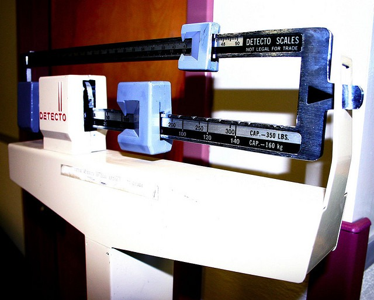

She stopped mid-sentence and said: "You look leaner". She was wrong, but I understood why she commented. I was the same weight I was the last time I saw her. My weight has been in a stable range of 194-198 this year.

### How I Keep Track of My Weight

About 3 times a week, I weigh myself at the gym. I take everything out of my pocket and step on the scale. Even though I learned from [The Power of When](/2017/08/what-i-learned-from-the-power-of-when/) that I'd be better off going to the gym in the afternoon, I'm still going in the morning. It is a hard habit that I have very little desire to break at this time. I even wear the same outfit, so everything is consistent for this measurement. The other number I get 3 times a week is a tape measure on the widest part of my waist. This is also taken in the morning. I don't know if this is the best place to measure, but I've been doing it this way for 15+ years. I'd love for a personal trainer to leave a comment on where they advise their clients to measure. Both male and female. Of the 3 numbers in both groups, I throw away the outlier and average the other two. I use the widest point because it is easy. Measuring my chest, arms, or even thighs accurately by myself would be more difficult. The only problem I see with the tape measure is there are periods where areas above and below the widest point lose in size before the widest point catches up. But I am patient, as I view any uneven fat loss as temporary and thus is not a concern. Directional accuracy is good enough for me.

### 2 Numbers Tell a Much Better Story

If your weight goes up, but your waist size remains constant, that means you likely gained lean muscle. A good thing. Just going by weight alone would not tell you that. Conversely, if your weight drops and your waist remains the same, you lost muscle. Not good news. I feel that using the two numbers together is essential for understanding where you are at. You could do a body fat test, but having 3 tests consistently done each week is not feasible for most people. Who wants to be pinched that much? As for the scales that measure body fat, maybe they are better now than they were in the early 2000s when I last used one. I found my scale was sensitive to things unrelated to me, such as room temperature.

### Why Was I "Leaner"?

My weight went from 194 to 197 while my waist size remained constant. In the last two months, I have increased my weight training as I am finally making progress on my knee issues. I'm also taking creatine again. So I'm gaining back some of the muscle I lost over the winter and doing it in a way that minimizes fat gain. Weight and waist size independently aren't that important, but together they tell a story. A man ideally wants a strong Golden Ratio, which means having broad muscular shoulders and chest and a tight waist. Build the "V".  _Photo by [Wade Kelly](https://flic.kr/p/23DZb)_

---

## Comments

### garymar
*July 2 at 2018 at 2:06 AM*

Same here -- every day I measure weight and waist straight out of bed after using the loo. I measure waist right at the belly button. Currently "plateauing" at 85 cm.

The waist measurements always lag the weight measurements by about 3-4 days. So if I overeat for just one day, no effect on waist measurements.

---

