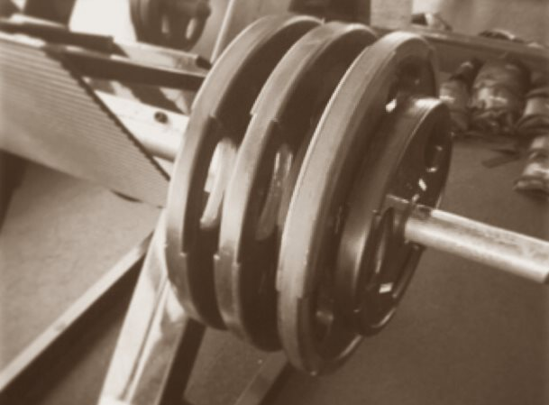

_This post is what I hope to be the start of a conversation. I haven't made up my mind on this topic yet._

Before I share some things I've learned recently, I'll give a little background on the topic. I first experienced true High-Intensity Training in February 2011 at Ideal Exercise here in Seattle. You can read [that post](/2011/02/high-intensity-training-at-ideal-exercise-of-seattle/) if you want to know how HIT differs from other forms of strength training.

I quickly became a convert to this style of lifting. You can see that from the numerous posts and comments I have on this blog. For me, HIT offered a path to strength that greatly reduced the risk of injury. There are many ways to get strong, but up until this point, the standard advice was to just use proper form and you won't get injured. I knew this advice was nonsense as form suffers under fatigue. Also, we as humans can use less than perfect judgment when we lift.

My love for HIT wasn't that it was superior to other forms of training on a week-to-week basis, but that on a long time horizon (years and decades), other forms of training that were less safe would "thin the herd" via injuries. Those injuries would become more pronounced as the weight got heavier and the lifter got older.

### My Understanding of HIT Principles

Before I go further into this post, I want to outline what HIT means to me. I'm not a trainer. I'm just a fitness enthusiast.

1.  Use of safe exercises that allow the user to go to failure without injury risk.
2.  Use of slower more controlled movements to reduce the role of momentum in assisting the exercise.
3.  Exercises that are taken to failure for deeper levels of fatigue, which should result in more efficient muscular gains.
4.  Fewer and shorter workouts due to the efficient programs used to quickly take the lifter to failure.

Those four principles help guide the design of a HIT workout.

### I Drifted Away From HIT By Accident

When I worked out at Ideal Exercise in 2011, the gym was a crisp 61 F. This is the same temperature that Doug McGuff, author of Body By Science, keeps his gym at. My guess is Ellington Darden does as well. The reason for this crisp temperature is the body can direct all its energy onto the intensity of the lift and not to cool the body.

For an understanding of this topic, think about city marathons. Most cities schedule their marathon when they think the weather will be in the 50s F. At this temperature, the elite runners don't need to slow their pace to avoid overheating. The goal of the city is not to hold the race for the comfort of the spectators or the middle-of-the-pack runners, but to increase the probability that a speed record is set on the course.

Well, weightlifting generates heat also. I stopped going to failure, not because I didn't believe in the principle, but because the commercial gyms (aka Glitter Gyms) I go to keep temperature too high for me. Around 68-70 F. I get exertion headaches and then have to leave the gym. That sucks.

So I backed off the intensity and increased the volume. So instead of 1 set to failure done every  5-7 days, I opted for 2 sets not taken to failure done every 3 days, but still using the controlled movements that I learned from HIT.

### Is Muscle Damage Needed For Hypertrophy?

Since Day 1 of lifting, we are taught the lesson that muscle grows bigger as a response to the damage incurred during lifting. It is an assumption we all carry. And it may not be true. In fact, after listening to this podcast, I don't believe it is necessary.

[SNR #239: Carl Juneau, PhD – Does Muscle Damage Actually Cause Hypertrophy?](http://sigmanutrition.com/episode239/)

The show discusses the article [Training for Hypertrophy: The Case Against Muscle Damage](https://www.strongerbyscience.com/muscle-damage/). It is a fascinating topic for anyone that lifts weights. Listen to the show and read the article. The short version is mechanical tension and metabolic stress are likely more important than muscle damage for hypertrophy.

If this is true, the HIT case for going to failure just got a lot weaker.

### Is Volume the Key?

Another great show that I listened to recently pairs nicely with this topic was James Krieger on Super Human Radio.

[Super Human Radio 2222 The Exertion Load Theory](https://overcast.fm/+Jo9bsaDWw)

My take away from this hour is that if I want to gain more muscle, 1-2 sets isn't optimal. I need more. Granted a HIT set can't really be measured the same as a traditional set, because the movements are more controlled and tension remains focused on the muscle. Still, I have already started adding sets slowly, as I ease into a more volume approach.

### Merging HIT Lessons With Recent Science

If we go back to the 4 principles I outlined above, I still see tremendous value in picking exercises that have a lower skill component where movement can be controlled in a slower manner.

However, if I know I'm going to be doing more volume, I can reduce the weight of some free-weight moves and perform them at a normal tempo. Although for safety reasons, I'm still not interested in barbell back squats or doing any max lifts.

I am doing benches with medium light dumbbells and trap-bar deadlifts with a more-than-safe weight. I can use a slower movement for the dumbbells to increase tension and more reps for that deadlift to shoot for volume.

Your thoughts?

---

## Comments

### Jim
*August 28 at 2018 at 8:57 PM*

@MAS
Interesting summary.  I develop mental blocks when trying to train to failure.  So HIT was never a good fit for me.  I do like slower movements and non-skill-based movements for safety reasons, though, as you mentioned.  If good results can be had with increased volume, then lower weights can be used, which is also probably safer.  I've also heard that many female bodybuilders seem to do better with higher volume training.  So maybe what's best depends on the individual.

---

### MAS
*August 28 at 2018 at 10:01 PM*

@Jim - Good point about female lifters needing more volume. That advice also extends to ectomorphs like me.

---

### Chris
*August 29 at 2018 at 8:25 PM*

@MAS  This is a helpful review from Lyle. 

https://bodyrecomposition.com/research-review/research-review-training/resistance-training-volume-enhances-muscle-hypertrophy-research-review.html/

Maybe the case for volume isn't as strong as it is being made out to be?

---

### MAS
*August 30 at 2018 at 2:28 AM*

@Chris - Thanks for sharing. The more years I spend looking at this topic, the more confusing it gets. 

Developing an intuition on what works best on a given workout is the skill I've been focused on building. Cycling between the competing ideas with safety as a focus is likely a wise path.

---

### Aaron
*August 30 at 2018 at 4:27 AM*

1 - Choose relatively safe exercises
2 - Work Hard
3 - Be Consistent

Many different ways to go about accomplishing #2 and, as you suggest, probably a good idea to cycle routines, but at the end of the day THAT you work out hard sometimes is more important than how many reps and sets, or how much weight and at what speed you use to get there.

---

### MAS
*August 30 at 2018 at 2:57 PM*

@Aaron - Well said. Most people that go to the gym get #1 and #3 wrong. This gives us the luxury to debate the details of #2.

---

### garymar
*August 30 at 2018 at 11:22 PM*

Glad to see you're thinking about these things again.

It's still about goals. Is hypertrophy the only goal? I started HIT because I believed it preserved the fast-twitch muscles fibers better than other movements. Is this not true?

However I too have moved away from exclusive HIT. I do a 3-way cycle of heavy static holds, medium weight dynamic lifts, and very high volume light weight dynamic lifts -- all of them on the Big 5 movements of Body by Science.

Lo and behold, I get pretty pumped up, and I just turned 65 years old. But hypertrophy was never my main goal.

---

### MAS
*August 30 at 2018 at 11:56 PM*

@Garymar - For me, general health and hypertrophy are the goals. I have trouble understanding "strength" as it is discussed in the weight-lifting community, because so much of what is defined as strength, I see as skill. 

The big lifts all have a high skill component. It is a combination of strength and skill that determines how much weight you can move. It is a skill I do not care to develop. I did at one point, because it motivated me, but not anymore. 

I like your workout plan. I'm going to incorporate those ideas.

---

### ZAP
*September 2 at 2018 at 1:48 PM*

This is a topic near and dear to my heart. I was a huge proponent of Mike Mentzer in the 90s, following his Heavy Duty protocol with good results. I bought into his work and that of Darden and Arthur Jones. There is something to it, yes, but overall it is incomplete for either strength, hypertrophy, or performance. It is a technique. Just like there is a time for 15+ reps, there is a time for heavy sets of 5, and also a time to do a max lift. Adhering to one strict method is just ignoring the volumes and volumes of evidence that just about any method works but in limited ways and not in all situations. It is akin to saying for sure without a doubt, keto is the way to eat. Those of us who are not strict dogmatic adherents know there is a time for keto but there is also a time and there is value to eating fruit or rice. I wish it were as simple as 1 set to failure for 4 movements done every 5-7 days like Mentzer tried to preach. And I wish just eating keto would end the discussion on nutrition.

---

### MAS
*September 2 at 2018 at 4:34 PM*

@ZAP - Agreed. Like an investment portfolio. There are times to invest in growth and times to invest in value. Rebalance your portfolio periodically as one strategy becomes overvalued vs undervalued. 

Lifting is the same.

---

### OSB
*August 31 at 2019 at 5:55 AM*

Hit sucks. None got big on that flawed way of training. No one.

---

### Miller
*September 4 at 2019 at 1:34 PM*

I'm an older (52) long time fitness enthusiast. In my late 30s early 40 drifted more into martial arts/conditioning type work.

Over the last decade slowly have been getting back into more strength and hypertrophy. Following the current volume-heavy recommendations I made OK progress if somewhat slow - which I attributed to my age more than anything. Began to drift back more to my roots and training more to failure, set extenders etc just to give myself more variety.

 I noticed that as I increased intensity and backed off volume my body responded a lot better. I have to repeat this - when I was in my mid 20s I hit 185lbs with pretty low BF% (about 9%), at 52 I now weigh over 195 with a 32" waist at 5'10". At 40 years of age I weighed 155 - training volume I made it back to about 180. My top working weights are not what I used to hit by any means (squat/bench/DL), but am damn close on many of my accessory lifts. Have regained visible vascularity on my pecs, traps, delts.

So the case for HIT might also be made partly due to better hormonal response in older lifters. Steve Maxwell also noted this a number of years back as he got older.

I do not use textbook HIT, in my opinion it has too little volume. But...something closer to DeLorme with a few relatively easy lead in sets followed by that one set to failure is working very well. HIT is slowly becoming more mainstream again, taking its rightful place among all the other strength training strategies out there due to indirect promotion by Jeff Cavaliere, Christian Thibeadaeu, arguably even Wendler 5/3/1 with its finishing AMRAP set is also a form of HIT.

It worked then, it works now. It might not agree with everyone's personality, and it definitely works better when training with a partner who will push the crap out of you.

---

### MAS
*September 4 at 2019 at 7:19 PM*

@Miller - Thanks for sharing your experience.

After your comment, I went to the gym and did a workout based on what is working for you now. I really enjoyed it. It captures a good middle ground between the extremists.

---

### Miller
*September 6 at 2019 at 3:28 PM*

@MAS
It never ceases to amaze me that DeLorme method or variations of it are still some of the most effective overall ways to build general strength and size. Fitness culture today is overrun with high volume or collegiate powerlifting programming. Why should I need Olympic bars and full gym to build fitness? For that matter why so long in the gym or why have to train low volume every single day?

My modified DeLorme - 1st set close to failure with 10-12 RM load, 2nd set nowhere near failure (3 or more reps in reserve) with the same load I'll be using for my third set, 3rd set to momentary failure with a 6-8 RM load, using Rest/Pause if the lift has a lock out position, or a Dropset if it does not. 

Disclaimer - while this is "intensity of effort" training it is NOT traditional HIT as I do not go to full concentric failure with rare exceptions - I go till I'm confident I can't get another clean rep - I'll shoot for it if I have any uncertainty. Once every few weeks I'll pick a lift and try to go to gravity-wins failure, but really this is just to keep me honest about my effort.

---

### Ondrej
*January 23 at 2020 at 6:26 PM*

"mechanical tension and metabolic stress are likely more important than muscle damage for hypertrophy - the HIT case for going to failure just got a lot weaker".

I don't think this is a logical conclusion. Mechanical tension (TUT in HIT is longer or at least similar than in multiple set training - let's say 1 set of 60-120 seconds vs 3 sets of 20-30 seconds) and metabolic stress (which is obviously higher towards the end of to-failure set and correlates with the lactate burn)  are present in big doses during a HIT set. It ticks all the boxes.

Frankly, I'm an agnostic. Stimulus can be delivered in various ways, and for amateur lifters, I believe it doesn't matter whether it's HIT or Brad Schoenfeld's Max Contraction protocol that makes your head spin just reading it.
You can either tap all the fibers in a HIT session where you use single set, but 2-3 sets per muscle group, or you can use multiple sets properly, as well as many static protocols, pyramids etc. 

The results are likely to be more influenced by consistency, training frequency, sleep, genetics than method. 

Sometimes people blame HIT, but it was more specifically Mentzer-ish low volume of three sets a week or a split where you train legs once a month that failed them.

---

### MAS
*January 23 at 2020 at 6:48 PM*

@Ondrej - I'm just sharing varying opinions. This one seems resonable to me. I don't know if it is correct, which is why I started the very next sentence with "If this is true...".

---

### OSB
*November 29 at 2020 at 10:17 AM*

@miller

Nice sales pitch for hit, shame it's not true though. And as for hit becoming mainstream, don't make me laugh. Hit is a fad and nothing more. 50 years of this idiotic way of training and it has nothing to show for it.

---

### Mike
*November 6 at 2021 at 1:53 PM*

I use Mike Mentzer's Ideal workout in his book Heavy Duty. What I myself have learned is that you have to make changes as you age. You can't keep the same pace when your older that you did when you were younger. So what I did was lower my increasements when I train, I No longer make 5 to 10 lbs. jumps when lifting I use 1-2 pounds jumps instead. It's the intensity you use more than the weight it's self so use smaller jumps and keep good form and move slower on your exercises. It takes time to increase strength and muscle so don't be in a hurry pace yourself. I'm 67 and still make slow gains.

---

