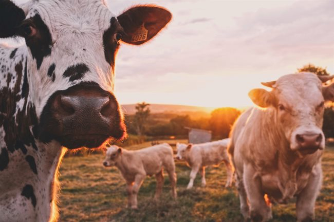

Recently, I have been considering the ethical implications of a vegetarian diet. I have several thoughts on the topic, and they will likely spill over to other blog posts, but in this one, I want to revisit a thought experiment I had years ago and extend that discussion.

Four years ago, I posted [Proposal: Vegetarian/Vegan Offset Credits](/2014/10/proposal-vegetarian-offset-credits/). I wanted to take an economic concept and apply it to nutrition.

The short version is that a vegetarian or vegan would most likely nutritional benefit from having an occasional animal-based meal to shore up any nutritional deficiencies. And that a typical meat-eater would benefit from taking a break from the meat and having a nutritious vegetarian meal.

> An ethical vegan would be able to eat animal protein for a day and still be within their moral guidelines provided they were able to convince a fast food eater to eat vegetarian/vegan for a day. They might even prepare the meals to assure that the fast food eater stays away from animal protein.

My conclusion was:

> The impact to the planet is neutral, yet both parties should be nutritionally better off. Actually, I am guessing the vegan would consume grass pastured or more humane forms of animal protein, so the ecological effect would be a net positive.

I liked the idea, but it was just a thought experiment, and I'm guessing the vast majority of vegetarians, and especially vegans, would never entertain my credit idea because they don't want to be connected with any additional animal suffering personally.

Then I got an offal idea.

People who are into nutrition - such as the readers of this blog - know that some of the most nutritious parts of an animal are the parts that most Americans do not eat. Organ meats and bone broth. The offal parts.

Because Americans (and I'm assuming most 1st-world Western countries) do not eat the liver, the kidney, the heart, or use the bones for soup, a lot of this food gets wasted. Some of it is traded to Asian countries, but a lot is thrown away.

If a vegetarian consumed offal, they would not be adding to the animal death count, as those animals would already be bred and killed for muscle meat. Would those calories be ethical?

Then I considered that a vegetarian diet is not a diet without animal suffering. Small animals are killed during the farming of grains and legumes - which are staples of non-meat eaters. That number is likely small, but it is not zero. So if a vegetarian could displace some of those calories with offal, would it actually result in fewer animal deaths?

Even if the idea of an offal vegetarian is awful, it would still seem more ethical for meat eaters to replace a few of their muscle-meat meals with those nutritious parts that were destined to be thrown away.

I could be wrong.

UPDATE: About an hour after posting, I wondered how much offal ends up in pet food. And once pet food and exports to Asia are tallied, how much waste is left? A lot, a little?

[_Photo credit_](https://unsplash.com/@stijntestrake)

---

## Comments

### Jim
*October 10 at 2018 at 4:31 PM*

@MAS
Great idea.  
As you mention, implementing the idea would be difficult because most vegetarians/vegans do not separate between their ethical views and nutritional science. With that in mind, it was interesting to see this informal interview, in which a raw vegan states that you would be be better off eating animal protein (ethics aside) than eating a junk food version of a vegan diet.
https://youtu.be/8kgdGmnpMpQ?t=463

---

### Laura
*March 15 at 2022 at 6:38 PM*

Great reflections. I've been pondering along the same lines, especially since coming down with iron-deficiency anaemia recently (something which perhaps could have been avoided had I been in the practice of eating liver).   So far in my research, I am unable to determine to what extent offal represents an industry liability in the West, or to what extent that liability is offset through those avenues you mentioned (pet food, exports to Asia) or reduced by recourse to perhaps environmentally-unsound practices of disposal.  Were offal to be a liability, one could argue that any activity which compensated the meat industry for this liability would  strengthen its economic basis: something which veganism as a strategy of boycott would oppose.  However, to the extent to which this liability is reduced in any case by recourse to environmentally-unsound practices of disposal, then arguably there is a case for removing the incentive for those practices to continue by eliminating the problem at the shop front.  Either way, eating liver is unlikely to make or break the meat industry; my chicken liver meal today cost me a grand total of one  euro.

---

