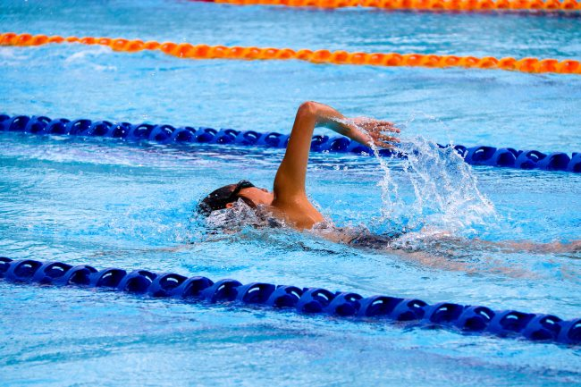

As I explained in the previous post [Searching For The Cardio Code](/2018/10/searching-for-the-cardio-code/), after a very long hiatus, I'm ready to reintroduce cardio training to my fitness plan.

Some would argue that my long [urban hikes](/tag/urban/) or my [10,000 steps a day](/2017/08/power-10000-steps-day-charts/) would qualify as cardio, but I am doubtful that my heart rate stays in that **(180 - your age)** range for an extended period. Seattle and San Francisco have hills and when I hike the streets, my heart rate may jump up enough to qualify as cardio, but only for a few minutes at a time. Also, as I mentioned in a previous post, years of doing SuperSlow HIT with exercises such as the leg press actually keeps my heart rate lower during the hill portion of these hikes.

### Injury and Pain are a Concern

The reason I stopped running shortly after college was a pain in my left upper hip. Think of the spot between your belt and pocket. I never figured that pain out and it only went away when I stopped running. Yesterday, after 20 years, I got reacquainted with a mild version of that same pain after just 20 minutes on an elliptical trainer.

Even though my knees are much better than that were in April, they aren't 100% and I don't know if they ever will be. The left one still feels spongy when I try to run across a street. Some people say running can protect and strengthen the knees and others say running hurts the knees. I suspect it is a [survivorship bias](/2013/07/can-running-be-antifragile/) thing and I may be one of the people that running is not good for. But I'd love to be proven wrong, however, I do fear reinjuring my knee. Considering the years I've dealt with this problem, I'd rather err on the side of caution.

### Cardio Ideas

Here are some ideas and my initial thoughts. Correct me where I get things wrong.

#### Running

Not an option at this time, maybe never. See above for explanation.

#### Biking

I would never bike outside in Seattle. I would consider smoking to be a safer activity. I do have access to both types of stationary bikes in the gym. Both bore the hell out of me. I have been doing 5-minutes a few times a week for knee rehab. I'm watching the clock the entire time. My heart rate never gets into the cardio zone and my knee still doesn't feel 100% comfortable with the movement.

#### Endless Rope Machine

Unfortunately, the 2 gyms I have access to right now do not have this [glorious machine](/2015/07/the-endless-rope-machine/). This would have been a good option for shorter cardio sessions.

#### Rowing Machine

Dr. Jay from the Cardio Code loves the rowing machine. People I respect in fitness either love or hate this machine for injury risk. I honestly don't know what to think. It is boring too.

#### Treadmill

Probably better than running, but not by much. I might experiment with power walking up an incline. If my knees are stable and my heart rate gets high enough, it is a candidate.

#### Elliptical Machine

Even though I got hip pain yesterday, this may have potential. My knees were happy. Too soon to tell.

#### Swimming

My new gym has a pool and I'm a decent swimmer, so this has potential. The only downside is depending on how crowded the gym is, my access to a pool lane will be less than certain. This would be a good backup choice.

#### Aerobic Dance

Never going to happen. Next.

#### Hiking

I love hiking, but I would need to travel to get to a trail where there was enough elevation to keep my heart rate up for 20+ minutes. For normal people that don't know the power of HIT, there are hikes close by that would work for them, but not for me.

#### Stairs

I do have access to a very long set of outdoor stairs near my house. I'll add them to the list.

#### Weighted Vest

Perhaps a Weighted Vest is an ideal way to get the heart rate up without increasing the speed of the cardio? Walking with a weighted vest is likely going to be better on my knees than running without one. Does that sound correct? It would need to be cheap. I see some on eBay. Wonder how many pounds I would need?

### Your Thoughts

If you were me and my knees, what would you do for cardio? I will ease into cardio on both time and times per week. My motivation is to expand my fitness. I won't continue if I'm in pain. If I can [listen to podcasts](/2017/11/the-10000-steps-university/) that is a huge plus.

_Photo by [Marcus Ng](https://unsplash.com/@marcusxsnapz)_

---

## Comments

### seantheaussie
*October 17 at 2018 at 2:07 AM*

You left out boxing against a bag, which can rapidly take your system to its maximum and has more visceral appeal than most cardio exercises.

I have a bad left knee. For cardio when it is feeling good I do a short, hard run uphill landing on my forefoot. It can get my cardio capacity from bloody awful to better (it is amazing how quickly cardio can improve) but the health benefits are unknown.

Swimming and stairs (without, then with weights) are the obvious ones to try from your list.

---

### JM
*October 17 at 2018 at 2:46 AM*

Jumping rope. 

Elev8d fitness from Egoscue. Lots of novel movements like bear crawls and unique to Egoscue movements that can get you huffing and puffing and most are low impact.

---

### Brock
*October 17 at 2018 at 9:31 PM*

This was exactly my point in my reply to the previous post: developing the aerobic base Maffetone style can be quite boring given modern implements. 

The only implement you left out was the VersaClimber, which is like a stepmaster but with handles near your shoulders so you work the upper body as well.

Two other suggestions to address the boredom issues are:
a) treat the exercise as a meditation and use breathing patterns to enhance that aspect of the exercise.  It's not supposed to be hard, so you can let your mind wander.  When I was a competitive swimmer, this was my approach on long sets.
b) Rotate aerobic exercises.  Aerobic exercise is for the heart and lungs, not the muscles you're using specifically, so doing 5 minute rotations of 3 or 4 exercises at the appropriate heart rate gets you through 15-20 minutes; repeat as necessary.  Robb Wolf said he does this on one of his podcasts/blog posts about his current training because he has a similar aversion to long bouts of the same repetitive exercise.

---

### MAS
*October 18 at 2018 at 12:44 AM*

@seantheaussie - Oh the memories. Back when I had a home gym in California, I had a heavy bag and a photo of the great Evander Holyfield. 

@JM - I'll look into those ideas. Thanks.

@Brock - I don't think my gym has the VersaClimber, but it does have Ellipticals with the arm things. I'll try that next. Also, thanks for the "boredom" wisdom. That all makes sense. 

@All - Today I tested the treadmill at 5% incline power-walking and I was able to hit the cardio zone without hurting my knee or hip for 20 minutes. I could have gone longer, but I wise enough to ease into these exercises.

---

### Marc
*October 18 at 2018 at 12:51 AM*

MAS,

You solicited my advice on what type of aerobics to use. The Assault bike types are great. The Concept 2 rower is awesome and offer unique cardio benefits per Dr. Jay book. After studying the rower movement pattern, I simulated this movement pattern by hooking a loading pin to a carabiner clip snap hook which is hooked to a revolving handle short lat bar. This arrangement allows momentum (10 HiTers just puked) to be used on kettlebell swings  … unlimited weight …  less wrist strain with the revolving handle ... standing position.  Awesome aerobic device … but slightly inferior to my Assault bike.  

Dr.  Jay wrote a book on kettlebell conditioning called Viking Warrior Conditioning … very good.... but inferior to his Cardio Code book.

In the book "Cardio Code"  Dr. Jay laid out the requirements  of cardiovascular  conditioning:

1) use a minimum of 50% of body's available muscle mass

2) a rapid rhythmical contraction-relaxation of agonist and
 antagonist muscles

3) Unimpeded  breathing  …  no Valsalva maneuver to decrease venous return to the right atrium

There are modern heart rate monitoring tools available today with the Apple watch being an exciting addition to any aerobic workout

---

### MAS
*October 18 at 2018 at 12:55 AM*

@Marc - Thanks. Quick question, would nasal breathing be considered "unimpeded"?

---

### Marc
*October 18 at 2018 at 1:49 AM*

MAS,

yes ….. for lower intensity aerobics

---

### Gary
*October 18 at 2018 at 2:33 AM*

Besides my resistance training, I do Heavy Hands walking. Last year I started at 1.5kg (about 3 pounds), and now I'm up to 9 pounds per hand. Usually do 30-35 minutes per session.

It beats cycling because I stay on the streets near home. I can go out under threatening weather and come back quickly if the weather turns bad.

I don't know what my heartrate is during the exercise, though, so I don't know if it qualifies as cardio or not. Weighted cardio, sure.

The thing I love about it is that the time flies! It's mesmerizing. I'll come back from a short walk and think, "that was about 20 minutes",  but the clock says it was 30 minutes. If I think I was out walking for 30 minutes, it's usually closer to 45 minutes.

Also, since it's walking, not running, it's very easy on the lower limb joints.

In my own particular circumstances, there's a social component as well. If I go out for a walk in the neighborhood at 6PM, I meet all the dog walkers. Occasionally I stop for a quick chat and pet the dogs. So now everybody recognizes me.

---

### Eric
*October 18 at 2018 at 2:38 AM*

You live by a lake with an active rowing community.  Is sculling an option or does that fall into the same bucket as biking?

---

### Ritesh
*October 18 at 2018 at 5:18 PM*

Weighted vest has worked well for me. I have a 10kg and a 15kg. I am smaller (and weaker!) than you so maybe the 15kg (35lb) would be ideal for you. Heavier than this for extended walks tends to cause me neck tension. A pack could be added occasionally and stairs incorporated, and this would have the advantage of being a simple extension of the daily hikes which you area already doing. In the gym I favour the elliptical and some of the upmarket stair machines for variety. The concept 2 is also a great machine and may suit your build more than running/elliptical type movements. Music helps the monotony!

---

### MAS
*October 19 at 2018 at 12:50 AM*

@Eric - Good idea for the spring, but first I would need to prove myself on the indoor rower. I'm a big believer in "earning your gear" before your spend money. 

@Ritesh - Thanks. For now, I am going to hold off on the weighted vest and keep monitoring my heart rate. After I get more conditioned, then I'll likely need to decide between adding speed (potentially bad for my knee) or adding weight. 

Funny story: a friend of mine was jogging along a railroad track with a black weighted vest several years ago in a small town outside of Seattle. Someone reported suspicious behavior. Cops arrived with guns drawn. He had to explain to them the weighted vest. That'll get your heart racing!

---

### Andrew
*October 19 at 2018 at 3:41 PM*

This is what worked for me. Find a steep hill. Sprint to the top as hard as you can and jog/walk back down. Repeat for as many times until those legs are burning and feel like someone has tied cement bags to them.

---

### Marc
*October 19 at 2018 at 6:45 PM*

I see a trend for high intensity trainees when they try and incorporate cardiovascular conditioning ....  incorporating way too much intensity. Maffetone warns of building cardiovascular condition while simultaneously building strength.  A base of CV comes first. Strength vs. CV are competing interests. This is where Dr. Jay’s method could improve.
Here is why aerobics should come first.  Vast amounts of mitochondria are found in the red muscle fibers (slow twitch endurance fibers)  which process glucose, fat stores in the muscle fibers, and fat in general to make ATP for energy. Resistance training is primarily an anaerobic activity which builds white fibers (fast twitch muscle fibers which fatigue fast) and contain less amounts of mitochondria. Resistance training can increase metabolism by increasing muscle mass and slow twitch fibers but is a poor way to increase CV function due to prolonged contraction time of the muscles which impedes venous blood flow return to the heart.

Increasing mitochondria in the slow twitch fibers helps burn more fat and raises ventilatory threshold 1 to increase the percentage of fat to carbohydrates ratio burned. Endurance fibers support joints. Need I say HiT was wrong. When HiT say that aerobics are useless, notice that data (facts) are never included which would include vo2max. What you wind up with is an emotional argument ... Sorry MAS!

---

### Geoff
*October 19 at 2018 at 7:01 PM*

Not to get all 1990s style up in here, but how about inline skating - either outdoors on a path or inside on a roller skating rink.  Assuming you can stay upright it could be a low impact option to consider for 20-30 minutes.

If you're going to use the Maffetone method, be careful.  There's more to it than 180-age.  With your knee condition you may need to take the -5 bpm discount.  Be sure too to do a so-called MAF Test to establish a baseline level that you can measure against to gauge your improvement. 

That said, I find my aerobic condition improves best when I operate in the 130-150 bpm range.

---

### MAS
*October 20 at 2018 at 3:12 AM*

@Marc - Thanks for sharing. I'm not cheerleading the HIT case anymore. Not because I know the answer, but because I've already got the benefits from HIT and now I'm seeking the low-hanging-fruit gains from cardio. The journey begins.

@Geoff - I did inline skating in the late 90s and it never clicked with me. I'm using the "180-age" as a way to get started and not overthink it. The 20-min sessions in that range I had this week seemed fine to me. I can start from here.

---

### MAS
*October 20 at 2018 at 3:06 PM*

@Gary - The Heavy Hands are interesting to me. When I learned about them last week, it was what prompted me to look into weighted vests again. I want the extra weight, but I also want my hands free.

---

### garymar
*October 26 at 2018 at 1:43 AM*

Thinking about this subject, I remembered to check my heart rate immediately after 2 30-minute Heavy Hands sessions.

Both times my heart rate was 120bpm. Since I'm 65 years old, it looks like that puts me into the "cardio zone".

Of course when I'm climbing that hill in the local park, the heart probably beats a bit faster than that.

---

### Mitch
*October 28 at 2018 at 2:13 PM*

Old school boxing workout, heavy bag and jumping rope along with kettlebell swings keeps my heart rate pegged. I thought the formula was 220 minus age times 70-85% depending on your intensity wishes. I also bike, but Denver has hundreds of miles of safe bike trails. Are you sure no bike trails in Seattle?

---

### MAS
*October 29 at 2018 at 3:22 PM*

@Mitch - There are bike trails. Getting to those trails safely would require time, a bike rack, and a lot more interest on my part. Biking indoor or outside doesn't interest me. 

@All - I'm using the elliptical (with and without the arm-things) successfully so far. 20 minutes 3x week. I'll likely bump that up to 25 minutes this week.

---

### Craig
*November 19 at 2018 at 2:59 AM*

Your question is a few weeks old, but I'll offer a suggestion: can you get your hands on an old style Nordic Track ski machine?

When I was younger, I enjoyed jogging for moderate distances and paces.   When I started having injuries, I tried a number of alternatives, and settled on a Nordic Track skier.    There is no impact, and you don't use a lot of knee flex.   You tend to use your hips more, and it can cause a bit of low back strain for some people.   Just be aware that an older, used machine may have enough clutch wear that it won't provide a good experience.   You may have to buy parts to recondition it.  

More recently, I have switched from the Nordic track to an elliptical machine, which I have set up at home, in front of a TV.  I use this for low to moderate intensity,  long-duration steady cardio sessions.   The TV helps with the boredom.

For interval work, I alternate between a rowing machine and a stationary bike, both at the gym where I lift weights.

---

### MAS
*November 19 at 2018 at 3:10 PM*

@Craig - Right now I'm doing well with the ellipticals.

---

### Sifter
*August 6 at 2024 at 4:58 AM*

I would think Hindu pushups and Hindu squats.  Uses 50%+ body mass,  rhythmic,  no vascular occlusion  like heavy weights, joint friendly. Why not?

---

### MAS
*August 6 at 2024 at 1:07 PM*

@Sifter - A solid exercise combo, but unless one was super conditioned it would be too intense to qualify as cardio.

---

### MAS
*August 6 at 2024 at 3:09 PM*

@Sifter - On second thought, I suppose it one slowed down the tempo of the Hindu pushup/squat enough that they fell into the cardio zone - it could work. Having a heart rate monitor could help one dial their speed. 

What do others think?

---

