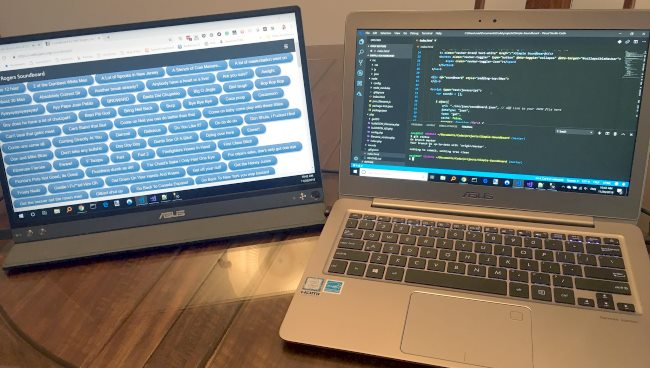

It is the shopping season, so I thought I would share my two favorite purchases of 2018 with you.

### #1 ASUS ZenScreen

This summer I was getting frustrated with the 13-inch screen size of my laptop as it was preventing me from being as productive as I could on my projects, so even though my laptop was only a year old, I started researching buying a new 15-inch laptop. Thankfully, I stumbled onto a much better and affordable solution. The ASUS ZenScreen is a 2nd monitor for laptops. It is thin and has a nice cover that doubles as a stand when folded. For around $200, I solved all my problems and now I have more screen real estate than I would have with a single 15-inch laptop.  _My 15.6-inch ASUS ZenScreen to the left. The laptop to the right the ASUS Zenbook, which I do not recommend (slow)._  A 2nd monitor is also great if you take online courses such as Lynda or Udemy. It allows me to code in an editor while watching the lesson without pausing the video and switching windows into focus. Side note: Many libraries provide FREE access to Lynda courses. But library websites are notoriously bad, so Google/Bing the name of your library system and the word Lynda.

### #2 Membership to Gym With a Sauna

For years, I have been playing the free-pass game to get access to saunas. I finally decided to get a membership at a nearby LA Fitness, which has a sauna. I'm going 5-6 times a week and I'm loving it. It is making the cold rainy season bearable. And the health benefits are amazing. Check out the podcast below if you want to hear more about how good saunas can be for you. [The Top 22 Science-Backed Benefits of Saunas (And How Saunas Help You Beat Fatigue and Increase Your Energy)](https://www.theenergyblueprint.com/benefits-of-saunas/) Do you have a recent purchase that you think I or the reader of this blog would like? Leave a comment. Thanks.

---

## Comments

### Elyse
*November 28 at 2018 at 2:37 PM*

I've been looking for a local sauna option and so far only found ones that cost $30/session and require advance reservations.  Thanks for pointing out the convenient and affordable option at LA Fitness!  I will stop by there tomorrow with a guest pass to check it out.

---

### MAS
*November 28 at 2018 at 3:25 PM*

@Elyse - Many 24 Fitness clubs (Super Sport) also have saunas and often Costco will sell you memberships at lower prices than you get on your own. And if you don't have a Costco membership, I believe you can still shop in the online store to get that deal. They will mail it to your home.

---

