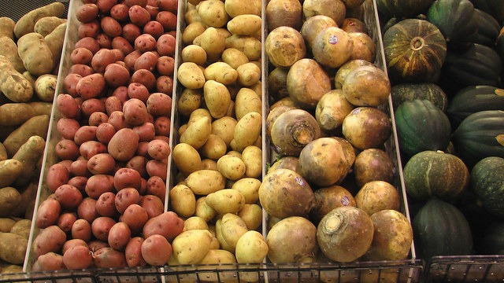

Every so often in a conversation, I'll mention how one can get lean without feeling hunger by eating boiled potatoes. I'll get challenged on this point as most people are clueless to the fact that potatoes are not fattening when you don't fry them or slather butter or cheese on them. So, I'll mention to the other party how I used potatoes to drop 25 pounds and keep that weight off for more than a year.

At this point, my debate opponent should pause and perhaps ask some follow up questions on what could be a learning experience. But they rarely do. That would destroy their nutritional worldview that potatoes and carbs are inherently fattening.

So they fire back with any idea that comes to their head to explain how I dropped 25 pounds by eating on average 10-15 pounds of boiled potatoes a week.

_You exercised more!_

Nope. My exercise levels have been consistent for years as well as the type of exercises I do.

_It must be genetics!_

Then how was it my genetics allowed me to gain 25 pounds when I wasn't eating lots of potatoes?

At this point, they try and shift the topic away from fat loss to something else.

_But potatoes are nightshades and nightshades are horrible._

I feel great and I feel even better being 25 pounds lighter.

_But the glycemic response will give you diabetes!_

Being a fat ass will give you diabetes. But if you want to lower the glycemic response, add a splash of red wine vinegar to the potatoes.

_I would get fat eating that many potatoes._ 

No, you wouldn't. You couldn't possibly eat enough potatoes to make yourself fat. Figure out your daily calorie burn and divide by 350. That is how many pounds of potatoes you'd have to eat just to stay the same weight. You might stuff yourself once trying to hit that number, but after that, your brain will suppress hunger signals before you get close. Enter calorie deficit. Enter fat loss.

I didn't just make this up. This nutritional trick is over 100 years old.

**Cognitive Dissonance achieved.** 

Then I tell them that now that I am lean, I cut back eating so many potatoes. This is when they get a glimmer of hope that I might be conceding them a point.

Then I explain the real reason.

I had to cut back on the potatoes because I was losing too much weight. I wanted to gain some muscle and my appetite was too low from the boiled potatoes, so I took a break from them for the time being.

# 🤯

Seriously, if you think eating boiled potatoes will make you fat, check out my [Potato Hack Diet](/tag/potato/) resource page. The potato has the highest satiety of any food on the planet. Potatoes are awesome!

_[Photo credit](https://flic.kr/p/fq91Fo)_

---

## Comments

### garymar
*November 30 at 2018 at 6:15 AM*

Ordered 10 kgs of potatoes a while back. My wife is off to see the kids for a few weeks from next week, so I may do a modified potato hack then.

After a few days, I always get severe intestinal distress when coming <i>off</i> the potato hack diet. This time, I am going to keep eating my stir-fry vegetable dish (6 different vegetables including konjac, fried in just a smidgen of coconut oil) every day, to keep the system running steadily.

---

### MAS
*November 30 at 2018 at 2:34 PM*

@garymar - You could try different variations, such as:

1- potatoes before dinner, then regular food.
2- Marine Potato 20  https://criticalmas.org/2017/08/marine-potato-20-easy-potato-hack-everyone/

When I started the Potato Hack I was strict with eating them cold and without salt. As I got closer to my ideal weight, I mixed things up. Now I eat them hot and cold. Always with salt and usually with red wine vinegar.

---

### Rod
*November 30 at 2018 at 11:27 PM*

I want to try the potato hack but wonder about my blood sugar.  I am at times just a bit above normal levels, but want to avoid adult onset diabetes.  Maybe I should just do it and see how my sugars respond.  As you mentioned, it would only be for short periods so maybe this is a non-issue from the start.

---

### MAS
*December 1 at 2018 at 2:58 AM*

@Rod - I don't want to give medical advice. Please read the Potato Hack book by Tim Steele to get all the facts.

---

### Kris
*December 7 at 2018 at 2:11 PM*

A quick search for satiety scores of food returned this chart showing much potatoes punch abover their caloric content in terms of what they call 'fullness factor'

https://nutritiondata.self.com/images/help/fullness-factor.png

This is the website https://nutritiondata.self.com/topics/fullness-factor

---

### David
*December 10 at 2018 at 8:53 AM*

Would this hack work if I added sautéed onions for flavor?

---

### MAS
*December 10 at 2018 at 7:08 PM*

@David - I answered you (and many others) in today's post.
https://criticalmas.org/2018/12/bargaining-for-flavor-fixing-your-potato-hack-mindset/

---

### Ondřej
*October 2 at 2019 at 10:14 AM*

I'm just reading Nutrition Compass by German author Bas Kast. Not sure if it's in english. Anyway, he is pretty much spot on, except one thing: potatoes. He says they are only mildly negative overall, but still...He seems to be somewhere in the middle between Guyenet and a LCHF person.

---

