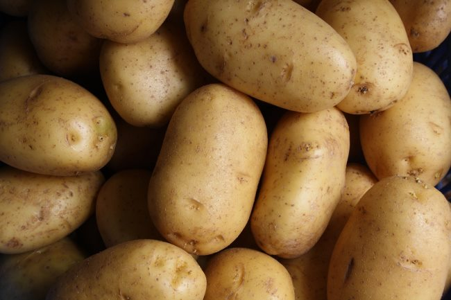

I have received some variation of this question so many times now, that I thought I would make a post directly responding to it. That question goes something like this:

> Can I add \_\_\_\_ to the potatoes for flavor during the potato hack?

What the person wants to add to the potatoes varies, but the theme is always the same. They want to make the potato hack easier. They want more flavor. They are bargaining. Bargaining for flavor. I briefly discussed this in the 2017 post [The Five Stages of (Potato Hack) Grief](/2017/08/five-stages-potato-hack-grief/). From Stage #3:

> Bargaining is the most predictable stage. Once they’ve accepted the concept, moved past any objection they can think of, they immediately start looking for loopholes. Can I have sour cream? Can I have ketchup? What about apples? Salads? Eggs? Protein shakes?

The Potato Hack works because you fill your belly with very-low flavor boiled potatoes. It tricks your brain in a good way to break the connection between flavor and satiety. It is a powerful learning experience that will not only help you lose weight but do it a way that helps reset your connection to food in an unnatural environment where food has been engineered to taste better than anything any previous generation of humans since the beginning ever had to taste. But, you are weak and you need your flavor. You can't go 5 days or even 1 day or even one meal with plain boiled potatoes. I have suggested two ways to make it easier to prepare for potato hacking.

1.  Use salt and red wine vinegar as "training wheels" to get the habit started. It will increase the flavor, but not the calories. From there, you can decide what you want to do next.
2.  [Marine Potato 20 – An Easy Potato Hack For Everyone](/2017/08/marine-potato-20-easy-potato-hack-everyone/)

But for some of you, these hacks aren't enough. Highly-flavorful foods have made you their bitch. You work for your taste buds. They are in control. So let's go back to the original question: _Can I add \_\_\_ to the potatoes for flavor?_ Add it up. If the average human eats 3-5 pounds of food a day, add the potatoes and all your _fixings_ you need, weight it up, take the total calories and measure it against your metabolic rate. There are calculators online to help you with finding yours. If the math works in your favor, test it out. If you are able to make your numbers and NOT FEEL HUNGRY, then congrats. You won't get the full benefit, but you might move in the right direction. Why is important to not feel hungry? Because the brain remembers. It doesn't want you to lean out. Do you know what hunger does during a diet? It puts the brain on alert. Then when your willpower is at its lowest, it cranks up the hunger. Most dieters regain their lost pounds because they never lost the weight in a manner that didn't trigger the brain to go on alert. How do you fool your brain? You fill your belly with potatoes until you can't eat another one. Silencing hunger is the key to maintaining fat loss. If you still think you need to flavor up your potatoes, let me share with you the mindset that helped me **drop 25 pounds and keep it off for more than a year without ever feeling hunger**. Once I understood the roles of flavor and satiety, I saw it like debt. The extra weight I was carrying was like credit card debt. It was there because I spent beyond my means. I took more flavor from the environment than my body could process, so it got stored as fat. I paid off my debt in full by reducing my flavor intake. By reducing my flavor intake, I reduced my calorie intake, but I did it in a way that I never felt hungry. My brain never went into alert status. I believe that reducing flavor is important to the long-term success of a diet. Not every meal, but some. You might potato hack a few days a month or a meal a day or whatever works for you. Plain boiled potatoes are the ultimate tool for breaking the flavor addiction. The ability to go without flavor for a meal or a few days is a skill you develop. It gets easier. That strength of character you build potato hacking stays with you and makes other challenges easier. You can [potato hack](https://criticalmas.org/best-of/potato-hack-diet/)! **Start with one potato.** Then a year from now, come back here and post a comment telling me how much weight you lost and how much better you feel or if you've already been successful, drop some encouragement below.  _Photo by [Lars Blankers](https://unsplash.com/@lmablankers)_

---

## Comments

### David
*December 10 at 2018 at 11:29 PM*

Well I guess that answers my question about adding onions...

---

### Hs
*December 13 at 2018 at 4:10 AM*

What benefits do you suspect losing weight this way has conferred upon you?  Better energy, better mood, fewer health complaints,  more ease moving around?  Just curious...

---

### Geoff
*December 13 at 2018 at 11:44 AM*

How about coffee, MAS?  High flavor but low calorie. Not that I would combine coffee and potatoes in a meal, but does consuming high flavor, low calorie beverages away from meal times help/hurt progress?

---

### MAS
*December 13 at 2018 at 3:20 PM*

@Hs - All those reasons.

@Geoff - I can't say since there isn't a version of me without daily coffee intake that I can compare against.  My guess is it is not a factor or if it is one, that effect is tiny (likely net positive though).

---

### matt
*December 14 at 2018 at 7:45 AM*

this diet makes sense but the protein deficit suggests youll surely lose more muscle than just the calorie deficit alone. would there be a problem with adding say 3 unsweetened protein drinks (which since theyre unsweetened are very bland), which would add less than 300 calories for 60 grams of protein? Or is there an advantage to reduced protein intake?
Btw you mentioned a while back youve switched from HIT to a volume approach to exercise, have you drawn any conclusions about its effectiveness yet?

---

### matt
*December 14 at 2018 at 7:48 AM*

Ah it looks like youve answered my first question above in your next post!

---

### MAS
*December 14 at 2018 at 3:20 PM*

@Matt - I do not think muscle loss is a concern on the Potato Hack. People fast for 18 hours a day or for periods of 3-5 days all the time without losing muscle. 

However, as one gets older and/or leaner, protein requirements go up. This means when you aren't potato hacking, increase the protein. You do not need to add protein to potatoes to preserve muscle. 

But as you see in my following post, I have experimented with a new way to tackle that potatoes w/ protein. Although it will work for all, I designed it for my needs (older & leaner). I'll cover it more in a future post. 

I picked volume over HIT because I was forced to. My gym is too hot for me to do HIT. Almost all gyms are too hot. I get piercing headaches going to failure when the room temp is too high. So I can't answer your question. There is not a version of me that had access to a cool (60 F) gym doing HIT that I can compare myself to. Both paths are fine. Whatever holds your interest the most at that moment is the best choice.

---

### Hs
*December 15 at 2018 at 3:23 AM*

MAS - To clarify I'm curious if you achieved such benefits along with weight loss.  Not the reasons.  I've heard of many cases (and experienced myself) declines in such things with weight loss.  But your methods seem more sophisticated and nuanced.

---

### MAS
*December 15 at 2018 at 2:26 PM*

@Hs - My guess is being lighter helped my knee recover faster. And being successful with my plan improved my mood.

---

### Raina
*July 2 at 2022 at 6:40 PM*

Going without flavor seems like a silent retreat for your body rather than your mind.

I've seen some of the info related to cooling the potatoes increasing the resistant starch and reducing negative impact on blood sugar. Does anyone know of data that specifically  speaks to the safety of potato hacking for type 2 diabetics? Thanks!

---

