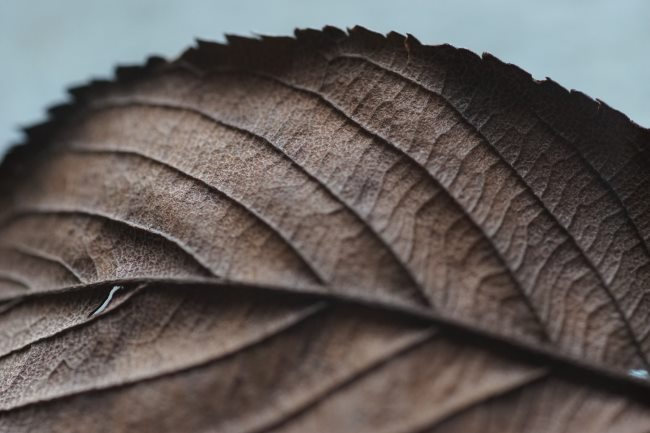

_Some names and identifying details have been changed to protect the privacy of the individuals mentioned in this blog post._ When I first arrived in Seattle, I met Erica at a local Meetup group. She was an attractive and outgoing lady from Eastern Europe. From 2007 until I left for California in 2014, I met up with her and other friends in that group on a regular basis. More in the early years though. I don't recall noticing her health was suffering before I left in 2014. She did seem thinner and increasingly more picky about food. She was getting caught up in the [toxic planet thesis](/2018/04/fear-of-a-toxic-planet/) at the same time I had already expanded my diet to include ice cream, after a few years of "clean eating". I recall one time she had switched to a vegetarian diet and actually manifested symptoms of illness when she incorrectly believed she had consumed some meat. I told that story in the post [The Time the Vegetarian Got Sick](/2017/08/time-vegetarian-got-sick/).

> My friend now knew she never consumed a meat product in that meal. Yet for twenty or so minutes she believed she did. This made her sick. Legitimately sick. Everyone could see her getting ill. Once she learned she hadn’t had meat, the paleness of her skin went away, but she claimed to still feel ill. But less so.

When I returned from California in late summer 2015, I tried to get the old group back together. Erica couldn't attend, because she was having some health issues which she did not describe to me. But a few months later, she invited us all to her apartment. She looked awful. She was underweight and had trouble moving. She needed a walker. It was uncomfortable for all of us. She didn't want to talk about her health and we didn't want to pry. We were close, but not really. When I left her place, I spoke to another friend in private. I said that regardless of what was wrong with her she needed to eat more. But her diet was so restrictive at this point, it would be a challenge to make that happen, especially since, at this point, she viewed so many food items as poison. Our group of friends sort of separated at this point. Not intentional. It just happened. Then last month, I received an email that Erica had died at the age of 54. At this point, I reached out to break the news to our group. I also organized a get together as a memorial to Erica. With the exception of the person that sent me the email, nobody knew what had happened. This is what we learned. Sometime in her late 40s, Erica was developing painful symptoms regarding heavy bleeding. She visited two doctors where she learned she had fibroid tumors. Both physicians advised her to have hysterectomy surgery. She felt she was too young for this to happen to her, so she didn't schedule the surgery. Then Erica had a conversation with a guy who I'll call James at a Coffee Club Meetup that I was hosting. James, in my opinion, is an orthorexic hypochondriac. There was always something wrong with him and he was always restricting his diet further and further. At the point he was chatting with Erica, he was a raw vegan. James told Erica how he fixed or cured some ailment with his diet. She was inspired by his story and went down the rabbit hole of Internet "research". Every time her condition worsened, she restricted her diet more. She started going to the sauna twice a day to expel toxins from her body. Her weight kept dropping. Her mobility got worse. She couldn't work anymore and refused medical help.  At this point, she didn't trust any medical professionals. Eventually, she was too disabled to care for herself and was forced to move back to the East Coast with family members. Before she left, one friend tried to get her to visit a clinic that specializes in orthorexia. She not only declined to go but got angry and severed contact with that friend. Erica also turned against her family when they tried to get her to accept medical help. We don't know what happened in the last year of her life and that one friend that emailed me only discovered of her passing by searching her name online, where she found the obituary. I run into James about twice a year now. I don't know how well he knew Erica or if he would even recall that conversation he had with her. At first, I considered telling him, but as of right now, I don't think I will. If it wasn't him that inspired her, it likely would have been someone else. She was seeking an alternative answer. He just happened to be there when she was searching.

### My View

I posted this story because it is instructive. Erica had a false health narrative. She believed that if she changed her diet, she could solve all her health problems. When her health got worse, instead of accepting she might be wrong and might need medical help, she restricted her diet further. Soon she was underweight and even if her diet was solid, she didn't have enough calories to restore herself back to health. Viewing calories as nutrients in themselves is something I learned on this blog from a frequent commenter (Anemone). If you are chronically undereating, you are depriving your body of tools that it needs to keep you healthy. Even if those calories are less than nutritious compared to others. [Fear of a toxic planet](/2018/04/fear-of-a-toxic-planet/) is something I've posted on before. The fear will inflict more damage than the toxins. Finally, question your decisions from time to time. Challenge your assumptions. Try not to fall into [false health narratives](/2019/01/false-health-narratives/). And if you do, it is OK to admit you were mistaken and change direction. Had Erica paused along the way and reexamined her decisions, I doubt her health would have declined so rapidly and she would most likely still be with us.  _Photo by [Hiroyuki Igarashi](https://unsplash.com/@viivle)_

---

## Comments

### Rachel
*January 31 at 2019 at 7:14 PM*

How sad but it is so necessary to talk about these things. The vegan community seems to really be suffering right now with many people finding themselves in terrible health because of the dogma. Perhaps we should stop using the internet to dictate our behaviour and really start to get in tune with our bodies.

---

### norlee
*February 1 at 2019 at 2:36 AM*

It is my understanding that eating disorders are similar to addiction in that you can understand that you are killing yourself and still be unable to stop the compulsive behavior.

---

### Elizabeth
*February 1 at 2019 at 1:45 PM*

I live in New Orleans, where we eat as poorly as possible, and exercise to combat the effects. I've never heard of such as situation as you talk about above. How terrible! Thank you for the information.

---

### Anemone
*September 28 at 2020 at 2:11 AM*

Ironically, I found that the site that told me about the importance of calories was seriously orthorexic, too, in its own way, and following its advice wrecked my health. (Fortunately not permanently.)

And I have since discovered Wallace D. Wattles' *The Science of Being Well*, and Luigi Cornaro, who "ate but little" (like, seriously, very little from about age 40 – and he was spry to about the age 100), and now I have no clue.

Right now my focus is on not stress-eating (I recently figured out how to avoid a lot of it), and seeing how much my body actually wants.

---

### MAS
*September 28 at 2020 at 2:01 PM*

@Anemone - Nice to hear from you.

I discovered the same thing about a site that I had trusted. 
https://criticalmas.org/2017/08/directionally-accurate-metabolic-unicorns/

---

### Anemone
*September 29 at 2020 at 4:10 AM*

Ugh, yeah. Matt Stone is how I found Your Eatopia, which was not good for me. Neither of them were. It turns out I have a really low body temperature and my morning temperature is typically 35.x°C. I was never able to get it up to normal levels no matter how much I ate. So much for eat for heat. Also, I get indigestion from most plant foods, so I have to restrict no matter what. I hate being an outlier, or at least a low income one. At least I keep ending up back at the same solution.

---

