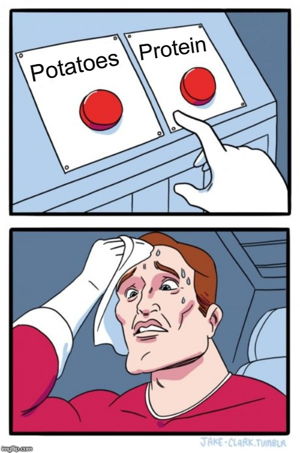

I recently received an email asking about the best way to keep weight off after a diet. I like the question because at its root is an understanding that once you get to your ideal weight it is too soon to declare victory. We know this because so many dieters regain the weight they lost. Often more. I've seen stats that say between 70% and 95% of dieters will eventually regain the weight they lost. I am not an expert on this topic, but I researched the hell out of this question before I even started the diet helped me lose the weight I needed to. And so far, I've been successful at keeping off the weight. My measurements:

-   222 - March 2017
-   202 - August 2017
-   197 - April 2018
-   194 - January 2018

_(Height 6′ 2.5)_  My story is not a story of going from obese to ripped, so I don't know how valuable it will be to you. I will say that the easiest weight to lose in any diet will be the initial pounds. The hardest pounds will be at the end. For me, the fat loss was not difficult, because I designed a diet that crushed hunger, so I didn't need any willpower to consciously reduce calories. I selected foods that were high volume (boiled potatoes) and high protein (eggs, sardines, Greek yogurt, lean ground beef, legumes). But how you lose the weight is not the topic of this post. This is about defending that loss.

### #1 Don't Declare Victory Too Soon

In [Declaring Victory! How I Lost and Kept Off 25 Pounds](/2018/04/declaring-victory-how-i-lost-and-kept-off-25-pounds/), I explained why I waited so many months after I hit my goal weight before I told myself and my readers that I had achieved my target.  One of the reasons:

> If setpoint theory is correct and I use a conservative 1/2 pound per week reset, then my fat loss moved much faster than my setpoint. But now that we are just over a year, it has caught up. This means that because I’ve been at my lower weight for several months now, I’ve likely locked in the new lower setpoint.

Many dieters will lose 1-3 pounds a week. That is faster than many researchers believe our setpoint moves. If the tendency is for the body to regain lost weight, respect that biological fact.

### #2 Keep Taking Measurements

Stepping on a scale and taking a tape measure readings a few times a week is something I highly recommend you continue doing. You are playing defense now. Don't let your guard down.

### #3 Understand the Math of Metabolism

Dieting makes your metabolism more efficient. This means your expected caloric burn at your goal weight will be lower than had you never gained and lost the weight. Read [Why Is It So Easy To Regain Weight?](https://weightology.net/why-is-it-so-easy-to-regain-weight/) by James Krieger for a detailed explanation. Let us say a person diets from 200 down to 170, which is the weight that person had in college. When they get down to 170, they may have to restrict their calories as if they were at 160, because the body recognizes the threat of calorie restriction and dials down metabolism as a survival strategy. How long this lower metabolism persists is still being debated and it may change from person to person based on the amount of fat loss, age, or other factors. Assume at least a year. This is another reason not to declare victory too soon. I do not know if designing a diet like I did which quiets the hunger hormones prevents this downregulation in metabolism. I suspect it can only help.

### #4 Understand P-Ratio

I cover P-Ratio more in [High Volume or High Protein Foods For Fat Loss](/2017/08/high-volume-high-protein-foods-fat-loss/), but the short version is when we lose weight, some of the weight comes from fat and some from muscle. As one gets leaner, the body starts to burn more muscle. This is bad. The defense is to increase protein as you get leaner and keep that level of protein higher to defend that fat loss. What percent is best? Let the scale and tape measure be your guide.

### #5 Document What Works (and Doesn't)

If you have just succeeded in hitting your goal weight, it would be a great time to jot down every idea that worked for you and those that didn't. Then refer to it when you need to. Here is mine: [Fat Loss Cheatsheet: What Works and What Doesn’t (for me)](/2018/02/fat-loss-cheatsheet-works-doesnt/) I put those 1200 words down just prior to declaring victory on my diet. I've read it a few times since then. There will be nothing forgotten should I ever need to diet again. I'll have a working playbook already in hand.

### Wrap Up

Recently, I introduced [Potatoes and Protein – Two Attacks on Hunger](/2018/12/potatoes-and-protein-two-attacks-on-hunger/). Not only would this plan help someone lean out, but it is an excellent tool for defending fat loss. I designed it as a no-thinking cheap-as-hell way to stay lean with minimal time commitment to food preparation. These are my tips. If you have one you'd like to share, leave a comment below.  _When a diet starts, either button is fine. But as you get leaner, hit the protein button more often. Both work!_

---

## Comments

### rbiser
*February 6 at 2019 at 1:37 AM*

I would be interested in hearing your thoughts on the opposite problem. 

I have commented here a few times before and we have a similar build.

Due to stress at home and work I have been steadily losing weight, I am 6'4" and normally about 190 pounds. I am down to 170. I'd think the answer is ice cream and donuts but if my self diagnosis of IBS is correct (and a long standing problem even before recent stress) it doesn't help if it runs right through me.

---

### MAS
*February 6 at 2019 at 2:29 AM*

@rbiser - Some ideas off the top of my head:

1- lower protein to stimulate appetite
2- snack
3- liquid calories 
4- foods with high flavor reward (carbs + fat)
5- increase your eating window 

You can still avoid the foods that are problematic and get into a calorie surplus.

---

### rbiser
*February 6 at 2019 at 4:14 PM*

Thanks for the reply. 

2 and 5 will be the hardest. I rarely want breakfast or snacks. This morning had the carbs and fat and liquid calories though. 

Saw your post on orthorexia. That’s not me. Usually I just play Russian roulette with the ice cream or whatever and the IBS. I had Chick Fil A super sized for lunch yesterday to get an easy 1000 calories.

---

### rbiser
*February 6 at 2019 at 5:11 PM*

Regarding orthorexia. I think a post combining your thoughts on detoxing your body because eliminating toxins and washing your veggies or whatever is good with not being paranoid about a “toxic planet” and eating whatever your friends or family cook when visiting and having a snickers occasionally is good would be helpful. Or maybe just cross link those posts because not everyone will see both.

---

### MAS
*February 6 at 2019 at 5:23 PM*

@rbiser - On reflection, I agree that you should avoid snacks and a wider eating window. With IBS, your digestive system probably needs to spend less time processing food. So focus on making those meals calorie dense. 

At this time I want to keep the orthorexia post as is with no deep links. I'm not an expert on orthorexia or rational detoxing. I'm don't want to give advice on something that is clearly a life-or-death medical concern. The orthorexia post is a single story of one person that made the wrong choices. I hope I never need to post on the topic again.

---

### rbiser
*February 7 at 2019 at 12:44 AM*

You have obviously considered the orthorexia post and particular tragedy more in preparing it than I had in just reading it. 

I have been starting my day with a liter of coffee (coffee, paleo, and CrossFit is how I found your website years ago, thanks for convincing me not getting injured
Is my number one exercise priority). I will cut back on coffee as well and see if appetite increases and weight improves.

---

### rbiser
*February 18 at 2019 at 8:07 PM*

1, 3, 4, and less coffee is working. 

Up two pounds, even after taking rock climbing up again and getting more exercise thereby.

---

