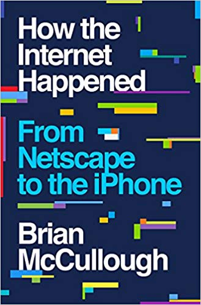

A few weeks ago, I was searching for a podcast on Overcast and I stumbled across a title that I wasn't looking for but it grabbed my attention instantly. It was called the [Internet History Podcast](http://www.internethistorypodcast.com/).  After listening to a few of the initial episodes, I knew I had to get the book that was written by the host.  _How the Internet Happened: From Netscape to the iPhone by Brian McCullough_ I'm a fan of history, finance, and web development. I've been pushing content onto the web since at least [1996](/2010/07/my-first-dated-blog-post-was-from-july-1996/). I was there at the dawn of browsers with my dial-up modem. This book was for me. Have you ever told a story from years ago that sounds so incredible you start to doubt your own memory of the event? The lunacy of the dot-com days was one of those periods. This book not only reminded me that my memories were not exaggerated, but it was even wilder than I recalled. The numbers on some of those deals were insane. So much money was being plowed into even the shakiest of ideas. The late 1990s were a period of unbridled optimism about the future and what would be possible on the internet. Business plans and profits weren't important. Exponential growth was the key. Build it first, get big, and get rich. Imagine telling a 20-year old today that the former Surgeon General had a medical website in 1999 (DrKoop.com) that raised $85 million on an IPO for a site that had only earned lifetime revenues of $43,000. And this is far from the craziest story. Blue Mountain Arts was a website where all you did was send digital greeting cards. It was sold for $740 million. Insane! The book covers the early browser wars, the dot-com boom, the crash, blogging, the solid businesses that survived, Napster, how the first social networks started, and the early days of Facebook. The book concludes with the rise of mobile and the history behind the first iPhone. In many ways, this book made me nostalgic for the early days. Yes, the browsers and network speeds sucked. So did development tools, but we didn't know better. The story of the internet was still in the early innings. Back then those of us with even a minor amount of technical skills were pioneers. I started using the handle **_digitalcolony_** on the web back in 1998 because it felt like we were colonizing a barren digital landscape.  _The logo from my site from 1999._ Today, that feeling is gone. The internet feels like it needs to be disrupted from the walled-gardens of Facebook, Twitter, etc. It has gotten too static, predictable, and monopolistic. A handful of massively powerful companies now control the attention of almost all users on the Internet. In my opinion and maybe those that recall the early days, things have become boring. We are long overdue for the next major disruption. If you are interested in learning about the 1993-2007 era of the Internet and how we got to where we are now, read _How the Internet Happened._  Highly recommended.

---

## Comments

### Hs
*January 31 at 2019 at 8:56 PM*

<i>Today, that feeling is gone. The internet feels like it needs to be disrupted from the walled-gardens of Facebook, Twitter, etc. It has gotten too static, predictable and monopolistic. A handful of massively powerful companies now control the attention of almost all users on the Internet. In my opinion and maybe those that recall the early days, things have become boring. We are long overdue for the next major disruption.</i>

I feel your sentiment here.  I remember the early days of the internet having a warm human feeling charm.  I remember colorful but ameraturish websites, webrings and search engines that, while they didn't work as well seemed to have the intent of helping me find things rather than showing me name brands and what's popular related to my search terms.  Now most of the web feels alienating and controlled by creepy, non-human entities i.e. tech giants with ulterior motives.  Most of the internet seems to be about making a buck.  Perhaps it was always that way though.  Was the warmth and charm real, or was I just a naive kid who wasn't aware of controlling power of money and thus less cynical?

---

### Hs
*January 31 at 2019 at 9:00 PM*

Scott Galloway makes a decent case for breaking up the tech giants btw.

https://m.youtube.com/watch?v=6NyFRIgulPo

---

### MAS
*January 31 at 2019 at 11:33 PM*

@Hs - Galloway was a good guest on Masters in Business (Bloomberg) and I enjoyed his book. He has a point. 

I recall John Mauldin mentioning an economic phenomenon that in times when interest rates are super low, it is cheaper (and faster) for a larger firm to acquire their competition than to compete with them directly. Today there are far fewer public companies than 20 years ago when interest rates were higher.

https://www.bloomberg.com/opinion/articles/2018-04-09/where-have-all-the-u-s-public-companies-gone

---

### Jim
*February 1 at 2019 at 4:02 PM*

@MAS
Nice post.
For years, folks used to talk about Pets.com as the epitomy of the Dot Com bust.  "What idiots ever thought that people would pay to have heavy bags of dog food shipped?  Ha Ha Ha."  Lately, though, I see ads for this company called Chewey.com doing exactly that. So I guess some of those early conpanies were just ahead of their time.

---

### MAS
*February 1 at 2019 at 4:08 PM*

@Jim - Marc Andreessen says many of these ideas weren't bad. Just early. 

(#1) https://qz.com/36368/eight-things-marc-andreessen-said-to-quartz-that-made-us-sit-up-and-listen/

---

