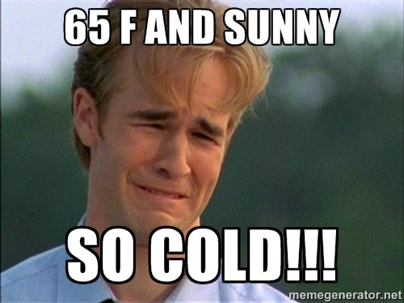

I am now about 3 months into my membership at LA Fitness. I joined up so I could start going to the sauna regularly. And I have taken advantage of it. I'm going to the sauna about 5 times a week. Each visit is either one 20-minute or two 15-minute sessions. As much as I love my sauna visits, it hasn't been perfect. Let me explain.

### The Good

Winter in Seattle sucks for me. It isn't the cold. It's the short days with almost no sunlight. Months of wet dreary gray. The sauna is the antidote for this. It has improved my mood. I love it. There are also a lot of health benefits for the sauna. I'm not going to speak to those benefits, however, give this podcast a listen if you need some reasons to get to a sauna. [The Top 22 Science-Backed Benefits of Saunas (And How Saunas Help You Beat Fatigue and Increase Your Energy)](https://www.theenergyblueprint.com/benefits-of-saunas/)

### The Bad

Longtime readers of this site know that I moved to Seattle from San Diego. When I got here, I was a temperature wimp. So I decided to do something about it. That sent me down a path of [cold exposure](https://criticalmas.org/best-of/cold-weather-training/). And it worked. My ability to tolerate and even be comfortable at lower temperatures is greater than the vast majority of people. I even [mock young men](/2014/09/temperature-wimps-san-francisco/) who can't tolerate some cold. Well, I don't know if it is because of the wetness of this winter or my near-daily sauna use, but I'm losing some of my cold tolerance. I'm guessing I just pushed the upper bound of my temperature range and maybe my lower bound comfort point moved up too? Regardless, this is the coldest I have felt since my first winter in Seattle (2007). I still don't own a coat and would never wear a scarf here, so compared to others I am still cold-resistant, but compared to prior years, I've lost a little. I'm not too concerned. I'll take the trade-off for now. When the sun returns, you'll see me out in shorts while other "men" are still wrapped head-to-toe like they were skiing. 

### The Ugly

She looked at me and asked if I had been traveling. I said no. Then she asked if I started tanning. Nope again. She brushed it off and said the lighting in the room made me look darker. Then a week later someone else asked if I had been tanning. The only thing different this winter was my sauna use. Saunas don't tan you. Then I started researching. Turns out that people with a history of rosacea are advised not to go to the sauna because it can flare up their redness. I almost forgot that I [used to deal with rosacea](/2011/04/be-your-own-dermatologist/). I haven't had a flare-up in a decade. On the rosacea forums, they explain how the heat aggravates the capillaries close to the surface of the skin. Some recommend going to an Infrared sauna instead, which is not an option for me at this time. I'm not having flare-ups or persistent redness like I did in the 2000s. Just a slight reddish hue. Will I get redder if I continue to go? We are going to find out because I like the benefits more than I dislike the faint reddish tint my skin has right now. After the sauna, I started doing a cold water rinse, but I was told by someone who knows a lot about skincare that is the worst thing I could do. But opinions on this are split. For now, I'll rinse my face with lukewarm water. Let me know if you have any tips.

---

## Comments

### Eric
*January 27 at 2019 at 2:30 AM*

Infrared saunas cost a couple of hundred dollars on Amazon.  They're far easier to get access to than dry saunas.  Give it a shot!

---

### MAS
*January 27 at 2019 at 4:43 PM*

@Eric - A reader of this blog with rosacea emailed me to let me know he will be testing the infrared sauna. I'm going to wait for him to report back.

---

### Geoff
*January 29 at 2019 at 2:40 PM*

MAS - At approximately what temperature do you start wearing a jacket? I don’t add a jacket until temperatures get below freezing. Do you have a lower bound where you begin adding layers?

---

### MAS
*January 29 at 2019 at 4:13 PM*

@Geoff - I used to track those things, but I don't anymore. It is more than temp. It is also wetness and wind. You are more cold-adapted to me. At my peak, I was near you. 

Another thought I just had is that after I raised my body temp from 96.9 to 98.6, I reduced cold exposure. It wasn't a conscious decision. I now wonder if that was a factor and I wish I knew my body temps prior to my cold exposure challenges.

---

### karen
*March 11 at 2019 at 7:03 PM*

You might not be a fan of night time moisturizers :),  but I will say that using coconut oil on my face at night cleared up my rosacea.  I put it on after washing my face and after about 30 minutes or so, it soaks in to the skin.  My skin feels great and no more redness! and it's cheap.....

---

### MAS
*March 11 at 2019 at 7:09 PM*

@karen - Interesting. If I decide to keep using the sauna after winter, I will try your tip. Thanks!

---

