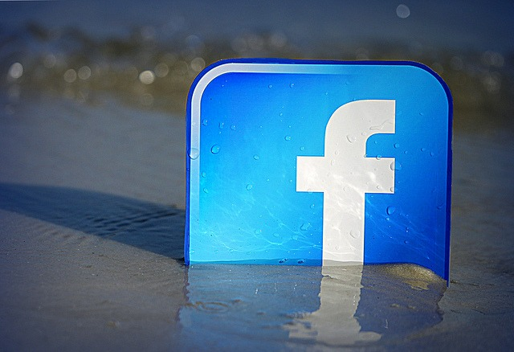

[Quitting Facebook](/2019/02/leaving-facebook-was-easy/) in 2018 turned out to be easy for me, but I took several steps before I quit to make it much easier. Here is how I quit Facebook.

### #1 Define the Reasons You Want to Leave

Write them down. I listed my 8 reasons on the post [Leaving Facebook](/2018/12/leaving-facebook/). You might have different reasons than me. The reasons you have to leave should be greater than the reasons you have to stay. If not, I don't think you'll be successful.

### #2 Remove the Facebook Mobile App

I removed mine years ago. If I wanted to access Facebook, I needed to do it from a browser. Doing this greatly reduced the number of visits I had to the site. This had the effect of making Facebook less addicting. Facebook is a privacy nightmare. Do you trust them with all your info and your location data? Do a search on Facebook scandals and privacy if you need to be convinced they are not to be trusted. By accessing the site from a browser, you can run tracking and ad blockers (such as uBlock). You can also use a browser extension such as FB Purity to hide a lot of noise. These are steps you can't take on the mobile app.

### #3 Log in and Out With Every Visit

Do not leave a Facebook tab open and connected. Get in the habit of logging in and log out with every visit. Get in and get out as fast as possible. Your goal is to reduce the time you spend on the site and the number of visits. Forcing yourself to log in and log out adds a little bit of friction to the process. There are even browser extensions that can help you limit your time commitment to distracting websites.

### #4 Stop Posting

Move from being a participant to being an observer. Most of the addicting pull of social networks is seeing if anyone responded to your posts. If you stop posting, your need to connect to the network weakens. As I went from daily to monthly posting, my time on Facebook dropped. Then I stopped posting completely and my interest in connecting fell even lower.

### #5 Find Other Ways to Connect to Good Sources

There are some people putting out quality information on Facebook. Do they also have a newsletter, RSS Feed, Podcast, or YouTube channel that you can get that info from? If so, start the process of gaining access to them outside of Facebook.

### #6 How Will You Spend Your Liberated Time?

If you free up 20 or 60 minutes every day that would have been mindlessly scrolling on Facebook, what will you do with that time? Plan for that before you leave or you will replace one bad habit with another. I was thinking about this back in [2010](/2010/08/going-on-a-distraction-diet/).

> In the book The 4-Hour Workweek, author Tim Ferriss teaches the readers to DEFINE their goals first and then ELIMINATE the noise. An error I have continually made is to ELIMINATE the distractions before defining the goals. My experience tells me that this just creates a vacuum for new distractions to fill the void.

The fact I now have a 63-day meditation streak on Oak and I left Facebook just over 2 months ago is not coincidental. And the Spanish book that I was reading just a few pages a week, I began reading several pages a day and I was able to finish it. 

### #7 Start Data Scrubbing (optional)

Before I left Facebook, I wiped my account clean. I deleted old posts and removed most of the info from my profile. I downloaded photos I wanted to save. I exported a list of friends and grabbed any contact info I might need to reach them. _Note that I still have Facebook Messenger for reaching people on Facebook._ What I don't recommend doing is Unfriending people. That is not necessary. I monitored when people unfriended me (FB Purity alerts). Without an explanation, it can never lead to a good outcome. Some people post they are trimming their networks, but then Facebook hides that announcement and then someone gets unfriended and doesn't know why. This can only lead to weakening relationships. Don't do it. If you stay on Facebook, it is easier just to block someone. By the time I quit Facebook, I had blocked probably 30% of my "friends".

### #8 Create a New Profile Page Elsewhere (optional)

I have this blog. I also have other websites and profile pages that I maintain. Anyone that discovers I am missing from Facebook can find me if they want to. What about you? Is that true? Do you want people to find you after you leave Facebook? You could create a website or a LinkedIn page. There are several ways to plant another flag on the Internet. One free option is to create a free account on GitHub and use their free GitPages service to put up a web page. Here is [mine](https://digitalcolony.github.io/). It takes a little while to learn, but with all the time you'll be saving from leaving Facebook, you'll figure it out. Once your new page is up, post that link on your Facebook profile. You are leaving breadcrumbs for others to follow.

### #9 Walk On

I didn't say goodbye before I left. I explained why in the [Leaving Facebook](/2018/12/leaving-facebook/) post.

> I didn’t tell anyone I was leaving. I just did. I always found those people annoying that would make some grand announcement about how they had to quit Facebook, while still on Facebook. More than half the time, the person would return months, weeks, or even days later.

Another reason I didn't announce my goodbye is that it is rude to leave a party unhappy and then tell all the people that are still having a good time that you are unhappy. Just leave. The people still on Facebook enjoy it. Don't interrupt their experience to call attention to yourself. If anyone asks why you left, you can just tell them you are taking a break. That break might be a month, a year, or forever. 