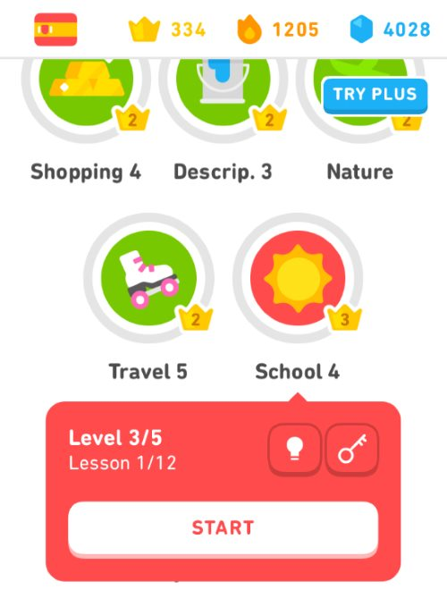

In 2015, I began using mobile apps to learn Spanish. I've tried a lot of them. Some are better than others. A few people recently asked for my feedback on the topic, so I am putting this post together. Maybe it will help others as well.

### ✅ Duolingo

Duolingo is where you start. It is fun and easy to get started. The app has continually improved over the years. When I started they did not have any lesson info for the courses. You learned by making mistakes. Today, the app has very helpful single-page guides for the courses. _(Look for the lightbulb icon)_ 

-   Duolingo has streaks.
-   Duolingo lets you build clubs and the person with the most points in your club wins the week.

I win most of the weeks in my Spanish Club and my current streak is at 1205 days. I use the FREE version of the app.

### ✅ Memrise

Memrise is the king when it comes to vocabulary. I have learned so many words thanks to Memrise. I started using Memrise shortly after I found Duolingo. For one year, I had the PRO paid version, but I went back to the FREE version after their support staff ignored a few bug reports I made.

_Side note: When a software developer sends you a detailed bug report, cherish it. Thank them. Don't ignore them. Especially if they are a paying customer._ 

-   Memrise has streaks, but the streaks are based on the course and not the app. So once you complete a course and start a new one, you lose your streak. On the web site (PRO) you can see a heatmap of your last 365 days, which doesn't help me since I estimate my streak is somewhere between 1300 and 1400 days.
-   You can also add friends on Memrise and compete. However, unlike Duolingo, Memrise doesn't tell you who won a week or a month. You have to be there at the exact moment the week or month rolls over taking a screenshot.

Despite my issues, I highly recommend getting the FREE version of Memrise for building your vocabulary. If you have a suggestion or bug report, keep it to yourself. They do not care.

Memrise is better than Tinycards, which is Duolingo's flashcard vocabulary building app. Tinycards might be a good program for children, but you won't learn near the volume of words that you will with Memrise.

### ✅ SpanishDict

I use the SpanishDict app every day. This dictionary is a paid app. Totally worth it. You learn the meanings of a word with examples and pronunciation. If the word is a verb, the conjugation is included. Irregular verbs have the irregular portion of the stems in a red font.

### ✅ Clozemaster

This is an outstanding program. They take a sentence and remove a word. You enter it by typing it in or selecting it from multiple choice. I have the FREE version.

-   They have streaks. I'm at 274. I haven't missed a day since I installed it.
-   You can follow friends and other people to see the weekly and all-time scores.

I don't think Clozemaster is ideal for beginners. Once you have learned enough of the basics on Duolingo and Memrise, install it.

### ✅ Google Translate

This glorious FREE app is a must-have. It is slightly better than Bing Translate, which is also a good program. Install one of them.

### ✅ Conjuu - Spanish Conjugation

If you need to focus on verb conjugation, look to Conjuu - Spanish Conjugation. That is all this app does. I would combine this app with a good workbook. It is a paid app.

### 🤷‍♂️ Other Apps?

I've tried a lot of other Spanish apps. Most failed to make an impression with me. I won't name names. What I dislike might be the perfect app for someone else. Plus, many of these apps are improving all the time, so what didn't click with me before, might be better now.

**UPDATE:** I forgot to include BBC Mundo. It is the Spanish version of the BBC News site. This will help you improve your Spanish reading skill. There is a section for Health, Technology, and Economics, which are my interests.

---

## Comments

### Simon
*April 1 at 2019 at 9:24 AM*

Just a quick note on Memrise - it is being changed so that the official courses will stay on the official Memrise app and the community-created courses are being moved to a new website called Decks (currently in beta).

There is a loooooong thread on the Memrise forum about this change - I was one of the people who attended their office to discuss the change. Originally Decks was not going to have a pro paid-for version nor even an app - they are now planning to do so.

If anyone wants to check out a Memrise Spanish course they should bear in mind this split - if the course you like isn't the official Memrise one then it won't be on the Memrise app/website soon.

---

### MAS
*April 1 at 2019 at 1:31 PM*

@Simon - Thanks for adding that. 

Once Decks is out and settled for a few versions, I'll give it a try.

---

### Simon
*April 1 at 2019 at 2:03 PM*

@MAS - I meant to add that your comment about them not getting back to users on bugs was one of the topics we raised to them. They've done a poor job looking after the community course creators and their courses (which largely grew the user base) and shunting them to a new website.
I hope the fact that we should be able to pay for Decks in the future (originally was going to remain free - almost as a thank you) should spur more attention to those courses. They did also mention the idea of allowing users to reward course creators with money.

---

### MAS
*April 1 at 2019 at 3:56 PM*

@Simon - They would have to do a lot at this point to earn any trust with me. But if they do, I'd love to create some decks for my coffee website.

---

### Chris
*April 2 at 2019 at 5:19 AM*

@MAS thank you. It was down to you that I started Duolingo to get my Spanish back. I’m on a 897 day streak now. It’s just about the first thing in my morning routine. 

I can get by well enough now when I’m in Spain on holiday. 

What I’m also working through and I’m finding very good is an Audible audio book “Learn Spanish with Paul Noble”. It has both Latin American and Castilian and he explains things really well - like the difference between por and para.  I usually save it for long car journeys where I can talk to myself for an hour or so.

---

### Chris
*April 2 at 2019 at 5:20 AM*

Also I am on the paid version of Duolingo. I’ve got so much out of it that I want to support the enterprise.

---

### MAS
*April 2 at 2019 at 2:19 PM*

@Chris - Thanks for the tip. I think I might do a follow-up post with Spanish podcasts I listen to.

---

### Ryan
*April 3 at 2019 at 3:22 AM*

In addition to (or instead of) trying the usual structured approaches (brute force memorization of vocab grammar), you might be interested in one of the many "natural approach" (comprehensible input-based) strategies out there.

I've been using, for example, the ALG-based "Dreaming Spanish" channel on YouTube to refresh and improve my long-dormant Spanish. The channel creator, Pablo, has several hundred videos from Super Beginner to Intermediate, and I have to say I've enjoyed all of them. They're an easy way to watch an understand a ton of Spanish from a native speaker, and it's a far more enjoyable process (naturally picking up words) instead of forcefully memorizing content.

Hope that helps. Would be interested in your thoughts too if you have the time and interest in glancing at the channel (or other similar approaches/content).

---

### MAS
*April 3 at 2019 at 1:41 PM*

@Ryan - Thanks. I like his voice a lot. I just sub'd to his channel.

---

### MAS
*April 19 at 2019 at 2:28 PM*

@All - I just added BBC Mundo to the list. It is not a learning pp, but it is a great learning tool for improving your Spanish reading skills.

---

