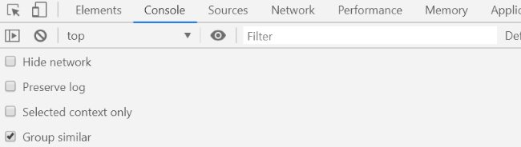

I discovered a neat trick with the Google Chrome browser that lets you take screenshots of all or part of a screen.

Being able to save an image is something I need for Twitter. Although WordPress is supposed to render a tweet properly with just a link, I've discovered it often doesn't work. Sometimes just the link to the tweet appears. And then sometimes the tweet is deleted, making your post incomplete. Making an image of the tweet is the way to go.

### #1 Find the Tweet  with Google Chrome (desktop version)

It can be in the feed or the detailed (larger) version. Pick the one that you want.

_I want to save my glorious joke where I give respect to my old hometown of San Diego while at the same time poking fun at Portland, OR. For the record, San Diego IMO is the fittest city in America._

### #2 Open Developer Tools

Hit F12 on Windows or Command + Option + i on Mac.

_This window may pop-up on the bottom or the side._ 

### #3 Open Command Pallet and type screenshot

Once the Developer Tools window is open, press Control + Shift + p (windows) or Command + Shift + p (Mac). This will open the Command Pallet. Start typing screenshot and you will see a few options.

_At this time there are 4 screenshot options in the Command Pallet._ 

### #4 Select Capture Area Screenshot

After this option is selected, go to the tweet and highlight it with your mouse. Once you release the mouse button, the image of the tweet will immediately download.

_Highlight the tweet and then release the mouse button._

### #5 Image Downloads To Browser

Go to the folder where downloads are saved and you'll find a PNG file of the area you selected.

_The tweet is now saved on my computer as a PNG file._ 

### Other Uses

If you are on a web page and would like a screenshot of the entire page, including the parts that are not visible on the screen, select _"Capture full size screenshot"_. No graphics program needed.

{ "@context": "http://schema.org", "@type": "HowTo", "image": { "@type": "ImageObject", "url": "\_\_WP\_IMAGE\_\_/2019/05/twitter.com\_CriticalMAS.png" }, "name": "How to Save a Tweet as an Image With Google Chrome", "description": "Using the Chrome Developer Tools, this is how to save an image of a tweet.", "totalTime": "PT1M", "supply": \[ { "@type": "HowToSupply", "name": "Google Chrome Desktop Browser" } \], "tool": \[ { "@type": "HowToTool", "name": "Chrome Developer Tools" } \], "step":\[ { "@type": "HowToStep", "name": "Find the Tweet", "text": "It can be in the feed or the detailed (larger) version. Pick the one that you want.", "image": "\_\_WP\_IMAGE\_\_/2019/05/tweet-to-image-1.jpg", "url": "/2019/05/how-to-save-a-tweet-as-an-image-with-google-chrome#step1/" }, { "@type": "HowToStep", "name": "Open Developer Tools", "text": "Hit F12 on Windows or Command + Option + i on Mac.", "image": "\_\_WP\_IMAGE\_\_/2019/05/tweet-to-image-2.jpg", "url": "/2019/05/how-to-save-a-tweet-as-an-image-with-google-chrome#step2/" }, { "@type": "HowToStep", "name": "Open Command Pallet and type screenshot", "text": "Once the Developer Tools window is open, press Control + Shift + p (windows) or Command + Shift + p (Mac). This will open the Command Pallet. Start typing screenshot and you will see a few options.", "image": "\_\_WP\_IMAGE\_\_/2019/05/tweet-to-image-3.jpg", "url": "/2019/05/how-to-save-a-tweet-as-an-image-with-google-chrome#step3/" }, { "@type": "HowToStep", "name": "Select Capture Area Screenshot", "text": "After this option is selected, go to the tweet and highlight it with your mouse. Once you release the mouse button, the image of the tweet will immediately download.", "image": "\_\_WP\_IMAGE\_\_/2019/05/tweet-to-image-4.jpg", "url": "/2019/05/how-to-save-a-tweet-as-an-image-with-google-chrome#step4/" }, { "@type": "HowToStep", "name": "Image Downloads To Browser", "text": "Go to the folder where downloads are saved and you'll find a PNG file of the area you selected.", "image": "\_\_WP\_IMAGE\_\_/2019/05/twitter.com\_CriticalMAS.png", "url": "/2019/05/how-to-save-a-tweet-as-an-image-with-google-chrome#step5/" } \] }

---

## Comments

### MAS
*May 29 at 2019 at 4:48 PM*

@All - The purpose of this post was I wanted to learn how to create a Rich Results webpage for Google Search. 

https://developers.google.com/search/docs/data-types/how-to

It validates. If it gets indexed is another story.

---

### Bruno
*June 17 at 2021 at 7:03 PM*

Hi MAS, another suggestion is to use https://tweetpik.com.

---

