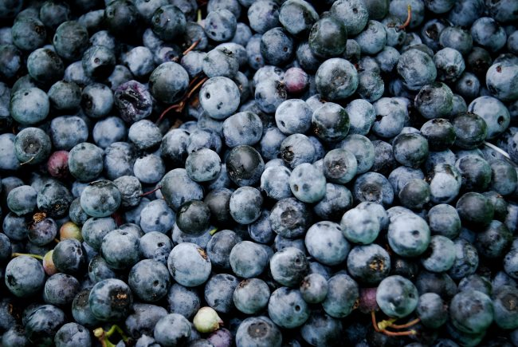

Recently, I was asked if I am still doing my [Peasant Diet](/2017/09/used-peasant-diet-lean/). Mostly. But I have shifted my focus a little. The Peasant Diet is based off cheap nutrient-dense foods that have low-calorie density. Whole grains, legumes, and tubers are the staples. I'm still eating those foods in high quantities.

I love the Peasant Diet and it did exactly what I wanted it to. It provided an [easy story for me to follow](/2017/08/using-power-story-fat-loss/) that enabled me to go from 222 to 194 pounds without ever experiencing hunger. I've kept the weight off for more than a year. The habits I built as a Peasant are deeply ingrained in me now. I know how to add or reduce the number of Peasant meals on the fly to get me the exact weight I desire without counting calories.

Now, my primary health goal is no longer losing weight or maintaining weight. Those riddles have been solved.  I need the next story. The next primary motivation.

Some of you will recall that in 2017, I [dismissed organic foods](/2017/09/used-peasant-diet-lean/) on the Peasant Diet.

> Someone asked me about organic food. My response is that a peasant can’t afford organic and while I’m on my Peasant Diet, I will only buy organic if it is the price is about the same. After I’ve achieved a perfect weight and held it for a satisfactory period, I may decide to change my diet, but while I’m a peasant I am frugal with money spent on food.

That satisfactory period is now over. This year, I have increased the quality of the food I purchase. I'm getting pastured eggs more often now than ghetto eggs _(a term I coined to reflect the cheapest eggs available)_. Instead of only buying organic when it is the same price, I will now pay more sometimes.

By dropping 13.5% of my body weight, I also dropped 13.5% of my grocery bill. I now have extra cash to pay up for the higher quality when I want to.

In the post [Fear of a Toxic Planet](/2018/04/fear-of-a-toxic-planet/), I was critical of the _free-range-organic-heirloom_ hype and I still am. I'm mostly a skeptic, but I also recognize I am in a better position now to buy a wider variety of nutrient-dense foods that might be out of the price range of a Peasant. A Peasant would select the cheapest foods to fill his or her belly. Stepping away from Peasant mode lets me buy a wider range of nutrient diverse foods whenever I want.

Was I wrong before? Not at all. When I did the Peasant Diet, I wanted to be laser-focused on my goal and the tools I would use to accomplish it. I didn't want to be distracted by competing health goals. Losing the extra weight was the number one most important thing I could do then. Adopting the Peasant mindset completely was key. When that goal was achieved, I could change the story.

_Photo by [Syd Wachs](https://unsplash.com/@videmusart)  - As a Peasant, I didn't splurge on organic blueberries. I bought bananas. Now that Peasant phase is ending, I am buying the berries more often._

---

## Comments

### Colin
*June 23 at 2019 at 8:26 PM*

True peasant food, that from before the industrial revolution, was by definition organic as there was no other kind, so you are not betraying your roots, so to say. Enjoy your heirloom blueberries!

---

### MAS
*June 24 at 2019 at 1:00 AM*

@Colin - Excellent point!

---

### Rachel
*June 26 at 2019 at 12:55 AM*

Can you give an idea of what you eat in a day now?

---

### MAS
*June 26 at 2019 at 4:26 PM*

@Rachel - That is a good idea for my next post. I haven't made a "What I Eat..." post since 2017.

Short version: lots of oatmeal and potatoes. Fruits and veggies. Sardines. Eggs. Limited red meat. Greatly reduced dairy. No alcohol (sampler sips only).

---

### Rachel
*June 26 at 2019 at 5:58 PM*

Thanks for the update. I love hearing about your perspective on food. I can't wait to read Tim Steeles new book as I loved the potato hack.

---

### Marcin
*July 3 at 2019 at 10:43 AM*

I really like the term "peasant diet" and it seems I follow it to some extent too. Red lentils, buckwheat, barley and potatoes are my staples, with addition of some (phyto)nutrients dense foods that are proved to be beneficial (greens, broccoli, high omega-3 seeds, berries, etc.). Usually my "base" foods monthly budget is ~ 50$, though food is relatively cheap where I live. When I adopted such a diet I kind of struggled to eat enough calories, since I was full with that way of eating, so opposite issues than usual.

---

### Norlee
*July 14 at 2019 at 3:51 PM*

hi MAS, if you do  a "what I eat" post I would like to know how you prepare and eat your sardines - thanks.

---

### MAS
*July 14 at 2019 at 5:45 PM*

@Norlee - There was a killer sale 6 months ago at a local grocery store. They were selling cans of Wild Planet Sardines in EVOO for 99 cents. I bought 14 cases of 12. I'm down to my last case.

I empty half the olive oil and then place 2 cans on a bed of white rice or boiled potatoes. The rice and potatoes are often cold leftovers. 

When I finish my last case, I will buy more at full price.

---

