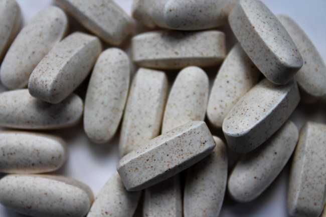

Wow! Has it been [6 years since my last supplement post](/2013/05/thinking-about-supplements-2013-edition/)? Before I begin with my updated views, let me say that when it comes to supplements the vast majority of us are just guessing. We are guessing what we are deficient in, we are guessing which supplements to take, we are guessing which brands are best, we are guessing how well they will be absorbed, and we are guessing if we think/feel/believe that we somehow benefited. But unless you are testing all these questions regularly, you don't know. You do your best and hope it works. My updated view on supplements is I don't believe in most. They are useless at best and potentially harmful. Do we know the effect of taking massive synthetic vitamins in doses never seen in nature for months or years on end? If we do, what about the combinations and ratios? I recently read Food Sanity, which has an entire chapter on the Vitamin industry. I was skeptical before. It was brutal. Listen to the author at 31:40 on [this podcast](https://overcast.fm/+I32IlV2sg).

### Vitamin D3, Magnesium, and Fish Oil

I take NO Vitamins or Minerals. That includes Vitamin D3 and Magnesium. I also avoid Fish Oil. For Vitamin D3, I get sun in the summer and eat sardines and eggs in the winter. And if I don't get enough, I'm OK with that. Years ago, I found the article [Why I don’t take vitamin D supplements](https://gettingstronger.org/2012/11/why-i-dont-take-vitamin-d-supplements/) to be persuasive to me. Back in 2011, I posted on the [complexity of the Vitamin D3 molecule](/2011/04/think-you-know-vitamin-d/) and how I was skeptical that we might be getting it wrong.  Let's assume we can get Vit D3 right, now we are told to pair it with other Vitamins such as A and K2. How much? Which form? And remember that vitamin D is a hormone. I hope you get it right. I'll stick to sunshine and food. I've tried various forms of magnesium. They always give me the runs. I'll eat pumpkin and sunflower seeds. In 2013, I posted [Fish Oil is so 2010](/2013/08/fish-oil-2010/). It is the biggest scam going. Frontline did an expose that discovered that 75% of all fish oil on the market is rancid. So not only is it not helping most people, it is likely harming them. But what about all the positive studies? Read what [Suppversity said](http://suppversity.blogspot.com/2016/12/33-top-selling-us-fish-oils-exceed.html) on this topic last year:

> Your fish oil contains 4000% more oxidized fats than prescription fish oil! That's a huge problem, because many of the studies you're so fond of, because they seem to prove how healthy fish oil is, have been done with medicinal grade fish oils. Accordingly, the results of these studies have ZERO predictive power with respect to what your "machine oil" fish oil will do to your health.

In other words, spend your money on food and not fish oil. BTW, I recently added chia seeds to my diet, which have healthy Omega-3 fats.

### The Supplements I Do Take

Creatine monohydrate. CM has the best resume of any athletic supplement and it may be neural protective. Protein powder. I add a scoop of whey or pea/hemp protein into my oatmeal most mornings. That is all. I suspect Essential Amino Acids taken during a strength workout would be beneficial, but I haven't tried them. Not sure if I will. My basic philosophy is [superfoods](/2008/03/150-superfoods-because-14-just-wasnt-enough/) are better than supplements. Supplements that are really packaged whole foods are worth looking into.

### Future Supplements

There are 2 areas of supplements that might have promise, but I'm going to let others go first. My strategy with supplements is to pay attention to which ones are gaining popularity over the years. So many supplements have a huge marketing splash and then disappear. The 2 areas are:

1.  Nootropics - supplements that measurably improve mental performance.
2.  Peptides - Special chains of amino acids that can have amazing restorative benefits. The downside is most require injection and they are in a legal gray area right now. For a primer listen to this Energy Blueprint podcast. [The Amazing Benefits of Peptides For Anti-Aging, Fat Loss, Energy, Gut Healing, and More with Jean-François Tremblay (What Are Peptides? How Do Peptides Work?)](https://overcast.fm/+I32JhjbQk) Some people are diving into these, but I'm going to wait for now.

### Current Experiments

Just because I think most supplements are a waste of money, that doesn't mean I won't occasionally test that theory when something catches my interest. This year I'm doing 2 tests.

1.  PABA - A reader of this blog told me how the cheap supplement PABA reversed his gray hair. I have some gray hair. Not much. I think my hair is fine. It is not important to me. But, I love experiments where you can get a visual and measurable result. After 3 months of taking PABA, I can say it did nothing for me. I'm at the same level of gray as before. It would have been cool if a $7 supplement could have reversed gray hair, but it didn't for me.
2.  TRU-Niagen - This is an anti-aging supplement that in addition to helping you live longer (which you can't really A/B test), it is supposed to help with energy levels and recovery times. After 45 days, I can say that both my energy levels are higher and my recovery times are better. However, those benefits happened at the same time I was coming off a cold, and when I doubled my daily meditation minutes. So I don't know. When the bottle runs out, I'll cycle off the supplement to see what happens.

What supplements do you believe in?  _[Photo Credit](https://unsplash.com/@amandagraphc)_ 2020 Update: [I changed my view on Vitamin D3](/2020/05/doubling-my-vitamin-d-levels-in-2-months/).

---

## Comments

### Jim
*June 18 at 2019 at 12:00 PM*

@MAS
Nice post.  Always interesting to see updates.
I'm currently taking no supplements. or vitamins.
Why do you take creatine?  It does appear to have a clean track record in the research.  I'd feel fine taking it if I wanted to have a more bulked up appearance, but that's not what I'm after.

---

### MAS
*June 18 at 2019 at 1:30 PM*

@Jim - Mostly I want to add a few pounds of "muscle". Has other benefits on performance and stuff, but I just want the "gains".

---

### garymar
*June 18 at 2019 at 11:11 PM*

I have to stop taking creatine a month or so before my annual physical checkup, as the supplement drives up my creatinine levels to the point where they think I've got chronic kidney disease! I got a sternly worded message once after my physical, telling me to consult with a nephrologist immediately.

Even after stopping supplementation, my creatinine levels decline but still remain high because I've put some muscle on. I'm not a sarcopenic old lady.

I still take magnesium, boron, glycine, and vitamin D3 (in winter mostly). And of course whey protein in my oatmeal, or in a shake on workout days.

---

### Rachel
*June 19 at 2019 at 6:53 AM*

I don't take any supplements except a quality NZ casein to improve satiety. Can you do an update on foods you are eating ATM? Do you have any updates to your peasant diet or potatoes and protein protocol?

---

### MAS
*June 19 at 2019 at 3:16 PM*

@Rachel - Good idea. I'll do a diet update post soon.

---

### Jim
*June 19 at 2019 at 3:28 PM*

@garymar
It's interesting that you discontinue use prior to a checkup.  Several years ago I had a blood test (I was getting life insurance) and my total cholesterol was over 300.  I took a month off from using a protein powder I had been taking, and it dropped to 190.  Don't know what in the protein powder would cause that, but it was a surprising discovery.

---

### garymar
*June 19 at 2019 at 11:53 PM*

@Jim

That's another good idea! Maybe I'll go low-protein for the month before my physical, cut back on the weightlifting and switch to endurance exercises like cycling and heavyhands walking.

Physical Checkup is at the end of September, and where I live that's the best month for cycling and other outdoor activities  anyway.

Maybe I'll finish up the last days before the physical with a few days of pure Potato Hacking.

---

### MAS
*June 25 at 2019 at 1:16 PM*

@All - A new study just came out saying Vitamin D isn't the wonder supplement for CVD after all. My skepticism was valid. 

https://www.news-medical.net/news/20190620/Vitamin-D-supplementation-may-not-reduce-the-risk-of-heart-disease.aspx

---

### Gary
*June 26 at 2019 at 12:25 AM*

As for vitamin D, possibly the causation arrow runs the other way. Poor cardiovascular health leads to reduced vitamin D levels.

I just search Pubmed on Vitamin D and bone health, and a recent survey found very little positive benefit, though they admit that the dosages may have been too low, they checked both D3 and D2, etc. 

Of course this is all Pubmed Ninja stuff.

---

### Marcin
*July 3 at 2019 at 11:05 AM*

Yeah, many supplements seem to go through 3 phases: hype, hype debunked and proven (near) uselessness, harmfulness. D3 seems to be entering phase 2 and fish oil in 3. Supplements I take are
- B12 methylocobalamin, a must since I don't eat animal products.
- Zinc to balance copper, usually as ZMA - bodybuilding supplements are dirt cheap.
- D3 in winter, usually I try catch some sun at summer, but it's inconsistent. Also the tide is turning in sun exposure department - non-burning sun exposure is beneficial and it seems it is beneficial beyond D3 production.

The rest of vitamins and minerals I try to get from food to at least 200% RDI.

---

### Ondřej
*July 14 at 2019 at 2:28 PM*

I just "believe" in creatine and a whole food diet.
But I don't take creatine at the moment.  If I did, I'd probably stick to 5g a day. I saw some difference when I took it, but even though it's safe, I still consider taking anything like this "forever" potentially dangerous. I saw many "ripped" people who don't take creatine due to gastrointestinal issuses and look amazing, so I feel quite comfortable leaving this one on the shelf as well, and focusing on training, diet ,sleep.

---

### Ondřej
*July 20 at 2019 at 10:16 AM*

To expand: supplements are not medical drugs because they don’t work. 
Creatine is the best working thing among things that don’t work. That said, about 15% of supplements in Europe - that has tighter controls than US - are contaminated. Recently a guy died from protein supplement that contained amphetamines...

---

### SteveRN
*July 27 at 2019 at 10:12 PM*

What was your reason for stopping magnesium? From my understanding, getting it from food is not always easy. I do magnesium, Vit k, switching to just winter time for any D,  intermittent (every other or every third day) for lithium and iodine, since I don't care for sea food or use much, if any salt. I think that is about it now, used to be way more. Oh, and melatonin for sleep. Years of night shift left me screwed up. I probably need to work on stopping the prescription sleep aids too.

---

### MAS
*July 27 at 2019 at 10:22 PM*

@SteveRN - "I’ve tried various forms of magnesium. They always give me the runs. I’ll eat pumpkin and sunflower seeds." 

That is why I don't take Magnesium.

---

### SteveRN
*July 27 at 2019 at 11:55 PM*

Sorry, I missed  that somehow, when it was a point I was specifically looking for! I use Jigsaw brand, they haven't given me any issues, even back when I was going heavy on them. But, that may be just me. Pumpkin and sunflower probably are better, but taste great, and portion control is an issue for me.

---

