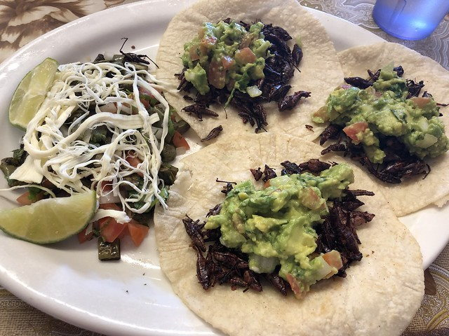

I stumbled into Casa Mixteca in Burien (just south of Seattle) this weekend and discovered they offered something I have never seen on a menu before. Grasshopper (chapulines) tacos! Casa Mixteca specializes in food from the Oaxaca state of Mexico.

Without hesitation, I ordered them. I have [no fear of eating insects](/2012/12/potato-soup-with-bugs/).

The 🦗🌮 flavor was great. Crunchy and not too spicy. Perfect. What surprised me was just how filling they were. I thought it would be a light meal, but I was full for several hours.

According to the SF Gate article The Nutrition Values of Edible Bugs & Insects article, crickets and grasshoppers are packed with protein.

> A 3.5-ounce serving of raw grasshoppers contains between 14 and 28 grams of protein...

Crickets, which are similar to grasshoppers, have an impressive nutritional resume. See the article [The Most Overlooked Superfood is…Bugs?](https://insightpest.com/bug-cricket-nutrition/)

> 100 grams of cricket contains more calcium than the same amount of milk, more fiber than 100 grams of green beans, and more than three times the iron present in a comparable amount of Popeye’s favorite food, spinach.

I wonder how many grams of protein were in my meal?