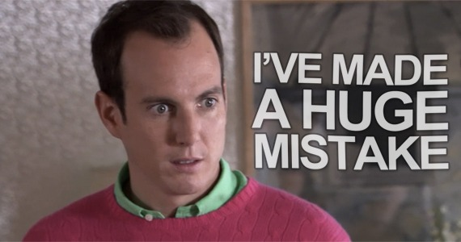

Well, not a huge mistake, but for me, a serious mistake.

In May 2018, I sold the original domain for this blog (criticalmas.com) and set up shop here at criticalmas.org. At that time, I updated all my links and then [requested that others do as well](/2018/05/criticalmas-org-is-my-new-home-i-need-to-ask-a-favor/).

I sold the domain because I had such a positive experience selling another domain of mine (digitalcolony.com). The company that bought it is doing great things with the name. Better than anything I was doing with the domain.

Unfortunately, the people that now have criticalmas.com [turned out to be sleazy](/2018/06/an-issue-with-the-domain-sale-i-did-not-forsee/). They didn't build their own product or service with the domain but instead used the backlink strength of my blog to promote some health product at first then some financial site. Don't go to the domain, as I don't know if the site is pushing malware.

Anyway, immediately after the transfer, I had a report built of every link into my blog. I reached out to as many sites as I could where I could find contact info. I told them the pages on their site that linked to mine. I provided a new link and thanked them if they decided to update.

About 60% of them did.

I am honored that they linked to my site. The last thing I would want is for one of their readers to follow a link to a site they never saw or endorsed and get bad info at best or a virus at worse.

If I had to do it over, I probably would not have sold criticalmas.com. But I was paid and I had no idea what their intentions were. It was an anonymous representative and we went through an escrow site. I did the best damage control I could. Or at least I thought I did until recently.

Not every one of my links was fixed. Because they weren't on the link report, I missed more than 100 links. They were on my Flickr, Pinterest, and Twitter accounts. They were all old and mostly forgotten, but still pointing to my old domain.

🤦🏽‍♂️

Those links have all been fixed or deleted. Most bloggers don't care about broken links, but I do. Just two months ago in the post [Bloggers Share a lot of the Blame of the Demise of the Independent Web](/2019/06/bloggers-share-a-lot-of-the-blame-of-the-demise-of-the-independent-web/), I partially blamed the decline in blogging on the fact bloggers aren't maintaining their links and losing trust with their readers.

I think everything is fine now.

---

## Comments

### Mike
*August 19 at 2019 at 6:43 PM*

What are your recommended tools for checking broken links?

I recently consolidated old Bloggr, Tumblr, Wordpress, and Squarespace posts onto a Wordpress.com site, and then exported them to XML for importing into a micro.blog site (don't, just don't ask why :) ). 

It was a fun tech experiment. BUT yes, broken links galore, images linking to the old wordpress site, etc. I'm also using it as an opportunity to prune lots of deadwood posts and bring others up to date. It's a fun rainy-day project since my blog is a hobby project.

---

### MAS
*August 19 at 2019 at 8:06 PM*

@Mike - I use this WordPress plugin:
https://wordpress.org/plugins/broken-link-checker/

It is not perfect, but it does the job.

---

