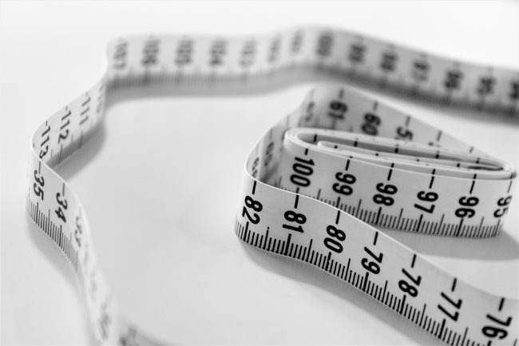

Almost two months ago, the scale at my gym was gone. It broke and I was informed that they would be ordering a new scale soon.

Not a problem. As I have mentioned in previous posts, in addition to measuring my weight on the gym scale, I also use a tape measure. Weight at times can be deceiving, but measuring both weight and inches will keep you honest.

In February 2018, I posted [Fat Loss Cheatsheet: What Works and What Doesn’t (for me)](/2018/02/fat-loss-cheatsheet-works-doesnt/). At #4 on the What Works list, I stated:

> Measure your weight a few times a week. I use a tape measure a few times a week. When I measure, I make progress. When I don’t, I slip.

Without the scale, I decided to use the tape measure daily instead of just 1-2 times a week. Within a few days, I could guess my size within 1/4 of an inch at a glance. I discovered the daily feedback loop of the tape measure was more powerful than I expected.

With a tape measure, having a smaller waist size is almost always better. Whereas a scale is just a number. A smaller number on the scale might mean you are getting lean or it could be you are losing muscle. And on the flip-side, a larger number could mean you are gaining fat or gaining muscle. So the scale number to me has always been less motivating.

_Photo by [Siora Photography](https://unsplash.com/@siora18)_

Weeks went by and my gym still had not replaced the scale - or so I believed. After about 8 weeks, I asked the status of the scale and they pointed me to the new scale which was now kept in the personal trainer section and not at the spot it had been at for the last 8 years. 🤦🏽‍♂️

I stepped on the scale to discover what I had suspected. My weight dropped from the 192-194 range where it had been stable for over a year to 186. 😵

The lesson I want to share here is that the tape measure is a super powerful tool if you want to be honest about your weight. Start every day off with a measurement. The scale might lie (in the short term), but the tape measure doesn't.

When your waist is up a little, reading that number is a little extra motivation to tighten up the calories that day. When your waist size is down a bit, it is a little signal that whatever you've been doing recently is working and to keep it up. Win-win! 🏆

It should go without saying, don't use the sizes on your clothes as an indicator of your size. Today, the sizes are no longer real sizes, but "vanity sizes" used to make overweight customers feel better about the clothes at the time of purchase. Check out the article [Are Your Pants Lying to You? An Investigation](https://www.esquire.com/style/mens-fashion/a8386/pants-size-chart-090710/), where the author found one pair of jeans was 5 inches greater than the label.

> Where no other 34s had been hospitable, Old Navy's fit snugly. The final measurement? _Five inches larger than the label._ You can eat all the slow-churn ice cream and brats you want, and still consider yourself slender in these.

That article was from 2010. Sizes might be even more distorted now.

---

## Comments

### seantheaussie
*October 31 at 2019 at 2:06 AM*

I like to have a pair "of measuring pants" that I use to monitor my waist. They work from when 2 inches too small to one inch too big when monitoring your waist. It positions the measurement at the same place each time, and, importantly, approximately the same tension (internal and external). I have no idea how loose my abdominal muscles should be during tape measurement and how much indentation the tape measure should make in the fat, but through tens of thousands of repetitions over the decades, I know how tight I like my pants.

---

### Mike
*October 31 at 2019 at 6:25 PM*

For me, it's the same belt I've had for years. When it gets too tight, I'm slacking.  A cruder instrument than the tape measure but effective.

---

### MAS
*October 31 at 2019 at 6:32 PM*

The upside of a tape measure over clothes and belts is that I can see 1/4 inch movements (or less) easier and sooner. And there is something about a number that is more motivating than a feeling.

I also want to add something I should have mentioned in the post and that is that when I was taping 1-2 times a week, there was a disconnect between my actions and those measurements. It lacked the sense of urgency. Knowing that I will taping EVERY DAY keeps me honest on my calories EVERY DAY. I can make course corrections much sooner and the results are coming faster. I only wish I had figured this out years ago.

---

### Mike
*November 12 at 2019 at 5:45 PM*

And I do thank you for this idea! I keep a pad on my bureau, I keep my Perfect Waist Tape Measure (got it from Amazon) in the sock drawer, and I measure my waist every morning I pull out my socks. I also weigh myself once a week or so and it's instructive to see the pounds go up and down while the waist measurement remains steady. 

My measurements have not changed in over a week so the lesson I draw from that is that what I'm doing is fine for maintaining my current weight, but not doing a thing to burn any fat. So -- time to tweak my eating and exercise systems and monitor the change.

Oh and thank you also for the hard boiled eggs idea; i now eat those during my afternoons before I get hunger pangs and they keep me pleasantly full till supper.

---

