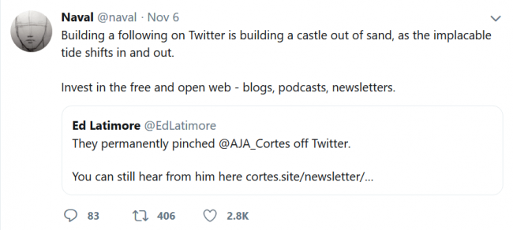

After my last post, [My Blog Was Hacked and WordPress Sucks](/2019/11/my-blog-was-hacked-and-wordpress-sucks/) I received an email from a reader that I want to share and respond to.

> What a clusterfck, Just think of the headaches that would create for a neophyte. The neophyte would have to pay some whoring web design/hosting operation thousands over the course of a few years just to troubleshoot the constantly evolving miasma of bullshit. After reading your post -- I am convinced that having a blog would be a really bad idea. A San Diego contact appears to use a FB business page for his digital product, mail chimp newsletter etc. Maybe that's the way forward for us tech neophytes.

The spirit of this comment is absolutely correct. WordPress for a non-technical person can be done, but it has so many moving parts that for most people it can be problematic. You can make a lot of these problems go away by spending more money or accepting more limitations. You can give your money to a developer or a designer and hope everything works out. The beginner is often the person that doesn't know if blogging is right for them, but wants to try. A self-hosted WordPress site is a big hurdle to tackle, especially at the same time you are trying to come up with ideas to post about. For years I have attended a local WordPress Meetup group. There are designers, developers, and bloggers. Countless beginners have attended these events to find someone to help them solve their WordPress issues. I've seen many come month after month tackling one issue at a time. They spend their time fighting the software and not creating content or creating very little. I'd guess the majority give up and quit. Defeated by the software.

### Digital Sharecropping

The fact that WordPress gets more bloated and frustrating every year and that Google has never modernized the Blogger platform are driving a generation of would-be bloggers to social media as a "blogging" platform. It is much easier to use Facebook, Instagram, or Medium. But there are big problems with this approach.

1.  You don't own anything. WordPress is open-source software. If I don't like my web host, I can fire them and be up and running on a new host in an hour. I can even run a local copy on my laptop.
2.  Social media hides A LOT. See [this post](/2013/11/shutting-down-the-criticalmas-facebook-page/).
3.  You can be kicked off without recourse or even an explanation at any time for any reason. Make a joke or a comment that offends someone in a tech company and you can see years of work disappear in seconds. And it is happening.

 Social media does have a place and that is to promote your content. Use social media to leave breadcrumbs back to your assets, but don't use it for creating those assets. Before I left Facebook last December, I looked for ways to connect with some creators outside the FB ecosystem. If I found a blog or newsletter, I went there. If they didn't have anything but Facebook, I left them. They lost me because I found Facebook to be a toxic platform.

### Easy Blogging Options

Wix and Square Space are two options that make blogging easier. I have not used either one but based on reading the help files, I would consider Square Space, as it seems it would be easier to export your content should you choose to leave. WordPress.com is probably the best option for now. They host a limited version of the WordPress site and handle the security for you. It is still a challenge but not as much as a self-hosted site. This might be the training wheels to get you going. And it would allow you to export your content easily when you want to do more with your site.  _WordPress.com is the paid service version of WordPress. It has fewer options, which can be a good thing when starting out._

### The Future

There is this big opportunity in the blogging space. We need an open-source blogging platform that is as easy to use as Medium and lets bloggers freely and easily move platforms without fear of being filtered or shutdown. I think Google could solve this problem (See #2 on [this list](/2019/06/how-google-helped-kill-the-indie-web-and-how-it-can-bring-it-back/)). But Google can't be trusted, as they have a [long history of killing off services](https://killedbygoogle.com/) that users invest so much energy into. This article outlines the [12 main blogging choices](https://www.isitwp.com/best-blogging-platforms-beginners-compared/) we have in 2019. It is a sad list, but the only two I would consider for a newbie would be #3 WordPress.com or #7 SquareSpace. As frustrated as I am with WordPress, it isn't going anywhere, as it runs about 30% of the internet. Learning WordPress on the training wheels version will help if you migrate to self-hosted WordPress someday.

---

## Comments

### Christian
*November 17 at 2019 at 12:13 PM*

I recently moved a friend's page from WordPress over to a Bludit blog. It stores the content as plain text files + a single file of metadata. Unless the server is hacked, it's pretty simple to keep the files safe and export the blog. The platform has a login/backend to create files, though, and that can still be broken in of course. 

But the point I want to make is: there are less popular projects growing all around the world that are perfectly serviceable. Upload a folder of PHP files, just like WordPress, and there you go. People embrace minimalistic templates anyway, so there's not much need for expensive graphical design.

If people wanted, they could have a blog within the hour that is not a pain to use, but they still have to want it.

---

### MAS
*November 17 at 2019 at 2:20 PM*

@Christian - Thanks for sharing. I did not know about Bludit.

---

### Mike
*November 17 at 2019 at 8:52 PM*

I moved my personal blog to micro.blog, which was a Kickstarter-funded project. Manton is always adding improvements; he just added the ability to buy a domain name through micro.blog.

Another easy way for perhaps a neophyte would be blot.im. Some ridiculously easy ways to blog out there, but few of them are as turnkey as they like to advertise. Even Squarespace (where my other blog is), has as complicated a dashboard as WP's and just-as-arcane workarounds.

---

### MAS
*November 17 at 2019 at 11:47 PM*

What Square Space or the hosted version of WordPress provide is a protected ecosystem where security is taken care of and users can't install potentially dangerous code. I'm assuming that statement is true and if it is not, there are teams of people that are there to put out any security issues that arise ASAP. 

Blot looks interesting. Thanks for sharing.

---

### Matrixik
*November 18 at 2019 at 5:11 PM*

I think that the future is static + cms + some kind of dynamic comments. For example Hugo with Netlify CMS. 

After some people got sick how much unnecessary stuff Discuss is loading some nice alternatives started popping up
https://gohugo.io/content-management/comments/#comments-alternatives

But the problem is they aren't packed for easy use by no technical for now.

---

### MAS
*November 18 at 2019 at 5:21 PM*

@Matrixik - I agree 100%. I'm learning Gatsby and Netlify right now. It won't help the 99.9% of the bloggers, but for people with technical skills (like myself) it will be the solution.

Comments are the part that is most tricky. I do expect innovation there and a leading solution to emerge. Thanks for that link. 

My plan is to tackle my 2 coffee sites first (EcoFriendlyCoffee.org - which has low traffic, and INeedCoffee.com - which has a lot of traffic). Neither host comments, which will help make things easier. 

I expect to take what I learn on those 2 migrations and apply it to this blog if my experience goes well.

---

### Mike
*December 4 at 2019 at 1:34 AM*

re Squarespace -- yep, the reason I went to SS from WP was because my host required me to go in there and edit the PHP,  run through a long checklist of security procedures, etc. I pay SS to handle all that tripe. (Several years later, I see that host now offers managed WP services so that they handle that stuff. Didn't bother checking the price of that service.)

Have you heard of Webflow? It's being touted as a WP alternative. Found this post by Nat Eliason, who runs several blogs, who describes why he moved from WP to Webflow. https://www.nateliason.com/blog/webflow-vs-wordpress

It looks a little too complicated for my less than basic skill set but you could probably pick it up lickety-split.

---

### MAS
*December 4 at 2019 at 3:30 PM*

@Mike Brown - Thank you for sharing. Web Flow looks great. 

It appears they have simplified what I see as the end game for WordPress (which may take years to get to). They are using all the code just on the backend CMS and then building static sites. Which means the sites are safer, faster, and secure. 

Search and comments are still the 2 pieces to solve for and it looks like they are doing that as well. I still expect more innovation in this area in the coming years.

---

### Yathav
*January 16 at 2021 at 2:40 PM*

Thanks for sharing this article. Web Flow looks great.

---

