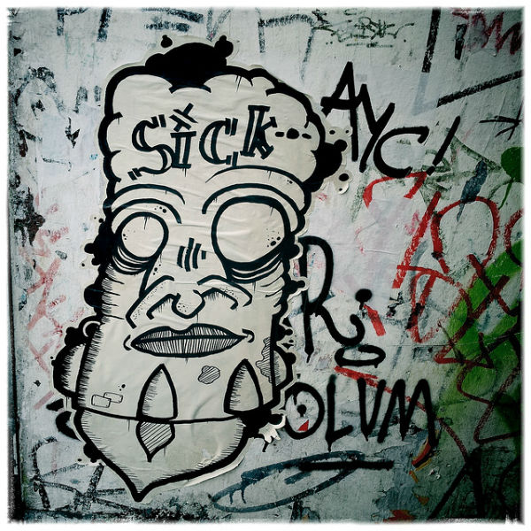

Another December, another cold.

The genesis of this blog ever discussing health-related topics goes back to June of 2007. I was still in San Diego and I had 2 brutal colds back to back. I wanted to solve the riddle. I was sick of getting sick every year. At times I felt I had solved the riddle. There are a few posts where I declared victory. But in recent years, I've been humbled.

I took the superfood route, the supplement route, and even the heavy use of the sauna. I stopped donating blood in the winter months to keep my white blood cell count higher. So far none of these strategies has been consistently effective. And here we are in December 2019, over 12 years since I started this journey, sick again.

But this time is different. I now have a fresh lead on something new to try. A brand new path. It won't help me today, but it could very well in the future.

About two weeks ago, I was listening to the London Real podcast with [Patrick McKeown](https://www.youtube.com/watch?v=CZtJmBPDf8I). The show was all about breathing techniques. A portion of the show covered people that sleep with their mouth open at night. They tend to get very poor quality sleep. He advises taping the mouth shut at night. This is something Carl, the host of Super Human Radio, does and has helped him a lot.

My sleep is great, so I didn't focus on that part of the show. I figured that was a tip for kids and big guys. Then I had a night or two where I was thirsty and had to wake up to drink water a few times. I felt a little sinus congestion. I knew from the show that was probably a sign that I was mouth breathing those nights.

Sure enough, the cold symptoms appeared immediately afterward. A sore throat followed by sneezing.

Had I taped my mouth, would I have been exposed to the cold virus? Forcing the air through the nose warms and purifies the air. I'm ready to try taping my mouth shut during sleep once this cold is over because right now I have too much congestion. I'm confident I can learn this skill on the nights when I don't have a cold or sinus pressure, but I might need some guidance on those nights I do.

These days, the most alcohol I consume is 2-4 ounces of a hard cider, maybe once a month at most. Any more than this and I feel sinus pressure. That restricts my nasal breathing, which I'm sure now negatively affects my sleep. And if the cold virus happens to be around, then my odds of becoming sick increases. All the ginger and garlic isn't going to save me then.

If you have any advice, tips, or wisdom on this topic, please leave a comment. Is this a good lead in my war against the common cold?

_photo by [Tanja Djordjevic](https://www.flickr.com/photos/fotokiosk/7138860333/)_

---

## Comments

### Colin
*December 16 at 2019 at 8:10 AM*

I've had good experiences at nipping a cold in the bud by using a neti pot to clear out the sinuses.

---

### Glenn
*December 16 at 2019 at 6:20 PM*

Therazinc spray. Three or four times a day. It tastes terrible. It works wonders for me.

---

### Jim
*December 16 at 2019 at 7:46 PM*

@MAS -- Good post.
I only recently learned the following.
1.  Sleep.  I read about evening mouth taping, and I think it does improve my sleep.
2. Teeth.  Dentists have always chastised me for having a large amount of dental plaque.  My new/current dentist just said in a matter of fact way that this is a normal result of mouth breathing. I now just go for cleanings every 4 months  and everything is fine.
3. Tension.  I learned that it's not coincidental that meditation/yoga instructors recommend nose breathing.  Apparently, mouth breathing can trigger fight or flight responses and lead to tension in the neck/face.
4. Sore throat.  I used to always get a sore throat in the winter.  I now cover my mouth when running or skiing, and no longer get a sore throat.

---

### Nicolas
*December 16 at 2019 at 10:34 PM*

I've recently started chewing gum for 1-2 hours a day in order to strengthen my jaw and I quickly stopped mouth breathing during sleep (not every night but most).

I've also been sleeping in an inclined bed and it has improved my breathing, reduced nasal congestion and neck tension.

And of course mouth taping is great too!

But I can't say if it's a good way to fight colds. I haven't had a cold in 3 years after a life of frequent colds and I have no clue how I did that.

---

### MAS
*December 17 at 2019 at 6:53 PM*

I got rid of my Neti pot a few years ago. I wasn't sure it was helping me. But now, I can see I need to get another one.

I'll also get the mouth tape, the breath right strips, and pick up that zinc spray.

---

### matt
*December 24 at 2019 at 8:11 AM*

Thats very interesting, I had no idea mouth breathing was even a problem, will try mouth taping...

---

### RMC
*December 29 at 2019 at 6:31 AM*

I'd  say it's  karma.

---

### Matt
*May 7 at 2023 at 1:30 PM*

Interested in a follow up on this as I am recently coming off a stretch where I got hit with two colds in rapid succession.  Years later, have you found anything reliable for warding off colds that you still practice to this day?

---

### MAS
*May 7 at 2023 at 6:31 PM*

@Matt - I may do a full post on this, but the short version is since I started mouth taping in December 2019, I have not gotten sick once. The other 2 changes I made at the same time were daily contrast showers (1 min warm, finish cold) and washing my hands EVERY time I return home - not just when I returned from the gym or randomly.

---

