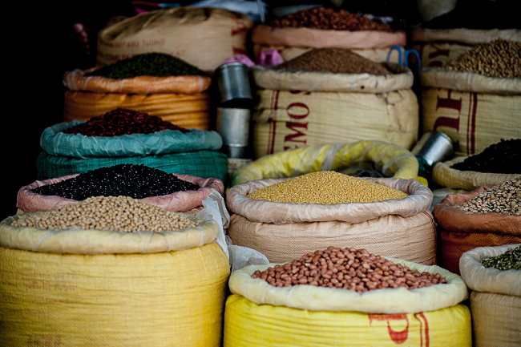

As someone that has had to [give up gluten twice now](/2019/09/gluten-wheat-just-when-i-thought-i-was-out/), I want to share some wisdom with those of you that are having to deal with this issue. STOP TRYING TO REPLACE YOUR GLUTEN BASED DIET WITH THE GLUTEN-FREE VERSION OF THE SAME PROCESSED FOODS. Did you get that? Now is the time to embrace whole-foods. You don't need gluten-free cookies. You need lentils, sweet potatoes, more veggies, and some lean protein. Become friends with an InstaPot. Try nuts and seeds for snacking. Or here is a radical idea: stop snacking. How much of the gluten issues we now see in society is a result of the massive quantities we have been consuming (mostly in the form of processed foods)? In order to consume as much wheat as we do, in the quantities that are being consumed, processing those grains needs to happen. So why reject processed gluten foods only to embrace the gluten-free options as the "healthy" choice? Don't. Take a break from it all. The book _Eat Wheat by John Douillard_ _([thanks for the tip Thomas](/2019/09/gluten-wheat-just-when-i-thought-i-was-out/#comment-26850))_ reminded me of how traditional cultures would not consume gluten all year round. It was consumed in the fall and winter. And the grains were often soaked and sprouted to help breakdown the food before digestion. You don't need bread at all. Bread is processed food. If you want grains, look into whole grains such as buckwheat and quinoa. That is what I am doing. What you will discover is that when you dump the processed gluten foods for whole foods is you'll end up consuming fewer calories. You will likely lose weight. When the pounds drop off, you'll feel better. This won't happen if you race off to the gluten-free bakery for your "safe" cookies and brownies. But for all this to happen, you need to accept the gift. The gift of having a dietary restriction thrust upon you that could improve your health, should you choose to use it wisely. 

_Photo by [v2osk](https://unsplash.com/@v2osk?utm_source=unsplash&utm_medium=referral&utm_content=creditCopyText)_

---

## Comments

### Thomas
*December 10 at 2019 at 12:29 PM*

Glad to see that my comment helped you!

I'm not celiac myself but removing bread and wheat-based processed foods is usually the easiest way to lose fat for me.

---

