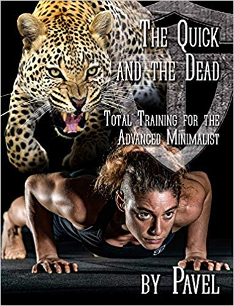

Pavel published a new book last year titled The Quick and the Dead - Total Training for the Advanced Minimalist. After [his appearance on Joe Rogan](https://www.youtube.com/watch?v=Rm0GNWSKzYs) recently, I discovered a copy in my local library.

In this post, I will give a review/summary of the book and my initial experiences with the workout plan.

_The Quick and the Dead: Total Training for the Advanced Minimalist_

### Explosive Strength

The theme of the Q&D is how to develop explosive strength. I don't play any sports or do martial arts, so I initially thought this book would be of no interest to me. But Pavel made a case that in addition to the benefits we normally associate with explosive training, it also has a powerful anti-aging health benefit.

First, we lose speed, then strength, and then endurance. Muscle fiber loss happens in a preferential manner where the Type 2 fibers go first. He cites that an 80-year old sedentary man will have lost half the Type 2 fibers he had at age 30. Power or explosive training helps defend and restore this loss.

> A World War II vet not prone to babying himself or others, Prof. Yakovlev prescribed accelerations as the number one exercise choice for the elderly to stimulate both the plastic and the energetic processes (in other words, muscle building and aerobic). Beefing up one's mitochondria and fast-twitch fibers with power training is a great prescription for turning back the clock.

Pavel also has charts describing the improvements the different forms of exercise have on different aspects of fitness. Power training does as well as Strength training on hypertrophy plus has the benefit of improving Aerobic Power almost as much as endurance training.

In other words, it is an efficient mode of exercise.

### Respect the Rest

The big idea from the Q&D to me was how we need to allow sufficient time between sets to get the full benefit of the exercise and to minimize soreness. If we take a set too long or if we rush back into the next set, lactic acid becomes the "enemy".

> Acid is the enemy of both tension and relaxation, drawing one into the stiff no-man's land in between. It muffles the brain's commands to the muscles, inhibits all three energy systems, and interferes with contraction and relaxation - read: strength and speed - in many ways.

Pavel likes 3 minutes between sets of the same muscle group. That seems like a long time, but it makes sense. The book has a lot of supporting science and charts. I didn't dive too deep into those pages. I figured I'd just test it out for myself. More on that later.

I also thought about how increased rest times would have the spillover effect of reducing injury rates, as we ideally would begin each set ready to give 100% without fatigue impacting our form.

### Push-Ups and Kettlebell Swings

Like Pavel's other books, the Q&D is focused on just 2 exercises. One push and one pull. To build explosive strength, power push-ups and kettlebell swings are used.

Cycle between the 2 exercises to make the most use of your time. Do 10 sets of 10 reps of each inside a 3-minute set.

-   Start your timer.
-   Do 10 explosive power pushups.
-   Then wait to the 1:30 mark to start 10 reps of kettlebell swings. You can do one arm or 2-handed. I'm doing the 2-handed.
-   Then wait to the 3-minute mark to begin the 2nd cycle.
-   Do 10 cycles.

The entire workout takes 30 minutes.

There is a lot of pages on how to know when to add bands to your push-up or increase the weight of the kettlebell. I skipped over most of that. I'll use intuition. Get the book if diving into these details is important to you.

Train every other day or 3 times a week.

### 2 Weeks of Q&D

Pavel had a bunch of pages that were too deep into the details for my interest level. I figured I would just test it out for myself. The Q&D seemed like a solid plan.

I ease into everything, so for the first week, I increased the sets from 4 to 5 to 7. The first thing I discovered is I am not used to waiting around that long between sets. It seemed like an eternity at my glitter gym. The second thing I discovered was I did not get any soreness (DOMS), but I did get tired, so I felt like I both got a great workout and there was nothing holding me back to return to the gym in 48 hours.

For week 2, I wasn't a good comrade. I increased my reps to 15 for both the push-up and the 2-handed kettlebell swing, while keeping each set at 3 minutes. This had the benefit of me not waiting around as much and I felt 5 sets was enough. For me, I felt like I got more out of the 15-rep sets than the 10. However, I felt a little sore.

I'll keep tinkering with the Q&D. I'll experiment with 12-reps next. I like it so far. I don't want to use push-up bands, but I suspect I'll need them soon. Either that or a weighted vest. Off to eBay?

Pavel doesn't like machines. I don't know how much of that opinion is marketing and how much is real. I get how the guy that made kettlebells famous in the USA would want to dismiss machines. But, for our needs, I'm wondering if you could pair 2 machines (a push and a pull) and get the same benefit? Maybe even cables? For now, I'll stick the push-up and kettlebell swing, but I'll likely experiment with other pairs later.

### Thoughts?

What are your thoughts on explosive training? For some of you, seeing me step away from slow lifting after [almost 9 years](/2011/02/high-intensity-training-at-ideal-exercise-of-seattle/) might be a shock. But, I figured a change would be nice. My intention is to do the Q&D for 12 weeks, which is how many weeks Pavel uses in the book. I'll report back then.

---

## Comments

### Jim
*January 24 at 2020 at 3:07 PM*

@MAS
Interested to see your results.
Art DeVany was always a proponent of using explosive movements.  I haven't seen anything from him in the last three years or so.  Last I heard, he was working on an anti-aging book.

---

### Elizabeth
*January 24 at 2020 at 4:27 PM*

Awesome podcast!  Thank you!

---

### norlee
*January 26 at 2020 at 1:54 PM*

thanks for posting this - I'm intrigued! Based on what you read, would there be any reason not to cycle through 2 or 3 different push/pull exercises in a single workout provided they are done "explosively"?

---

### MAS
*January 26 at 2020 at 3:06 PM*

@norlee - I suppose you could if you were able to calibrate every exercise in the routine to find the right level of resistance that allowed 10 seconds of exertion without being too easy. You would also need to get from push to pull and back every 90 seconds. If you are in a shared gym, that might be a problem. With the pushup and KB, you just camp there until the workout is finished.

---

### Greg
*January 30 at 2020 at 4:53 PM*

Pavel's anti-glycolytic training protocol attempts to minimize glycolysis since, he says, it releases acid, ammonia, and other metabolites that induce cellular damage and create other hormonal problems (such as increased cortisol). Slow lifting seems to *embrace* the glycolytic state. Any thoughts on the divergent philosophies of the two approaches?

I'm also curious why you changed his 6 minute circuit to 3 (see the first figure in the "Summary: Swings and Pushups" chapter). My reading of the earlier chapters suggests that the sequential *pairing* of sets of 10 (so that, for example, you do 20 push-ups in about 70 seconds) is necessary to get enough ATP depletion in a small enough time window for a training effect. I wonder if that's why you liked sets of 15 better--it's edging closer to Pavel's protocol.

Anyway, I also just started this (I'm a lanky ectomorph, 6' 2"). So far I'm finding it to be a very pleasant, low-stress workout. I look forward to your 12 week report.

---

### MAS
*January 30 at 2020 at 5:51 PM*

@Greg - Great comment.

I want to do a full post on your first question. I'll tackle that this weekend. When it is up, I'll leave a comment on this thread.

I returned the Q&D to the library, so I don't have the book in front of me now, so I can't tell you what page I was looking at. But there was a spot where Pavel mentioned doing the 2 exercises for 10 sets and completing the workout in a time-efficient 30 minutes. That is where I got the 3-minute protocol from. 

The 15-rep set was just me exploring. I went back to the 10-rep this week.

---

### Greg
*January 31 at 2020 at 5:46 PM*

@MAS -- That's right, 10 sets of 10 reps of two exercises, spread over 30 minutes. But the sets aren't evenly spread out it time.

His hypertrophy workout (which he calls "10/2") consists of five circuits, where each circuit is 6 minutes long. Here's the timing for each circuit (the first column is the starting time of a set in minutes:seconds):

0:00  10 swings
1:00  10 swings
3:00  10 pushups
4:00  10 pushups

So every 6 minutes you're launching a *pair* of sets for a given exercise, initiated one minute apart. This is much harder (at least it is for me) than uniformly launching a set every 3 minutes. 

My understanding of his set pairing is that it creates sufficient ATP depletion and glycolysis (you need some) in a short time window to efficiently stimulate the training response. His model suggests that spreading the sets out uniformly in time would be less effective for both hypertrophy and endurance.

---

### MAS
*January 31 at 2020 at 10:50 PM*

@Greg - Have you found a difference in soreness or recoverability by doing the split you just described?

I use the stopwatch on my iPhone and begin each exercise within 10-15 seconds of when I should. I don't get too exact. 

I'll try the split you outlined tomorrow.

---

### Greg
*February 1 at 2020 at 2:49 AM*

@MAS -- I haven't had any problems with soreness or recovery at all. But I was doing metabolic circuits (pullups, pushups, step-ups) before this--they were much tougher since I did minimal rest between sets. The Q&amp;D workout with all its rest intervals is pleasant in comparison.

---

### MAS
*February 1 at 2020 at 11:22 PM*

@All - The follow-up post to Greg's question has been posted.
https://criticalmas.org/2020/02/pavels-quick-dead-vs-hit/

---

### ZAP
*February 6 at 2020 at 1:34 AM*

This is at best an interesting workout in and of itself. As much as I love Pavel, this is not a complete routine/program for most anyone. KB swings are not a pull of any kind. A swing is a hinge. There is no true upper body pull action at all (rowing or pull-up motion) and very minimal squat/lunge/quad stress. Simple and Sinister with just KB swings and TGUs was closer to a real minimalist routine although still severely lacking. For some people who are simply trying to maintain minimal mobility and functional strength, this could be useful periodically. Even then, it's still not better than some basic upper body pushing (any press), pulling (row or pull-up), squat (any squat or lunge variation) and hinge (deadlift or swing). A quick routine that one could do forever would be 6-10 reps of an upper body push, 10 KB swings, 6-10 reps of an upper body pull, 10 KB swings, 6-10 reps of a squat/lunge, 10 KB swings, repeat. Rest 1-2 mins in between exercises. Easy. Couple this with regular walking and some occasional cardiovascular stress (I would prefer intervals to long, slow cardio most of the time) and you are pretty minimalist and cover your bases. 

Simple and sinister plus some strength work as I have outlined above is also a sustainable strength and power protocol. 10 swings, 1 TGU, one strength set, repeat 10x.

10 swings and 10 push-ups is just too basic. I can't believe there is a whole book about this.

---

### MAS
*February 6 at 2020 at 2:56 PM*

@ZAP - I'm on week 4 now and I already know you are correct. These 2 movements are not enough. I was going to wait to start swapping exercises, but I can already tell my legs and back are barely being worked.

---

### Greg
*February 6 at 2020 at 4:02 PM*

@ZAP and @MAS -- I also concluded that swings + pushups weren't enough. So I switched to a split while keeping his time and reps schedule: (pullups + pushups) on MWF, (step-ups + hyperextensions) on TuThSa.

But this still seemed unbalanced (e.g. pushups too easy, pullups too hard when sets are 50 seconds apart). No "effective reps" with his fixed rep schedule.

Yesterday I threw in the towel and went back to circuits: (pullups + kettlebell presses + hyperextensions) on MWF, (inverted rows + decline pushups + step-ups) on TuThSa. Six circuits only take about 15 minutes, followed by 30 minutes of jogging / sprinting. Pretty minimal and safe.

@MAS, are you going to swap exercises?

---

### MAS
*February 6 at 2020 at 4:53 PM*

@Greg - Yes. Today, I experimented with explosive goblet squats in place of the KB Swings. It has potential. I have other ideas. I'll post on them once I have them tested.

---

### matt
*February 27 at 2020 at 6:46 AM*

interesting about the optimum rest time (3 mins), clearly if volume/load on the muscles rather than intensity and muscle damage are the goal, then somewhat long rests would presumably help achieve the maximum effort/accumulated load on the muscles

---

### Justin
*April 27 at 2020 at 10:15 AM*

Pavel put a ton of time and effort in designing this program, I was one of his test subjects  for it several years back, and the reps/sets are set that way for a reason.  By changing them up you’ve effectively thrown the entire basis of the program out the window. Simple &amp; Sinister was the same idea, if you can do more than 10 explosive reps with the weight you have, get a heavier bell(or do a harder version). I’d suggest following the program as written for several weeks before reviewing it. One of my trainers used this to pass two of her StrongFirst certifications, one having a one arm push-up as a strength test.

---

### Blake
*June 5 at 2020 at 3:27 PM*

I actually switched out the push-ups with a landmine two-handed squat-to-press. I figured that it did a better job covering the quads and pressing muscles, while incorporating a cardio component (similar to KB swings). 

I appreciate the comment about following the plan as prescribed. That said, I like to tinker

---

### MAS
*June 5 at 2020 at 3:57 PM*

@Blake - The landmine squat is a PERFECT idea. Thanks for sharing.

---

### Ben
*June 14 at 2020 at 9:59 AM*

I think the key to this Programm is doing it as fast as possible. It is not a beginner program. When I do it I go fast with a 32 Kilo kettlebell and fast push ups. I am 200 pound not much fat and my push ups and swings loose
Speed after 10 reps.  There is no way to keep the quality of
Movement longer. 
I feel it is pretty complete. Back, Lats everything is working since you have and active downward swing too. I like the rest periods and need them to go explosive in the next set.

---

### Heliotropen
*January 20 at 2021 at 4:27 PM*

By adding more reps, it’s no longer Q &amp; D and your missing the point.
Do as written, do the shades boxing and active relaxation between sets, or choose another program.

---

### Dan
*June 7 at 2021 at 8:36 AM*

Yeah, the book feels like a convoluted marketing science-flex to the average joe, written to bulk out a very simple protocol. If you like that stuff, drink deeply. The protocol is , however, Fantastic for its INTENDED USE. Busy people (parents, first responders, military, working professionals) wanting to maintain an edge without thrashing themselves into illness. Yup-when feeling good and time allows I can't help but throw in other stuff on the off-days like a few calisthenic movements, isometrics or mobility.

---

### Forest
*June 28 at 2021 at 1:04 AM*

I clean a quarter body weight bar explosively from the hang  (5  to ten reps) segued immediately into the same number of explosive single arm shoulder presses of the same bar. Then halfway through the three minute interval I do two or three "jumping muscle up/ muscle down row overs" so that all push/pull hinge/squat muscle groups are covered explosively in each 3 minue circuit.

---

### Forest
*June 28 at 2021 at 1:49 AM*

Jumping muscleup/ muscledown row-overs are performed from a box that brings your upper chest to bar level when standing on the box... you start by (in one explosive movement) squatting down as far as possible without letting go of the bar &amp; rebounding upward (by max exertion of  quads, calves, biceps, triceps, &amp; back muscles) to the top of the muscleup. Then reverse the top half of  the muscleup (i.e. muscledown) to a brief static hold in the top position of a pullup, sequed into an explosive gymnastic pullover (row over), and finally dropping to the original position on the box with both arms and legs absorbing the impact plyometrically.

Is there any other body weight exercise that comes close to this one in taxing the rowing, dipping, and jumping muscles in four seconds or less?

The only supplement needed is the clean and press for the hinge and shoulder press movements ... hence the suggested pairing.

The jumping muscleup is easier and more explosive than a strict muscleup...raise the box if necessary. 

And pulling on the bar increases the acceleration of the jump thereby increassing the power in the same way that the use of a pole adds power to a vault.

It is very rewarding and not hard. But warmup thoroughly!

---

### Forest
*June 29 at 2021 at 7:10 AM*

I once read that 30% of your one-rep max is the ideal weight for an explosive lift ... so if your body weight is more than 30% of your maximum squat,  your standing vertical jump will need some kind of assist for maximum power. I suggest using your arms for that assist. That's why I believe the jumping muscle up is better for the quads than the burpee.

---

### Flip
*April 5 at 2022 at 5:55 PM*

I've been using Q&amp;D as the "main" part of my workout for a while. I'm enjoying it, it allows me to pursue BJJ or mountain biking or hiking without being too fried for those activities I care about. My physique hasn't degraded at all with a minimalist approach.

Here's what a typical session looks like. I'll do this twice a week, sometimes three if I don't go for a big ride or roll hard. This takes less than 45 minutes twice a week, complete with warmup. On off days I might mess around with some club circles and casts. 

Warmup-
Light getups, 3-5 a side
Split Squats or Goblet Squats, 3 sets of 5-8 reps 

Q&amp;D Swings and Pushups - 1 hand, 32kg, usually 80 reps. I'll do 2-handed swings to keep things even if I'm going for 60 or 100 if I do that. 

Some hypertrophy work-
Here I'll choose from Double Front Squat (24 or 28kg), Weighted Pullups (30lb vest), or some Clean and Press (24kg). Usually two of these movements, less than 12 reps each. Sometimes instead I'll just do 3-4 rounds of the armor building complex with the 24s.

---

### Darius
*August 6 at 2023 at 7:34 AM*

This is not Q&amp;D, my friend!

You should re-read the book and take notes in more detail:

"Pavel had a bunch of pages that were too deep into the details for my interest level. I figured I would just test it out for myself. The Q&amp;D seemed like a solid plan."

Yep. 

That seems to be the problem.

Read again: FOR THE ADVANCED MINIMALIST.

---

### MAS
*August 6 at 2023 at 3:41 PM*

@Darius - You are correct. I brushed right past the word "Advanced" in the subtitle and then made a post based upon my misinterpretation of the book. Thank you for calling that out.

---

### Stefano
*May 14 at 2025 at 5:22 PM*

My versione: four alternating sets of push-ups to failure and 2-hand kettlebell swing (load kg 16). 60" rest between sets. This Is my daily routine at 67.

---

### Benny
*June 17 at 2025 at 2:58 AM*

Pavel mentioned in his book about the guy alternating stair sprints and push ups. I have been doing a variation of that, except with short hill sprints. Instead of back to back, I merely alternate them...easier to keep up with. After 2 series, a full 2 minutes rest, whereas one minute between exercises. Maybe not true QD, but very useful, especially at age 66. Other days, pull up/be row, Bulgarian split squats, and some high hip bear crawls for shoulders ( thanks Kyle Boggeman).

---

