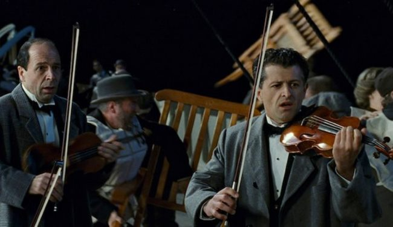

Remember that scene in the movie Titanic (spoiler ahead) when the ship started going down? The passengers were racing to get off the ship, but the musicians accepted their fate, sat back down, and kept playing music. That is what blogging feels like today. All your fellow bloggers have left or in the process of leaving. Yet you play on. Maybe not as frequently as before, but you've decided not to jump into the lifeboats provided by Facebook and Twitter. And you don't have the energy or interest to start a podcast or build out a YouTube channel. The blogging ship is sinking and yet you play on. And you are OK with that choice. Any requests?  _Keep blogging fellows!_

---

## Comments

### Hs
*January 19 at 2020 at 1:38 AM*

Well I avoid consuming content on FB and Twitter, so us Neanderthal passive content consumers are sinking too.  Your writings are interesting as they are. Keep on playing sir!

---

### T
*January 19 at 2020 at 3:15 AM*

Yes, please play on, sir!

I've been reading your blog on and off since your paleo days, and while I've never commented, I've always appreciated your calm, rational, and open-minded approach.  The (health-)blogosphere would be worse off without you!

---

### Steve
*January 19 at 2020 at 10:45 PM*

I enjoy your posts.  Glad you're still going.  I've learned a lot!  Thank you!

---

### Pauline
*January 20 at 2020 at 8:39 AM*

I don't read as much on websites like I did before but I always come back to visit your updates and freetheanimal.  I like your balanced views weighing up pros and cons  - and the comments are often very insightful too.

---

### Andy
*January 20 at 2020 at 9:19 AM*

Thanks for continuing the quality content as the ship goes down. I miss FTA and Angelo Coppola. Hopefully there is a revival of sorts once people tire of the social media-based fluff, probably wishful thinking! Only request I have is some recipes/ideas for potatoes/lentils etc and protein combos?

---

### MAS
*January 22 at 2020 at 9:12 PM*

@Andy - I've added cooked buckwheat and quinoa into the starch staples. I'm also eating more purple potatoes.

---

### Andy
*January 23 at 2020 at 8:40 AM*

@MAS nice mate, quinoa is damn versatile

---

### Roland
*February 5 at 2020 at 6:02 AM*

You're still bookmarked for my morning coffee literature, since many years. Still enjoying your well-reasoned, calm and accurate deliveries of true-to life scenarios and observations. It's equally enjoying as it is enlightening. Keep on blogging please!

---

### matt
*February 27 at 2020 at 6:31 AM*

keep blogging (please), i find your neutrality and flexibility on subjects informative, eg that muscle damage doesnt stimulate muscle growth and the implications that has for training, ie HIT versus volume

---

### Antonius
*April 12 at 2021 at 5:01 AM*

You're the Mom and Pop shop of the internet.  I like the fact that you are here and can always be "HERE" in the sense that you own everything you're producing MAS.  

BUT, I think this is something to consider.  There is more value when you're able to share your toughs far and wide.  -At least that's what Seth Godin seems to say, "Ideas that spread", "the idea virus".  

On the other hand, when you're creating things just for yourself, there's some real purity and art there.  Plus who else is really going to look at all your stuff as much as you are.  YOU better be pleasing YOURSELF first.  At least that's what some great artist said.  I think. 

At any rate. I was lucky to stumble upon Critical MAS, and I'm really happy about that.

---

