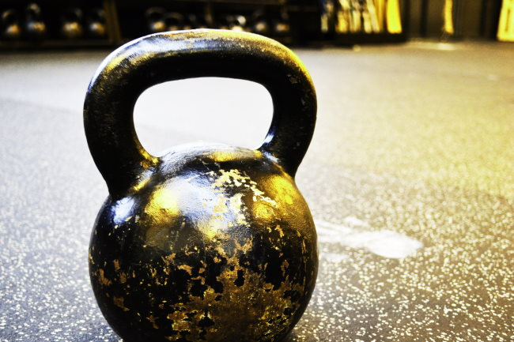

I was going to wait until I had completed the full 12-weeks of the [Quick and Dead](/2020/01/notes-on-pavels-the-quick-and-the-dead/) workout, but this can't wait. I see some potential issues with the Q&D and so have a few other commenters. First, I'll cover some of those issues and then we can brainstorm on ways to improve the workout.

The most concise criticism of the plan came from [Zap](/2020/01/notes-on-pavels-the-quick-and-the-dead/#comment-26994).

> As much as I love Pavel, this is not a complete routine/program for most anyone. KB swings are not a pull of any kind. A swing is a hinge. There is no true upper body pull action at all (rowing or pull-up motion) and very minimal squat/lunge/quad stress.

Zap is absolutely correct. At the expense of being super minimal and using just 2 exercises, the back and especially the legs don't get worked out nearly enough.

[Greg](/2020/01/notes-on-pavels-the-quick-and-the-dead/#comment-26994) agreed:

> I also concluded that swings + pushups weren’t enough.

Once push-ups become too easy, Pavel says to use bands to make the movement harder. My gym has one 30-pound band. It is awkward as hell. I tried using it a few times, but I could not get solid form reps using it. Maybe I need a better band or maybe the push-up isn't ideal? A weighted vest might work better, but I don't want to buy one right now.

The second issue I had was between all the push-ups and KB swings, my shoulders were taking a beating, while the rest of my body felt under-utilized.

_Photo by_ [_Jesper Aggergaard_](https://unsplash.com/@aggergakker?utm_source=unsplash&utm_medium=referral&utm_content=creditCopyText)

I liked the 10 sets of 10 reps inside 3-minutes, but it wasn't long before I started eyeing other exercises.

Pavel doesn't like machines, but I do. So, in one workout I cycled between 2 Hammer Strength machines - a chest press and the Iso-Lateral Low Row. The problem with going back and forth with machines in a shared gym is that it can be a challenge to hold two pieces of equipment for 30 minutes. I don't ever want to be the jerk in the free weight room. Unlike Millenials, I had great role models in the 1990s in Tampa's hardcore gyms.

Fixing the Q&D might be as easy as picking 2-3 exercises that can be done explosively in a safe manner and cycling between them. We don't need to do the same workout each time. Focus on the explosive movement and getting sufficient rest between sets instead.

When I lift HIT style, I am pure intuition. I rarely have a plan when I arrive at the gym and I never write anything down. I look around the gym, see what is available that is of interest to me, and then lift HIT style, before moving onto the next exercises. Q&D 2.0 will require a bit more planning if you are in a shared gym but should be doable.

I can do explosive goblet squats or push-ups next to any machine.

If you have any tips or suggestions for making Pavel's Quick and Dead better, leave a comment below.

---

## Comments

### Karoly
*March 29 at 2020 at 2:17 AM*

This is an interesting discussion. I haven't tried Q&amp;D as yet, as I am certainly not fit enough or ready for it. My comment, though, for what it's worth is about Swings as "pulls". I know they are a "hinge", but the "hinge" movement occurs in movements that we might recognise as "pulls" - the move from the "power position" to full extension in the clean or snatch, for example. In my experience, a good swing feels like a fast "pull"

I haven't done Swings for quite a while, but when I did them regularly, esp. if I pushed towards an all out max-rep set, they really hit my lower back and, to a lesser extent, my legs. (This took the form of intense, but short-lived pain, probably due to local muscular fatigue.)
 
I rarely felt any strain/pain/soreness, etc. in my shoulders or upper body - that is, only if I was doing them incorrectly.

In that respect, the nearest exercise in terms of feel, for me, is the deadlift - which is about the purest pull you can get in terms of heavy loading. (Normally, I would not expect to feel any lower back "pain" at all in deadlifting, but have done so when I have "gone mad" and tried to do high volume sets without preparing properly for them - again, the "pain" was fatigue-based and not injury-related.)
 
I have never felt any pain or strain in my shoulders or upper body doing deadlifts. I ought to admit that I have Cerebral Palsy and my mechanics may not be "correct" in either the Swing or the Deadlift. For me, the swing was not an easy movement to learn or to do, so I found swings, even with a light bell, more challenging, initially, than heavy deadlifts.
This is only an attempt to comment on my experience and should not be taken as challenging or contradicting anything anyone else has said.
(BTW can I mention I added a comment to an old discussion on Kenneth Jay's "Cardio Code" and aerobic/cardio exercise, if that is still relevant?)

---

### MAS
*March 29 at 2020 at 2:49 AM*

@Karoly - I ended up not liking for the swings myself. When combined with all the push-ups from the Q&D my shoulders were taking a beating.

---

### Rey
*November 4 at 2021 at 5:06 PM*

Honestly, been doing it for a couple months now. I am a firefighter, and I have seen that it has made me at least top 10 around my peers (who are pretty fit in comparison to most people.) It has maintained my pull up count to 14 without me practicing them regularly (I weight 200lbs) it has also maintained my 800 meter intervals at around 3:07 minutes. I think it’s great, hard at first to do because the rest are long and I come from a CrossFit BG, but it has changed my mindset. Honestly, kicking my ass for the sake of making me perform “better”just doesn’t make sense. I need to build myself up in training, and then really put out when I need it most (on the fire ground).

---

### Teodor
*June 22 at 2022 at 12:58 PM*

Hey. I'm a great enthusiast of Q&amp;D. I think that this training is absolutely perfect and flawless and awesome and the best of the best.

All those issues that you named also are valid, BUT....

I think that an improvement of Q&amp;D should be applied only outside of this perfect training.

Those issues are not the issues of program itself. It is complete for the certain PURPOSE, so...

First- master Q&amp;D with full dedication. 

Get the very strong habit of doing this and then...

Add other trainings and excercises afterwards.

Swings and pushups are chosen because you get load on full range of motion, constant tension, safety and EXPLOSIVNES.

Session of Q&amp;D- you are DONE with explosiveness.

And then you can do whatever you want to do.

I discover that Q&amp;D give me power to do other trainings, excercises, 

And here comes the most important part...

Q&amp;D alone, as Pavel says about Simple and Sinister Takes from you the psychic load about what to do, motivation etc.

I will wrote this second time, it just makes your head lighter.

And if you tray to do more than Q&amp;D make sure that you are already grounded in Q&amp;D.

I tried to improve it and I quit because of mental load.

But I'm starting over, full dedication in Q&amp;D, grounding habit and then adding reasonable what Q&amp;D lacks.

It does not lack anything by itself, I think it is perfect and closed as whole...

And those issues that you named should be resolved afterwards or as anothe sessions.

Thus said the Pavel and thou shalt not blaspheme against his best training that he reveal to us. Amen

:-P

---

### tim
*April 1 at 2023 at 6:32 AM*

Trade up the swings for snatches? Or even high pulls to get even more back action.....?

---

### Antonius
*August 15 at 2024 at 2:24 AM*

Hey MAS, thank you for putting this out and getting me into this.  I've modified the program like you've suggested.  Here's what I'm working with:

Min 0: KB dead lift 15x (worried about hurting my back with swings, but deadlifts are close 'nuff)
min 0:45 Push ups 10-12
Min 1:30 KB single arm rows 6x left side
min 2 KB singel arm rows 6x right side.
Min 2:30 repeat

I certainly get taxed on this and maybe more of a rest would be required, but I like it. started with 6 rounds and moving to 8.  I'm going to move up to 10 by the end of 12 weeks.   It's pretty simple and good to rock out at home, so I'm good for now.  Maybe after a de-load week we can add bands to the work out.

---

### MAS
*August 15 at 2024 at 3:14 PM*

@Antonius - I ended up using goblet squats - sometimes from a slant board - instead of swinging a KB.

---

### Steve
*February 21 at 2025 at 8:54 AM*

Pavel makes it perfectly clear that Q&amp;D is not the only training you should do.  It leaves you fresh to train other areas of the body or train for specific sports.  It's your consistent base - and a superb one at that.

---

### Jeff
*July 1 at 2025 at 5:17 PM*

In the book, Pavel talks about Viking Push Presses as a great alternative to push ups, but doesn't choose them because not everyone can do a VPP with the intensity needed, which doesn't make sense to me because the Q&amp;D protocol is supposed to be for advanced practitioners only. So I've long wondered if anyone has tried the protocol with VPPs.

Seems like doing the program with VPPs alternated with stadium stair sprints might work really well. 

I also think gorilla cleans would work great with this protocol, when combined with hill or stair sprints. And you could probably alternate workouts between VPPs and Gorilla Cleans. 

Thoughts?

---

### MAS
*July 1 at 2025 at 5:46 PM*

@Jeff - Brilliant. I love your idea of mixing VPP and Gorilla Cleans.

---

