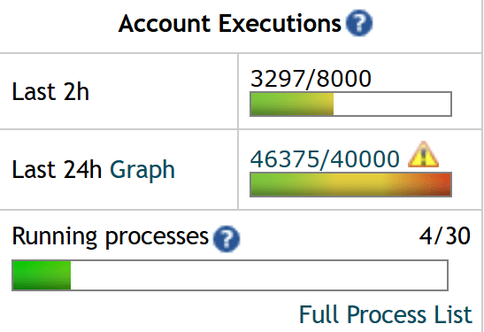
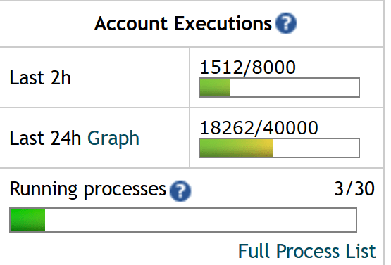
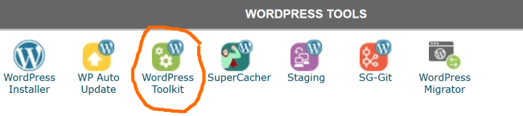
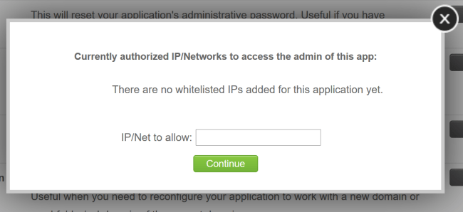

_This is version 2 of this article, which was originally published on Jan 25, 2020. It has more updated information._

One of the [many complaints](/2018/06/the-state-of-blogging-in-2018/) I have about WordPress is that it has become a magnet for malicious bots. These bots hammer your server trying to gain access. Even if your site is 100% secure, they will not stop. The problem is with many hosts, you have an execution limit for your account. The more executions your site initiates, the more your host can charge you.

I don't mind paying for my readers to access the site, but I'm tired of paying for the bots.

I'm on the highest plan with SiteGround (GoGeek). Even though my traffic has been steady for years, I have seen a steady rise in the number of executions from bots. Thousands of requests to my login page every day. Even though I can lock the page down with math problems or other CAPTCHAs, delivering the page itself counts as an execution, because all PHP pages, unlike HTML/CSS/JS, are server-side rendered.

For the past two years, I've exceeded my execution allotment. This week, I fixed it all. I was able to reduce my executions by more than 60%. Before I show you the steps I took, let me show you my numbers.

#### Execution Count on Saturday, January 20th

-   3,297 (last 2 hours)
-   46,375 (last 24 hours)

#### Execution Count on Friday, January 24th

-   1,512 (last 2 hours)
-   18,262 (last 24 hours)

Going from 46,375 to 18,262 is an eye-popping **60% reduction** in executions!

### #1 Restrict Admin by IP Address

If you can access the Internet via a fixed IP address, you can restrict Admin access to just your IP Address. Anyone else that tries to get to a page inside your WP-Admin will get a 403 Error message page delivered in HTML. Since it is HTML and not PHP, this will not count as an execution.

If you use Siteground, here is where to go. From cPanel, click "WordPress Toolkit", which is under "WordPress Tools".

After selecting that button, you will see a list of your sites with WordPress. Select the Manage button beside the sites you wish to lockdown. I locked down 3 of my 4 websites. The 4th one I share with a co-publisher that doesn't have access to a fixed IP Address.

Select Secure Admin Panel. Enter your IP Address. Now anyone not viewing the Admin from that specific IP Address will not get access. You can enter multiple IP Addresses if you need to.

If you are not with SiteGround, the steps are likely to be different, so you may need to contact your host for assistance on securing your Admin by IP Address.

If you aren't sure if your IP Address is fixed, periodically check the website [WhatsMyIP.org](https://www.whatsmyip.org/). If it doesn't change, it's probably fixed. And if it does change at some point, you can always log back into your cPanel and update the IP Address.

### #2 Block the wp-login.php by IP Address

There are 2 ways to get the Admin section. There is the **/wp-admin/** directory, which is addressed above and there is also **/wp-login.php** file, which lives off the root. Unfortunately, the SiteGround tool which blocks the Admin section does not restrict bots from accessing the **/wp-login.php** file. Your admin will be secure, but you will still rack up executions.

To fix that add this block to your .htaccess file. Replace the XXs with your dedicated IP Address. Note that if your IP address changes regularly, updating this file is going to be more cumbersome than changing a setting on the SiteGround Admin. But, if your site is getting hammered by bots, it may be your only option.

<FilesMatch "wp-login.php$> Order deny,allow Deny from all Allow from XX.XXX.XXX.XXX </FilesMatch>

Remember to replace XX.XXX.XXX.XXX with your dedicated IP Address.

### #3 Block XMLRPC

WordPress has a legacy file that isn't used much these days called **/xmlrpc.php**. Bots love this file. Mine was getting hammered almost as much as my login page.

To learn more about xmlrpc.php, read the article [What Is Xmlrpc.php in WordPress and Why You Should Disable It](https://www.hostinger.com/tutorials/xmlrpc-wordpress). The short version is it is a legacy file used by some apps to publish content outside the Admin, such as a smartphone. Most users do not need it.

First things first. Don't delete this file. Because, once Wordpress releases a new version, it will be reinstalled. The best way to block access to this file is to place this directive in the .htaccess file at the root of your domain.<FilesMatch "xmlrpc.php$"> Deny from all </FilesMatch>

### #4 Move the RSS Feed (Bonus)

I actually did this a long time ago and it helped a lot. You may not need to take this step to get your executions under control. I wrote two posts on Medium on how to perform this step.

1.  [How to Change Your Default RSS Path in WordPress Without Touching Code](https://medium.com/@CriticalMAS/how-to-change-your-default-rss-path-in-wordpress-without-touching-code-e7fa9add86b5)
2.  [Reduce Your WordPress Resource Usage By Hiding Your RSS Feed Link](https://medium.com/@CriticalMAS/reduce-your-wordpress-resource-usage-by-hiding-your-rss-feed-link-8ec388ed95d7)

As I mentioned in that article, my RSS feed was getting hit 2,000 times a day. I knocked that number down to 100. My [main site](https://ineedcoffee.com) is over 20 years old, so your mileage may vary.

### Summary

The bots are attacking WordPress sites at an increasing rate. The ideas I listed above will not only take a tremendous load off your server, but they will also make your site more secure and stable.

---

## Comments

### Renaud
*February 18 at 2020 at 9:36 PM*

Add a .htpasswd login to access the admin folder, and/or individual files such as wp-admin.php. Simple but effective.

---

